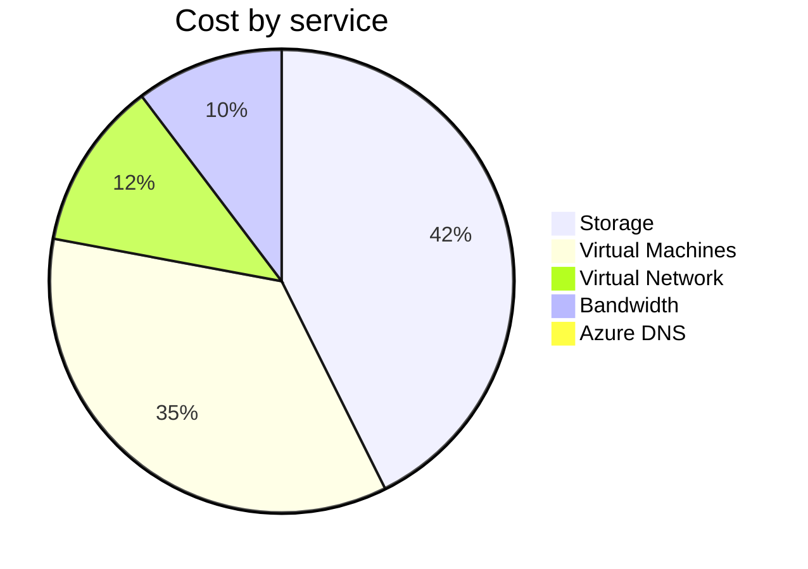
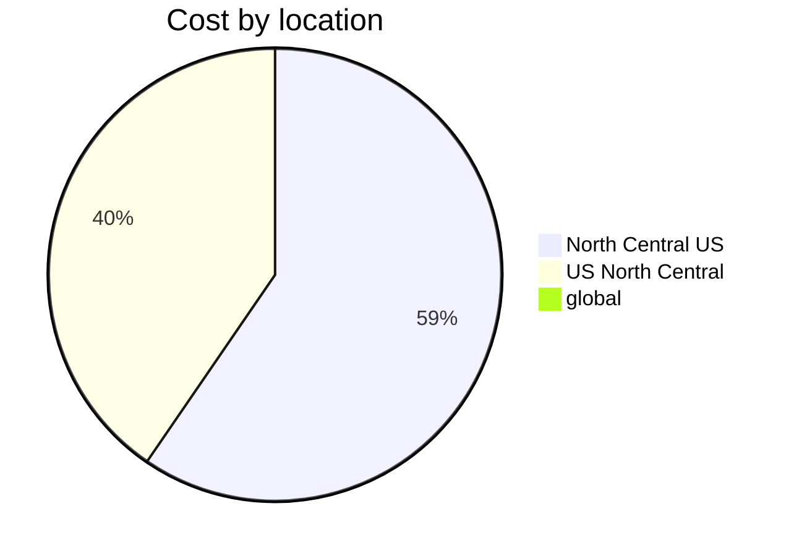
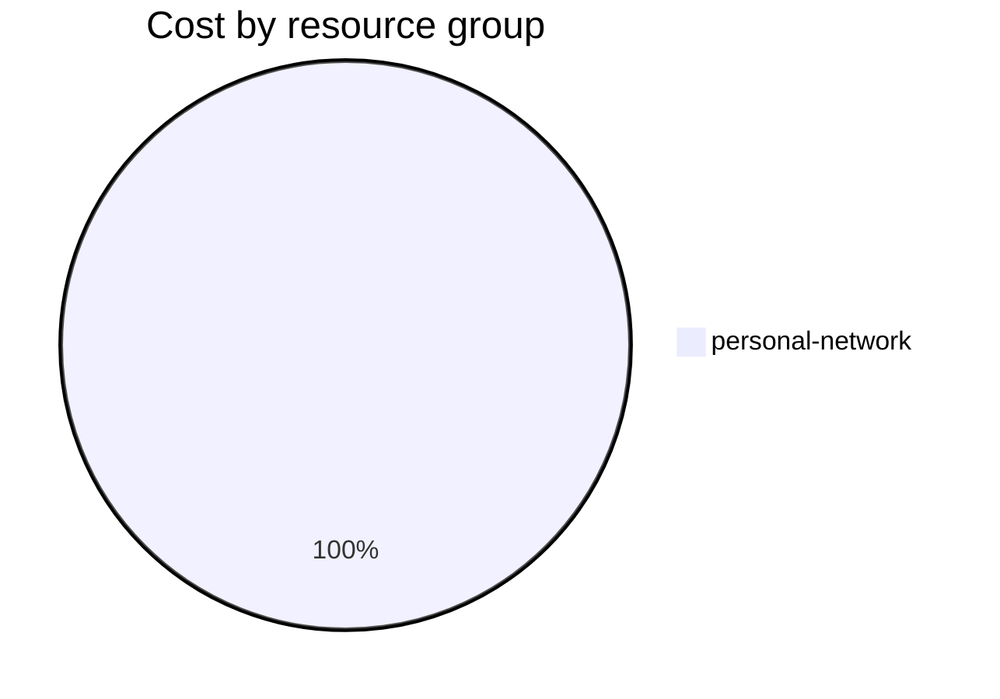

Fetching subscription details...
Fetching cost data...
Fetching forecasted cost data...
Fetching cost data by service name...
Fetching cost data by location...
Fetching cost data by resource group...
# Azure Cost Overview

> Accumulated cost for subscription id `JPF Pay-As-You-Go` from **11/01/2023** to **11/02/2023**

## Totals

|Period|Amount|
|---|---:|
|Today|0.11 USD|
|Yesterday|1.26 USD|
|Last 7 days|1.37 USD|
|Last 30 days|1.37 USD|

```mermaid
gantt
   title Accumulated cost
   dateFormat  X
   axisFormat %s
   section 01 Nov
   USD 1.26 :0, 126
   section 02 Nov
   USD 1.37 :0, 137
   section 03 Nov
   USD 2.91 : done, 0, 291
   section 04 Nov
   USD 4.31 : done, 0, 431
   section 05 Nov
   USD 5.53 : done, 0, 553
   section 06 Nov
   USD 6.86 : done, 0, 686
   section 07 Nov
   USD 8.22 : done, 0, 822
   section 08 Nov
   USD 9.62 : done, 0, 962
   section 09 Nov
   USD 10.99 : done, 0, 1099
   section 10 Nov
   USD 12.40 : done, 0, 1240
   section 11 Nov
   USD 13.67 : done, 0, 1367
   section 12 Nov
   USD 14.75 : done, 0, 1475
   section 13 Nov
   USD 15.95 : done, 0, 1595
   section 14 Nov
   USD 17.18 : done, 0, 1718
   section 15 Nov
   USD 18.45 : done, 0, 1845
   section 16 Nov
   USD 19.69 : done, 0, 1969
   section 17 Nov
   USD 20.96 : done, 0, 2096
   section 18 Nov
   USD 22.10 : done, 0, 2210
   section 19 Nov
   USD 23.05 : done, 0, 2305
   section 20 Nov
   USD 24.12 : done, 0, 2412
   section 21 Nov
   USD 25.21 : done, 0, 2521
   section 22 Nov
   USD 26.36 : done, 0, 2636
   section 23 Nov
   USD 27.46 : done, 0, 2746
   section 24 Nov
   USD 28.60 : done, 0, 2860
   section 25 Nov
   USD 29.61 : done, 0, 2961
   section 26 Nov
   USD 30.43 : done, 0, 3043
   section 27 Nov
   USD 31.36 : done, 0, 3136
   section 28 Nov
   USD 32.33 : done, 0, 3233
   section 29 Nov
   USD 33.34 : done, 0, 3334
   section 30 Nov
   USD 34.31 : done, 0, 3431
```

## By Service Name

|Service|Amount|
|---|---:|
|Storage|0.58 USD|
|Virtual Machines|0.48 USD|
|Virtual Network|0.16 USD|
|Bandwidth|0.14 USD|
|Azure DNS|0.01 USD|

## By Location

|Location|Amount|
|---|---:|
|North Central US|0.81 USD|
|US North Central|0.55 USD|
|global|0.01 USD|

## By Resource Group

|Resource Group|Amount|
|---|---:|
|personal-network|1.37 USD|

Generated at 2023-11-02 11:09:28 for subscription with id `4913be3f-a345-4652-9bba-767418dd25e3`
