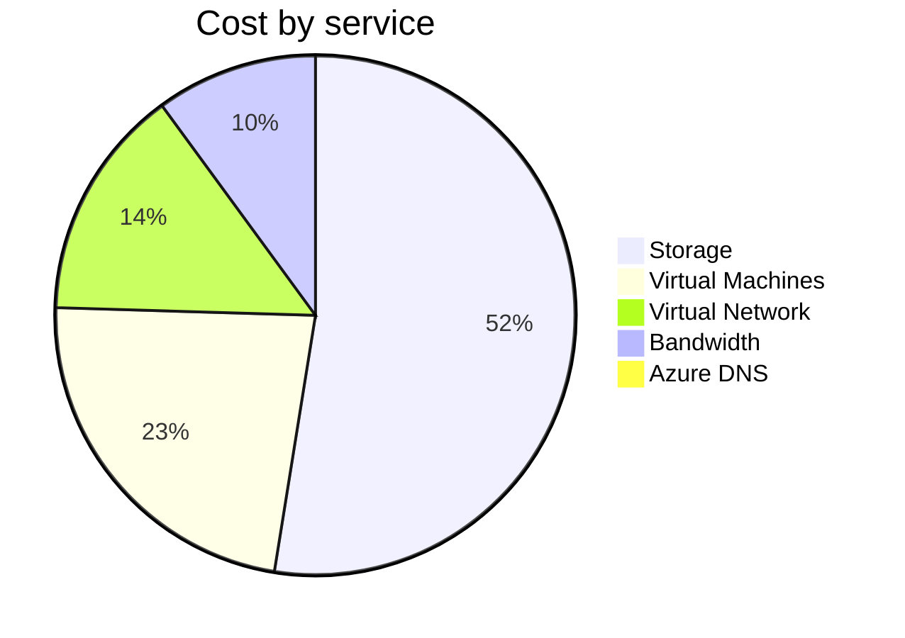
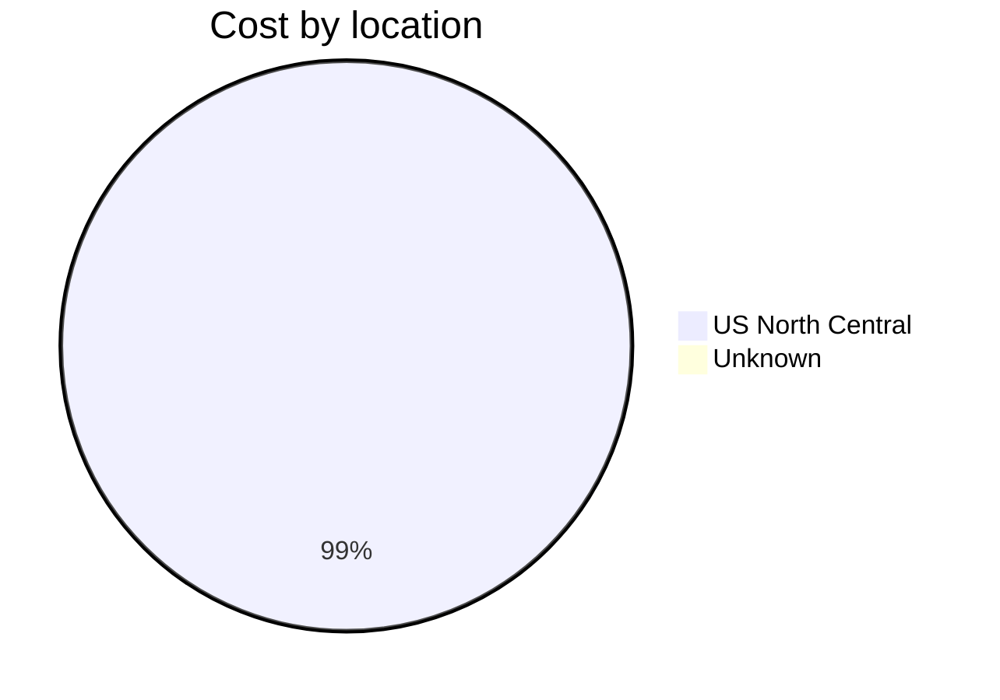
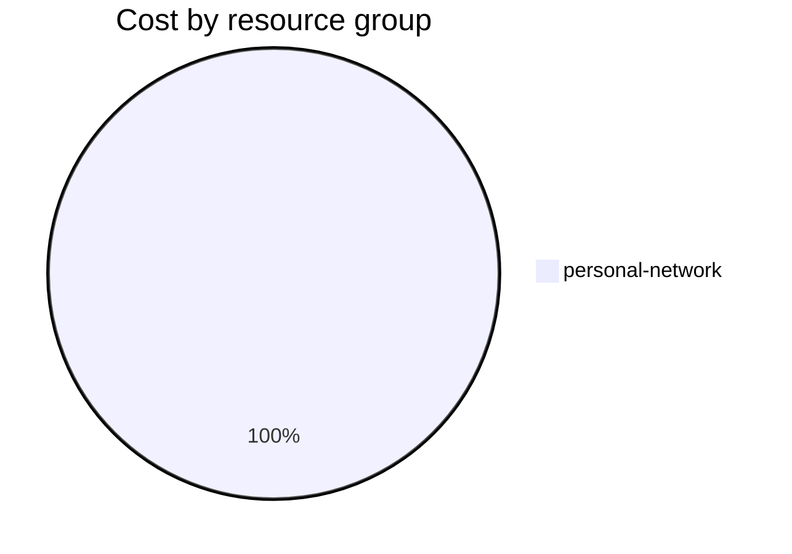

Fetching subscription details...
Fetching cost data...
Fetching forecasted cost data...
Fetching cost data by service name...
Fetching cost data by location...
Fetching cost data by resource group...
# Azure Cost Overview

> Accumulated cost for subscription id `JPF Pay-As-You-Go` from **11/01/2023** to **11/17/2023**

## Totals

|Period|Amount|
|---|---:|
|Today|0.08 USD|
|Yesterday|1.45 USD|
|Last 7 days|10.53 USD|
|Last 30 days|26.71 USD|

```mermaid
gantt
   title Accumulated cost
   dateFormat  X
   axisFormat %s
   section 01 Nov
   USD 1.83 :0, 183
   section 02 Nov
   USD 3.53 :0, 353
   section 03 Nov
   USD 5.51 :0, 551
   section 04 Nov
   USD 7.30 :0, 730
   section 05 Nov
   USD 9.02 :0, 902
   section 06 Nov
   USD 10.82 :0, 1082
   section 07 Nov
   USD 12.56 :0, 1256
   section 08 Nov
   USD 14.39 :0, 1439
   section 09 Nov
   USD 16.17 :0, 1617
   section 10 Nov
   USD 17.68 :0, 1768
   section 11 Nov
   USD 19.18 :0, 1918
   section 12 Nov
   USD 20.69 :0, 2069
   section 13 Nov
   USD 22.19 :0, 2219
   section 14 Nov
   USD 23.68 :0, 2368
   section 15 Nov
   USD 25.18 :0, 2518
   section 16 Nov
   USD 26.63 :0, 2663
   section 17 Nov
   USD 26.71 :0, 2671
```

## By Service Name

|Service|Amount|
|---|---:|
|Storage|13.90 USD|
|Virtual Machines|6.07 USD|
|Virtual Network|3.83 USD|
|Bandwidth|2.66 USD|
|Azure DNS|0.26 USD|

## By Location

|Location|Amount|
|---|---:|
|US North Central|26.45 USD|
|Unknown|0.26 USD|

## By Resource Group

|Resource Group|Amount|
|---|---:|
|personal-network|26.71 USD|

Generated at 2023-11-17 11:11:15 for subscription with id `4913be3f-a345-4652-9bba-767418dd25e3`
