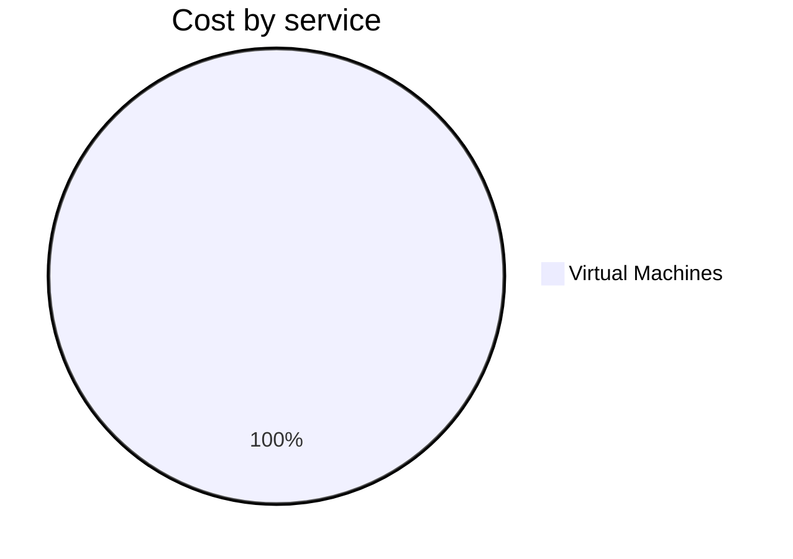
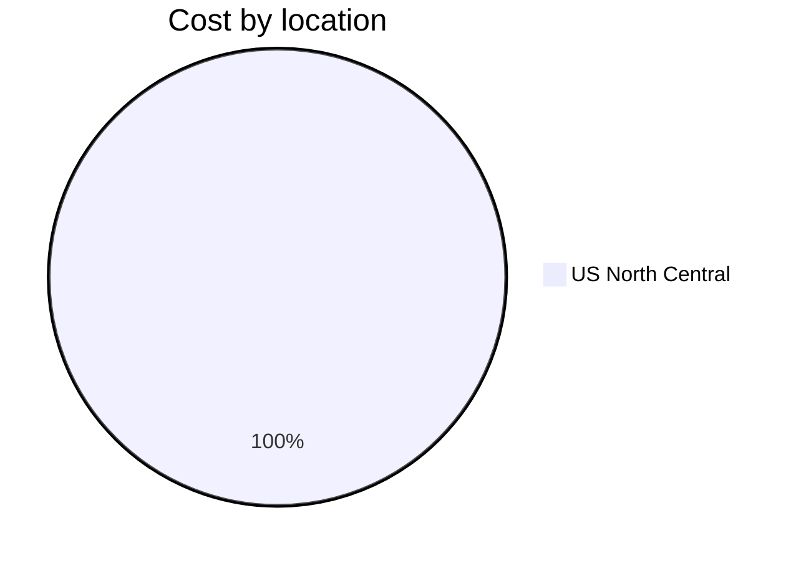
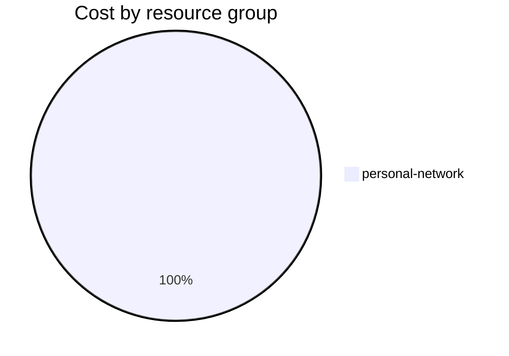

Fetching subscription details...
Fetching cost data...
Fetching forecasted cost data...
Fetching cost data by service name...
Fetching cost data by location...
Fetching cost data by resource group...
# Azure Cost Overview

> Accumulated cost for subscription id `JPF Pay-As-You-Go` from **01/01/2024** to **01/01/2024**

## Totals

|Period|Amount|
|---|---:|
|Today|0.09 USD|
|Yesterday|0.00 USD|
|Last 7 days|0.09 USD|
|Last 30 days|0.09 USD|

```mermaid
gantt
   title Accumulated cost
   dateFormat  X
   axisFormat %s
   section 01 Jan
   USD 0.09 :0, 9
   section 02 Jan
   USD 1.62 : done, 0, 162
   section 03 Jan
   USD 3.03 : done, 0, 303
   section 04 Jan
   USD 4.50 : done, 0, 450
   section 05 Jan
   USD 5.85 : done, 0, 585
   section 06 Jan
   USD 7.40 : done, 0, 740
   section 07 Jan
   USD 9.12 : done, 0, 912
   section 08 Jan
   USD 10.58 : done, 0, 1058
   section 09 Jan
   USD 12.05 : done, 0, 1205
   section 10 Jan
   USD 13.37 : done, 0, 1337
   section 11 Jan
   USD 14.78 : done, 0, 1478
   section 12 Jan
   USD 16.05 : done, 0, 1605
   section 13 Jan
   USD 17.53 : done, 0, 1753
   section 14 Jan
   USD 19.17 : done, 0, 1917
   section 15 Jan
   USD 20.56 : done, 0, 2056
   section 16 Jan
   USD 21.95 : done, 0, 2195
   section 17 Jan
   USD 23.21 : done, 0, 2321
   section 18 Jan
   USD 24.53 : done, 0, 2453
   section 19 Jan
   USD 25.73 : done, 0, 2573
   section 20 Jan
   USD 27.14 : done, 0, 2714
   section 21 Jan
   USD 28.71 : done, 0, 2871
   section 22 Jan
   USD 30.02 : done, 0, 3002
   section 23 Jan
   USD 31.34 : done, 0, 3134
   section 24 Jan
   USD 32.52 : done, 0, 3252
   section 25 Jan
   USD 33.78 : done, 0, 3378
   section 26 Jan
   USD 34.91 : done, 0, 3491
   section 27 Jan
   USD 36.24 : done, 0, 3624
   section 28 Jan
   USD 37.73 : done, 0, 3773
   section 29 Jan
   USD 38.97 : done, 0, 3897
   section 30 Jan
   USD 40.22 : done, 0, 4022
   section 31 Jan
   USD 41.33 : done, 0, 4133
```

## By Service Name

|Service|Amount|
|---|---:|
|Virtual Machines|0.09 USD|

## By Location

|Location|Amount|
|---|---:|
|US North Central|0.09 USD|

## By Resource Group

|Resource Group|Amount|
|---|---:|
|personal-network|0.09 USD|

Generated at 2024-01-01 11:08:14 for subscription with id `4913be3f-a345-4652-9bba-767418dd25e3`
