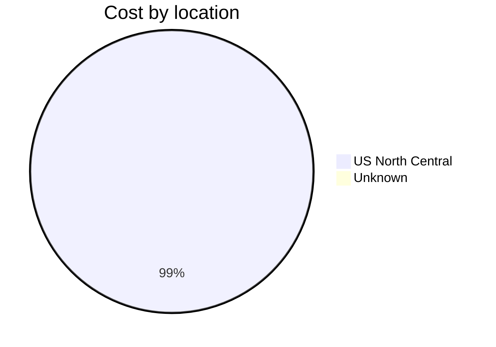
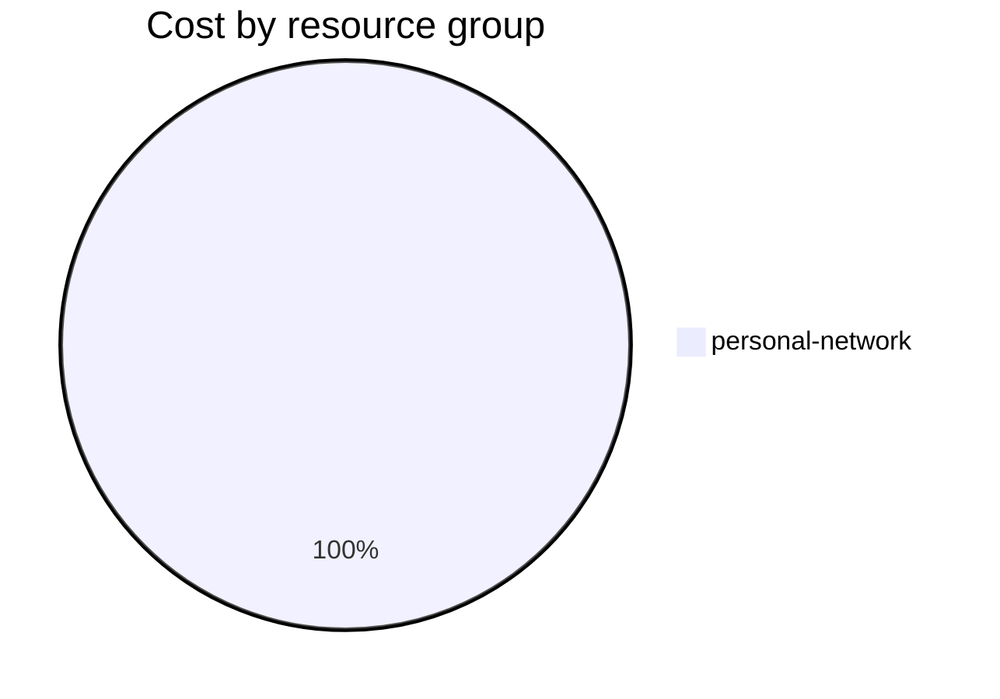

Fetching subscription details...
Fetching cost data...
Fetching forecasted cost data...
Fetching cost data by service name...
Fetching cost data by location...
Fetching cost data by resource group...
# Azure Cost Overview

> Accumulated cost for subscription id `JPF Pay-As-You-Go` from **03/01/2024** to **03/04/2024**

## Totals

|Period|Amount|
|---|---:|
|Today|0.09 USD|
|Yesterday|1.39 USD|
|Last 7 days|5.59 USD|
|Last 30 days|5.59 USD|

```mermaid
gantt
   title Accumulated cost
   dateFormat  X
   axisFormat %s
   section 01 Mar
   USD 2.68 :0, 268
   section 02 Mar
   USD 4.11 :0, 411
   section 03 Mar
   USD 5.50 :0, 550
   section 04 Mar
   USD 5.59 :0, 559
```

## By Service Name

|Service|Amount|
|---|---:|
|Storage|2.51 USD|
|Bandwidth|1.18 USD|
|Virtual Machines|1.14 USD|
|Virtual Network|0.71 USD|
|Azure DNS|0.05 USD|

## By Location

|Location|Amount|
|---|---:|
|US North Central|5.54 USD|
|Unknown|0.05 USD|

## By Resource Group

|Resource Group|Amount|
|---|---:|
|personal-network|5.59 USD|

Generated at 2024-03-04 11:34:18 for subscription with id `4913be3f-a345-4652-9bba-767418dd25e3`
