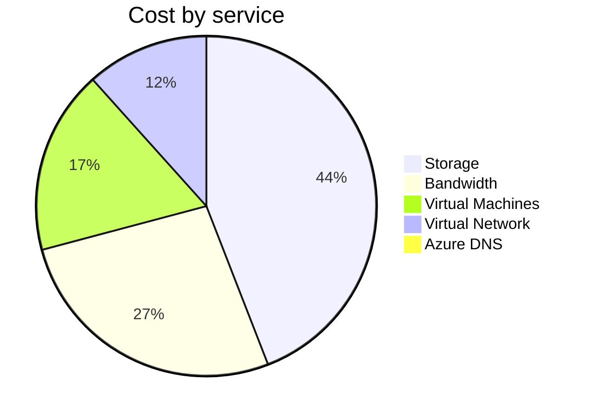
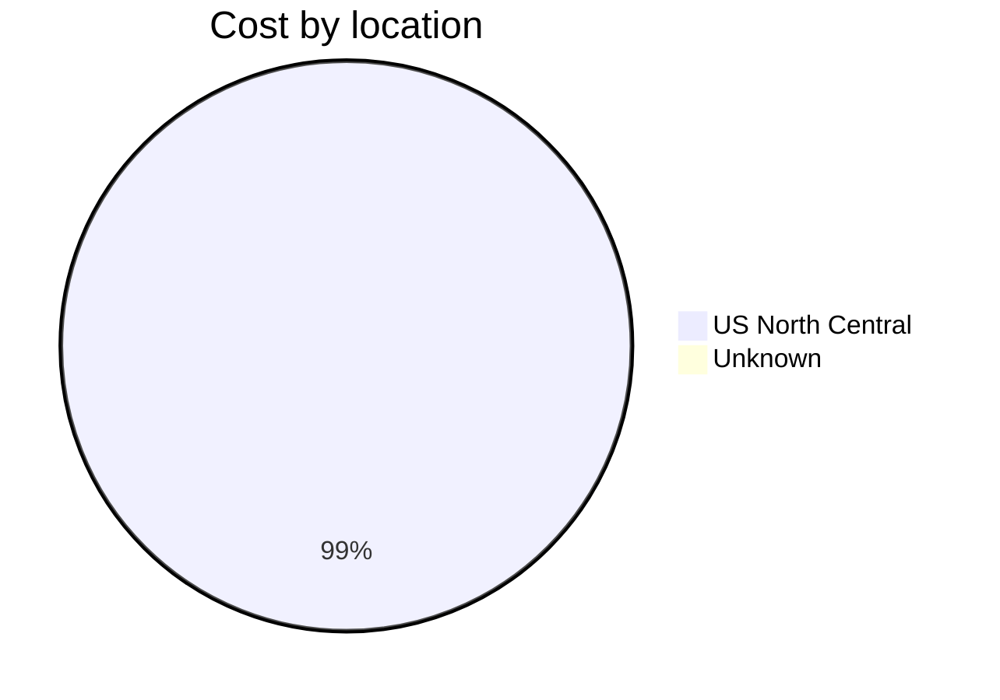
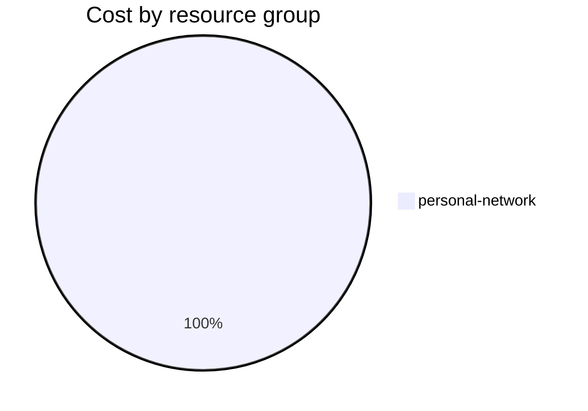

Fetching subscription details...
Fetching cost data...
Fetching forecasted cost data...
Fetching cost data by service name...
Fetching cost data by location...
Fetching cost data by resource group...
# Azure Cost Overview

> Accumulated cost for subscription id `JPF Pay-As-You-Go` from **02/01/2024** to **02/16/2024**

## Totals

|Period|Amount|
|---|---:|
|Today|0.09 USD|
|Yesterday|1.23 USD|
|Last 7 days|10.97 USD|
|Last 30 days|30.74 USD|

## By Service Name

|Service|Amount|
|---|---:|
|Storage|13.45 USD|
|Bandwidth|8.16 USD|
|Virtual Machines|5.34 USD|
|Virtual Network|3.55 USD|
|Azure DNS|0.24 USD|

## By Location

|Location|Amount|
|---|---:|
|US North Central|30.50 USD|
|Unknown|0.24 USD|

## By Resource Group

|Resource Group|Amount|
|---|---:|
|personal-network|30.74 USD|

Generated at 2024-02-16 11:06:49 for subscription with id `4913be3f-a345-4652-9bba-767418dd25e3`
