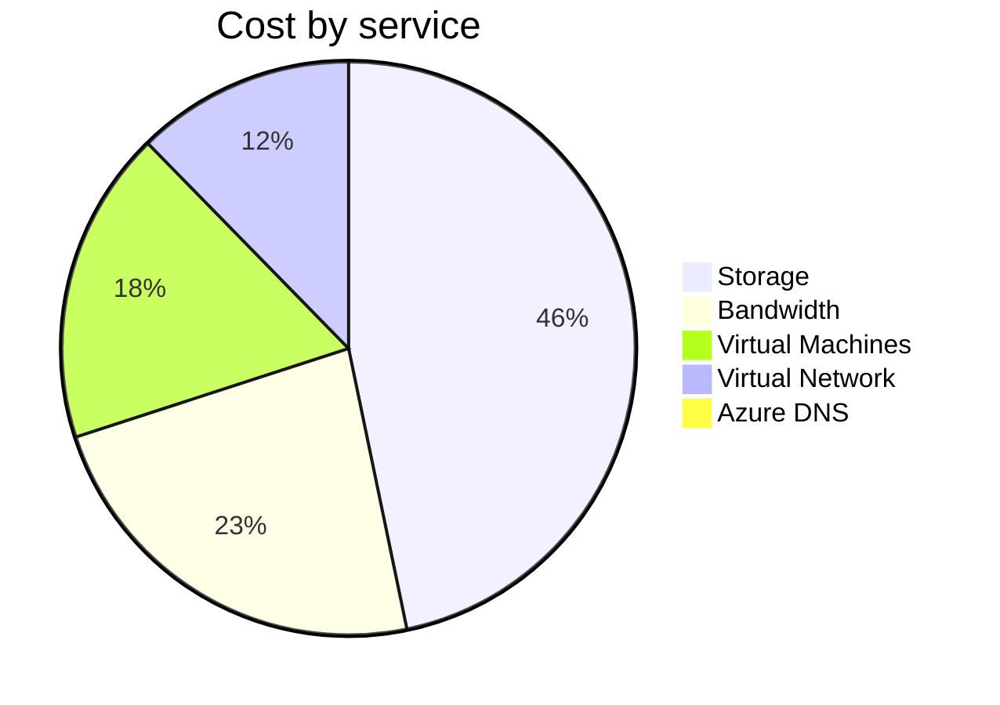
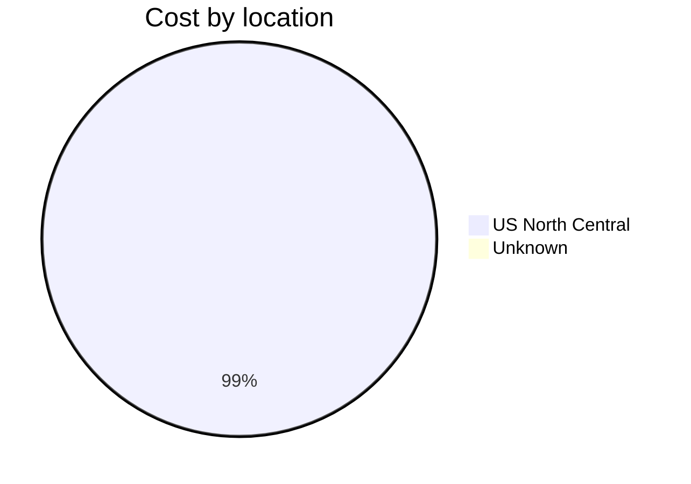
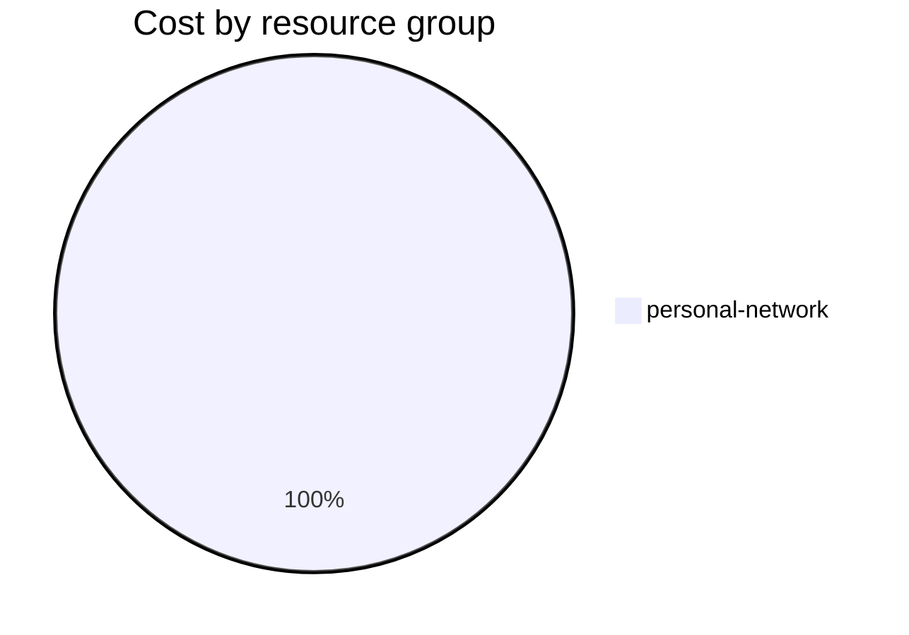

Fetching subscription details...
Fetching cost data...
Fetching forecasted cost data...
Fetching cost data by service name...
Fetching cost data by location...
Fetching cost data by resource group...
# Azure Cost Overview

> Accumulated cost for subscription id `JPF Pay-As-You-Go` from **02/01/2024** to **02/21/2024**

## Totals

|Period|Amount|
|---|---:|
|Today|0.00 USD|
|Yesterday|1.40 USD|
|Last 7 days|11.16 USD|
|Last 30 days|41.14 USD|

## By Service Name

|Service|Amount|
|---|---:|
|Storage|19.07 USD|
|Bandwidth|9.49 USD|
|Virtual Machines|7.21 USD|
|Virtual Network|5.03 USD|
|Azure DNS|0.34 USD|

## By Location

|Location|Amount|
|---|---:|
|US North Central|40.81 USD|
|Unknown|0.34 USD|

## By Resource Group

|Resource Group|Amount|
|---|---:|
|personal-network|41.14 USD|

Generated at 2024-02-22 11:06:22 for subscription with id `4913be3f-a345-4652-9bba-767418dd25e3`
