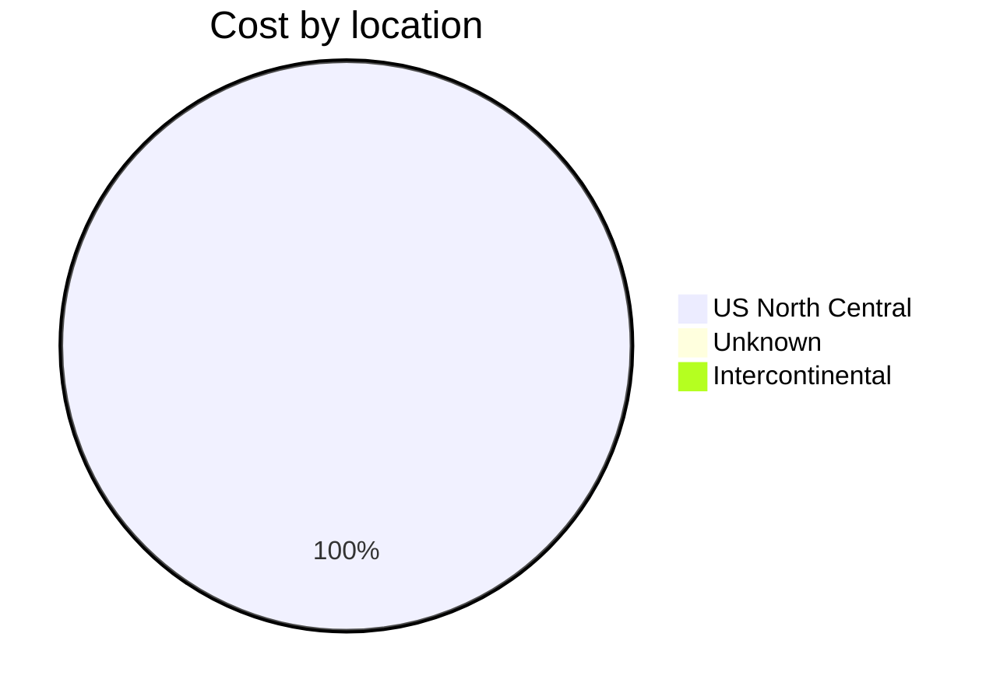
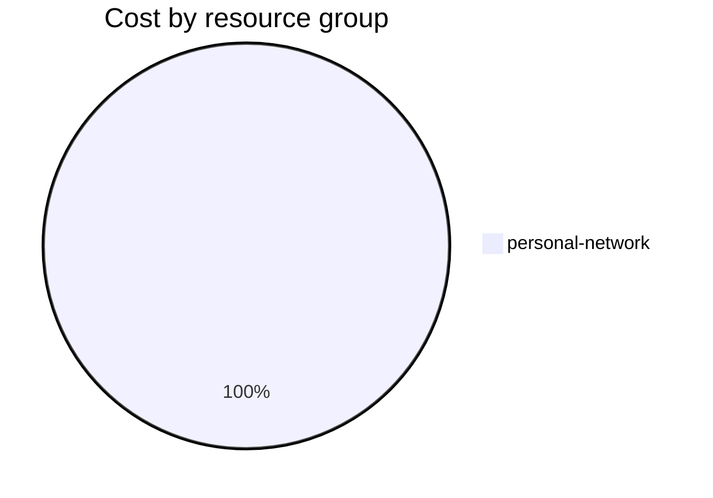

Fetching subscription details...
Fetching cost data...
Fetching forecasted cost data...
Fetching cost data by service name...
Fetching cost data by location...
Fetching cost data by resource group...
# Azure Cost Overview

> Accumulated cost for subscription id `JPF Pay-As-You-Go` from **09/01/2023** to **09/22/2023**

## Totals

|Period|Amount|
|---|---:|
|Today|0.03 USD|
|Yesterday|2.75 USD|
|Last 7 days|81.18 USD|
|Last 30 days|207.47 USD|

```mermaid
gantt
   title Accumulated cost
   dateFormat  X
   axisFormat %s
   section 01 Sep
   USD 3.20 :0, 320
   section 02 Sep
   USD 6.19 :0, 619
   section 03 Sep
   USD 9.27 :0, 927
   section 04 Sep
   USD 12.30 :0, 1230
   section 05 Sep
   USD 15.47 :0, 1547
   section 06 Sep
   USD 18.50 :0, 1850
   section 07 Sep
   USD 21.60 :0, 2160
   section 08 Sep
   USD 24.70 :0, 2470
   section 09 Sep
   USD 27.69 :0, 2769
   section 10 Sep
   USD 30.45 :0, 3045
   section 11 Sep
   USD 33.22 :0, 3322
   section 12 Sep
   USD 45.75 :0, 4575
   section 13 Sep
   USD 91.88 :0, 9188
   section 14 Sep
   USD 126.29 :0, 12629
   section 15 Sep
   USD 131.88 :0, 13188
   section 16 Sep
   USD 144.89 :0, 14489
   section 17 Sep
   USD 172.35 :0, 17235
   section 18 Sep
   USD 186.84 :0, 18684
   section 19 Sep
   USD 201.83 :0, 20183
   section 20 Sep
   USD 204.69 :0, 20469
   section 21 Sep
   USD 207.44 :0, 20744
   section 22 Sep
   USD 207.47 :0, 20747
   section 23 Sep
   USD 225.24 : done, 0, 22524
   section 24 Sep
   USD 243.53 : done, 0, 24353
   section 25 Sep
   USD 262.38 : done, 0, 26238
   section 26 Sep
   USD 286.68 : done, 0, 28668
   section 27 Sep
   USD 306.78 : done, 0, 30678
   section 28 Sep
   USD 327.52 : done, 0, 32752
   section 29 Sep
   USD 349.01 : done, 0, 34901
   section 30 Sep
   USD 371.04 : done, 0, 37104
```

## By Service Name

|Service|Amount|
|---|---:|
|Storage|185.31 USD|
|Virtual Machines|7.81 USD|
|Virtual Network|7.58 USD|
|Security Center|3.70 USD|
|Bandwidth|2.74 USD|
|Azure DNS|0.34 USD|
|Advanced Threat Protection|0.00 USD|

## By Location

|Location|Amount|
|---|---:|
|US North Central|207.13 USD|
|Unknown|0.34 USD|
|Intercontinental|0.00 USD|

## By Resource Group

|Resource Group|Amount|
|---|---:|
|personal-network|207.47 USD|

Generated at 2023-09-22 11:08:14 for subscription with id `4913be3f-a345-4652-9bba-767418dd25e3`
