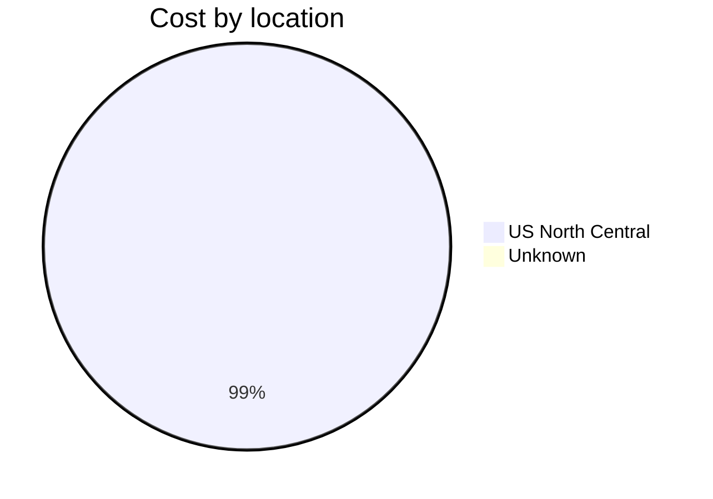
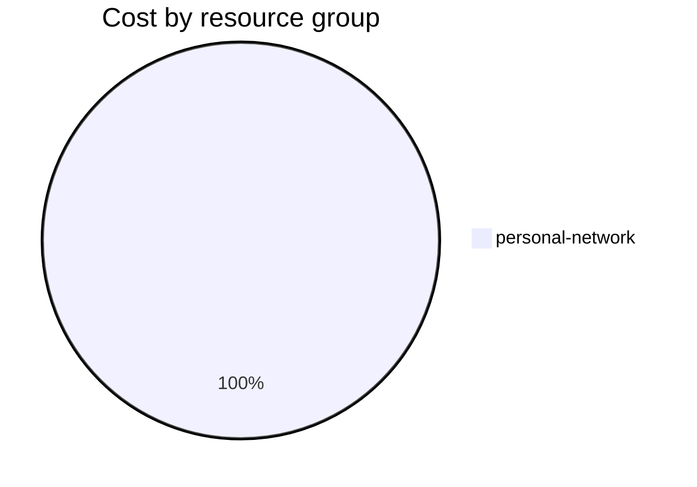

Fetching subscription details...
Fetching cost data...
Fetching forecasted cost data...
Fetching cost data by service name...
Fetching cost data by location...
Fetching cost data by resource group...
# Azure Cost Overview

> Accumulated cost for subscription id `JPF Pay-As-You-Go` from **11/01/2023** to **11/16/2023**

## Totals

|Period|Amount|
|---|---:|
|Today|0.10 USD|
|Yesterday|1.42 USD|
|Last 7 days|10.81 USD|
|Last 30 days|25.20 USD|

## By Service Name

|Service|Amount|
|---|---:|
|Storage|12.99 USD|
|Virtual Machines|5.71 USD|
|Virtual Network|3.60 USD|
|Bandwidth|2.66 USD|
|Azure DNS|0.24 USD|

## By Location

|Location|Amount|
|---|---:|
|US North Central|24.96 USD|
|Unknown|0.24 USD|

## By Resource Group

|Resource Group|Amount|
|---|---:|
|personal-network|25.20 USD|

Generated at 2023-11-16 11:08:14 for subscription with id `4913be3f-a345-4652-9bba-767418dd25e3`
