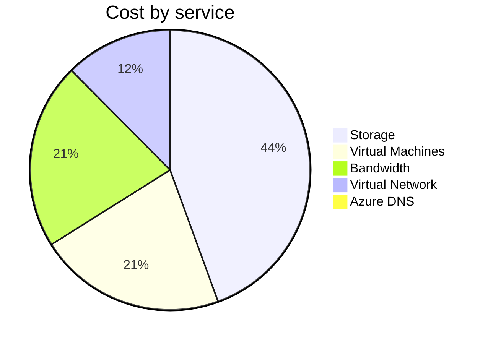
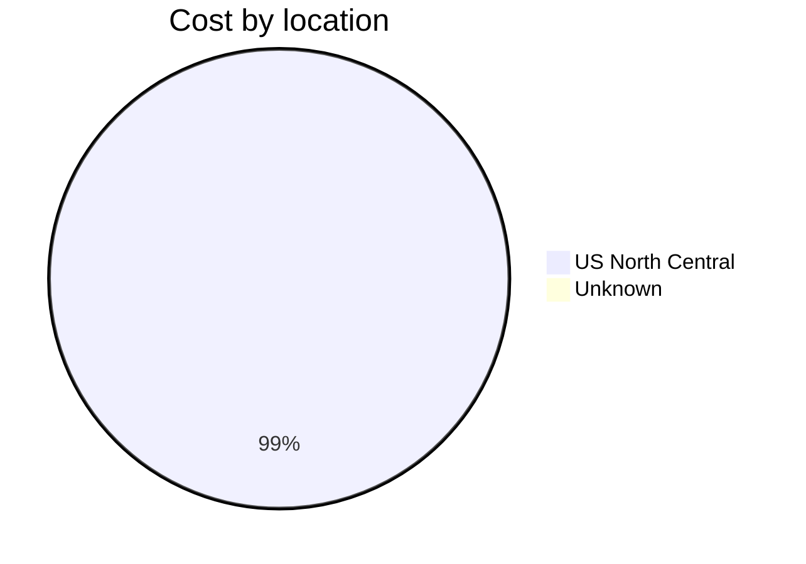
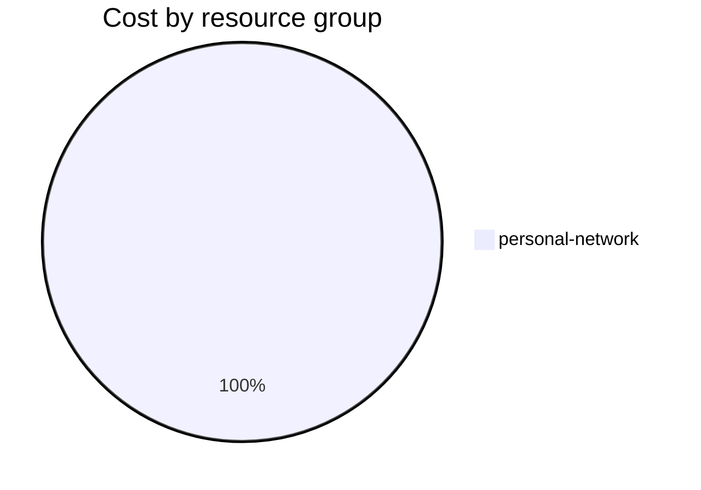

Fetching subscription details...
Fetching cost data...
Fetching forecasted cost data...
Fetching cost data by service name...
Fetching cost data by location...
Fetching cost data by resource group...
# Azure Cost Overview

> Accumulated cost for subscription id `JPF Pay-As-You-Go` from **01/01/2024** to **01/25/2024**

## Totals

|Period|Amount|
|---|---:|
|Today|0.12 USD|
|Yesterday|1.64 USD|
|Last 7 days|13.32 USD|
|Last 30 days|46.70 USD|

```mermaid
gantt
   title Accumulated cost
   dateFormat  X
   axisFormat %s
   section 01 Jan
   USD 2.01 :0, 201
   section 02 Jan
   USD 4.48 :0, 448
   section 03 Jan
   USD 6.29 :0, 629
   section 04 Jan
   USD 8.20 :0, 820
   section 05 Jan
   USD 10.14 :0, 1014
   section 06 Jan
   USD 12.40 :0, 1240
   section 07 Jan
   USD 14.14 :0, 1414
   section 08 Jan
   USD 16.56 :0, 1656
   section 09 Jan
   USD 18.51 :0, 1851
   section 10 Jan
   USD 20.12 :0, 2012
   section 11 Jan
   USD 21.92 :0, 2192
   section 12 Jan
   USD 23.74 :0, 2374
   section 13 Jan
   USD 25.91 :0, 2591
   section 14 Jan
   USD 27.43 :0, 2743
   section 15 Jan
   USD 29.03 :0, 2903
   section 16 Jan
   USD 31.44 :0, 3144
   section 17 Jan
   USD 33.37 :0, 3337
   section 18 Jan
   USD 35.23 :0, 3523
   section 19 Jan
   USD 37.11 :0, 3711
   section 20 Jan
   USD 39.32 :0, 3932
   section 21 Jan
   USD 41.20 :0, 4120
   section 22 Jan
   USD 43.09 :0, 4309
   section 23 Jan
   USD 44.93 :0, 4493
   section 24 Jan
   USD 46.58 :0, 4658
   section 25 Jan
   USD 46.70 :0, 4670
   section 26 Jan
   USD 48.62 : done, 0, 4862
   section 27 Jan
   USD 50.88 : done, 0, 5088
   section 28 Jan
   USD 52.72 : done, 0, 5272
   section 29 Jan
   USD 54.69 : done, 0, 5469
   section 30 Jan
   USD 56.67 : done, 0, 5667
   section 31 Jan
   USD 58.41 : done, 0, 5841
```

## By Service Name

|Service|Amount|
|---|---:|
|Storage|20.58 USD|
|Virtual Machines|10.02 USD|
|Bandwidth|9.96 USD|
|Virtual Network|5.75 USD|
|Azure DNS|0.39 USD|

## By Location

|Location|Amount|
|---|---:|
|US North Central|46.31 USD|
|Unknown|0.39 USD|

## By Resource Group

|Resource Group|Amount|
|---|---:|
|personal-network|46.70 USD|

Generated at 2024-01-25 11:10:47 for subscription with id `4913be3f-a345-4652-9bba-767418dd25e3`
