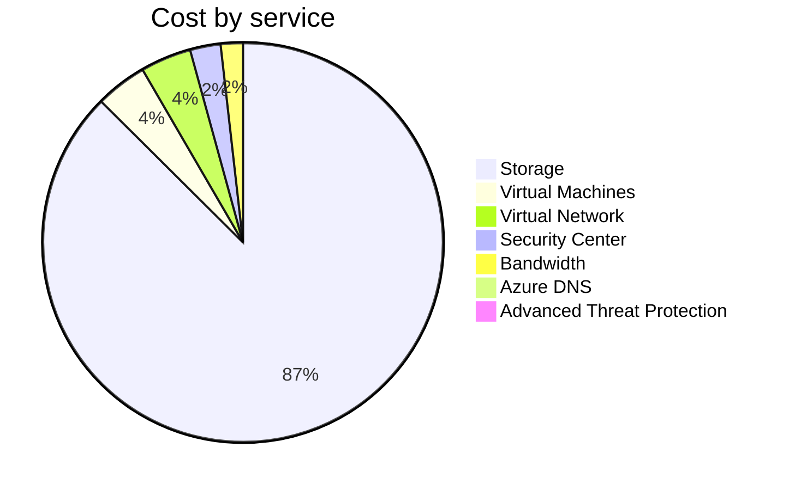
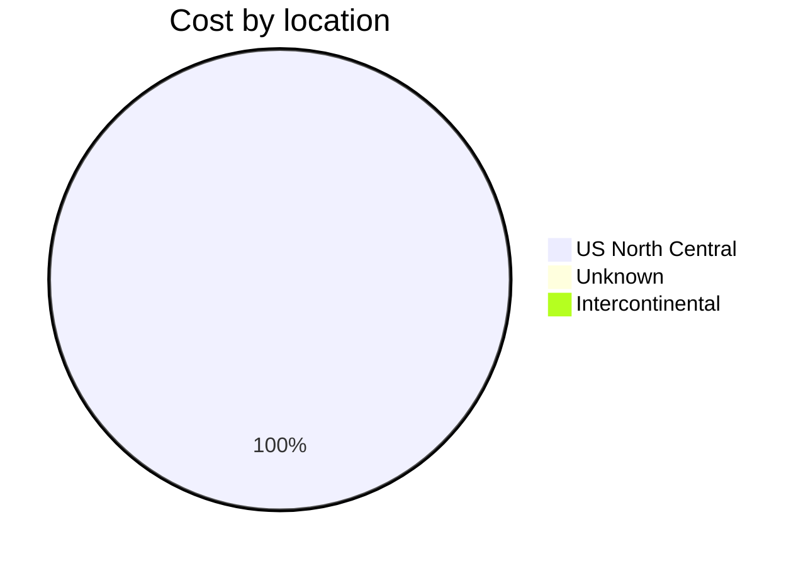
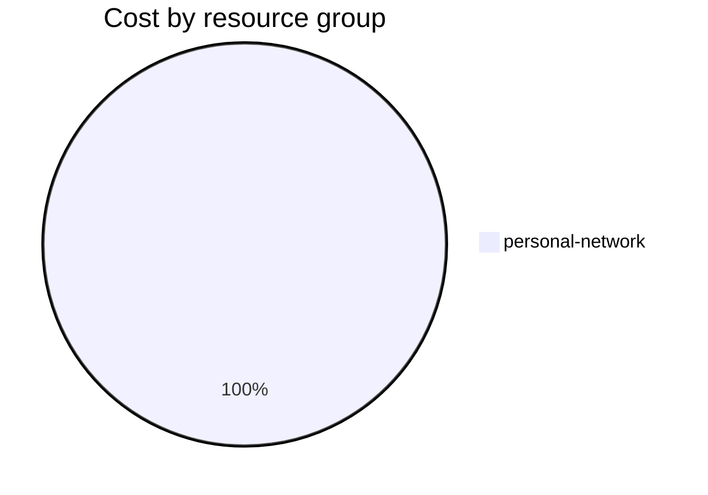

Fetching subscription details...
Fetching cost data...
Fetching forecasted cost data...
Fetching cost data by service name...
Fetching cost data by location...
Fetching cost data by resource group...
# Azure Cost Overview

> Accumulated cost for subscription id `JPF Pay-As-You-Go` from **09/01/2023** to **09/17/2023**

## Totals

|Period|Amount|
|---|---:|
|Today|5.41 USD|
|Yesterday|13.01 USD|
|Last 7 days|122.59 USD|
|Last 30 days|150.29 USD|

```mermaid
gantt
   title Accumulated cost
   dateFormat  X
   axisFormat %s
   section 01 Sep
   USD 3.20 :0, 320
   section 02 Sep
   USD 6.19 :0, 619
   section 03 Sep
   USD 9.27 :0, 927
   section 04 Sep
   USD 12.30 :0, 1230
   section 05 Sep
   USD 15.47 :0, 1547
   section 06 Sep
   USD 18.50 :0, 1850
   section 07 Sep
   USD 21.60 :0, 2160
   section 08 Sep
   USD 24.70 :0, 2470
   section 09 Sep
   USD 27.69 :0, 2769
   section 10 Sep
   USD 30.45 :0, 3045
   section 11 Sep
   USD 33.22 :0, 3322
   section 12 Sep
   USD 45.74 :0, 4574
   section 13 Sep
   USD 91.87 :0, 9187
   section 14 Sep
   USD 126.28 :0, 12628
   section 15 Sep
   USD 131.87 :0, 13187
   section 16 Sep
   USD 144.87 :0, 14487
   section 17 Sep
   USD 150.29 :0, 15029
   section 18 Sep
   USD 165.10 : done, 0, 16510
   section 19 Sep
   USD 180.49 : done, 0, 18049
   section 20 Sep
   USD 196.43 : done, 0, 19643
   section 21 Sep
   USD 212.87 : done, 0, 21287
   section 22 Sep
   USD 229.95 : done, 0, 22995
   section 23 Sep
   USD 247.35 : done, 0, 24735
   section 24 Sep
   USD 265.33 : done, 0, 26533
   section 25 Sep
   USD 283.79 : done, 0, 28379
   section 26 Sep
   USD 302.83 : done, 0, 30283
   section 27 Sep
   USD 322.41 : done, 0, 32241
   section 28 Sep
   USD 342.49 : done, 0, 34249
   section 29 Sep
   USD 363.23 : done, 0, 36323
   section 30 Sep
   USD 384.27 : done, 0, 38427
```

## By Service Name

|Service|Amount|
|---|---:|
|Storage|131.22 USD|
|Virtual Machines|6.25 USD|
|Virtual Network|6.16 USD|
|Security Center|3.70 USD|
|Bandwidth|2.69 USD|
|Azure DNS|0.26 USD|
|Advanced Threat Protection|0.00 USD|

## By Location

|Location|Amount|
|---|---:|
|US North Central|150.02 USD|
|Unknown|0.26 USD|
|Intercontinental|0.00 USD|

## By Resource Group

|Resource Group|Amount|
|---|---:|
|personal-network|150.29 USD|

Generated at 2023-09-17 20:10:26 for subscription with id `4913be3f-a345-4652-9bba-767418dd25e3`
