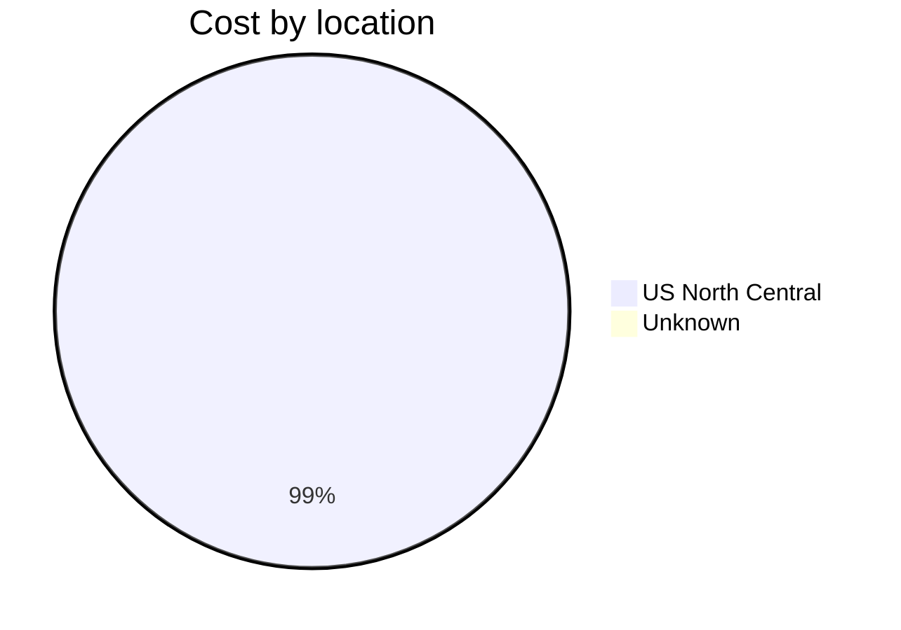
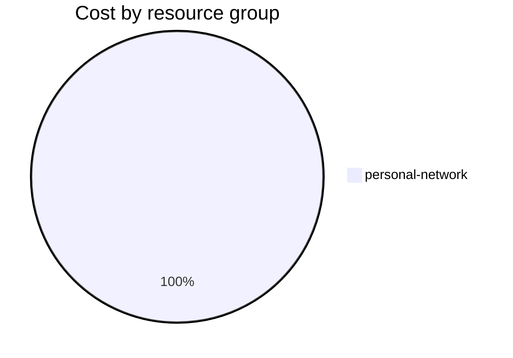

Fetching subscription details...
Fetching cost data...
Fetching forecasted cost data...
Fetching cost data by service name...
Fetching cost data by location...
Fetching cost data by resource group...
# Azure Cost Overview

> Accumulated cost for subscription id `JPF Pay-As-You-Go` from **02/01/2024** to **02/23/2024**

## Totals

|Period|Amount|
|---|---:|
|Today|0.03 USD|
|Yesterday|1.42 USD|
|Last 7 days|11.25 USD|
|Last 30 days|42.90 USD|

```mermaid
gantt
   title Accumulated cost
   dateFormat  X
   axisFormat %s
   section 01 Feb
   USD 2.32 :0, 232
   section 02 Feb
   USD 5.35 :0, 535
   section 03 Feb
   USD 7.82 :0, 782
   section 04 Feb
   USD 10.18 :0, 1018
   section 05 Feb
   USD 12.59 :0, 1259
   section 06 Feb
   USD 14.76 :0, 1476
   section 07 Feb
   USD 17.01 :0, 1701
   section 08 Feb
   USD 19.77 :0, 1977
   section 09 Feb
   USD 21.87 :0, 2187
   section 10 Feb
   USD 23.61 :0, 2361
   section 11 Feb
   USD 25.11 :0, 2511
   section 12 Feb
   USD 26.60 :0, 2660
   section 13 Feb
   USD 28.35 :0, 2835
   section 14 Feb
   USD 30.03 :0, 3003
   section 15 Feb
   USD 31.65 :0, 3165
   section 16 Feb
   USD 33.38 :0, 3338
   section 17 Feb
   USD 34.94 :0, 3494
   section 18 Feb
   USD 36.56 :0, 3656
   section 19 Feb
   USD 38.19 :0, 3819
   section 20 Feb
   USD 39.85 :0, 3985
   section 21 Feb
   USD 41.45 :0, 4145
   section 22 Feb
   USD 42.87 :0, 4287
   section 23 Feb
   USD 42.90 :0, 4290
   section 24 Feb
   USD 44.58 : done, 0, 4458
   section 25 Feb
   USD 46.00 : done, 0, 4600
   section 26 Feb
   USD 47.09 : done, 0, 4709
   section 27 Feb
   USD 48.52 : done, 0, 4852
   section 28 Feb
   USD 49.80 : done, 0, 4980
   section 29 Feb
   USD 51.33 : done, 0, 5133
```

## By Service Name

|Service|Amount|
|---|---:|
|Storage|19.93 USD|
|Bandwidth|9.63 USD|
|Virtual Machines|7.82 USD|
|Virtual Network|5.26 USD|
|Azure DNS|0.35 USD|

## By Location

|Location|Amount|
|---|---:|
|US North Central|42.63 USD|
|Unknown|0.35 USD|

## By Resource Group

|Resource Group|Amount|
|---|---:|
|personal-network|42.98 USD|

Generated at 2024-02-23 11:07:54 for subscription with id `4913be3f-a345-4652-9bba-767418dd25e3`
