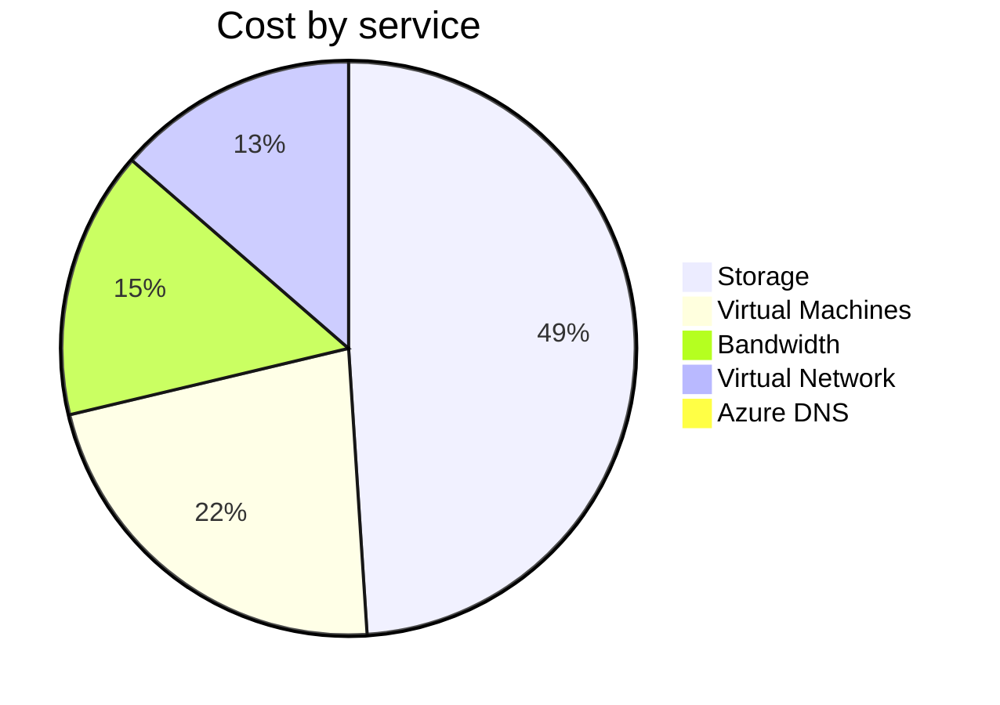
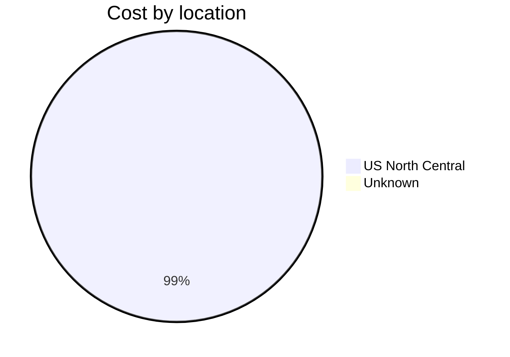
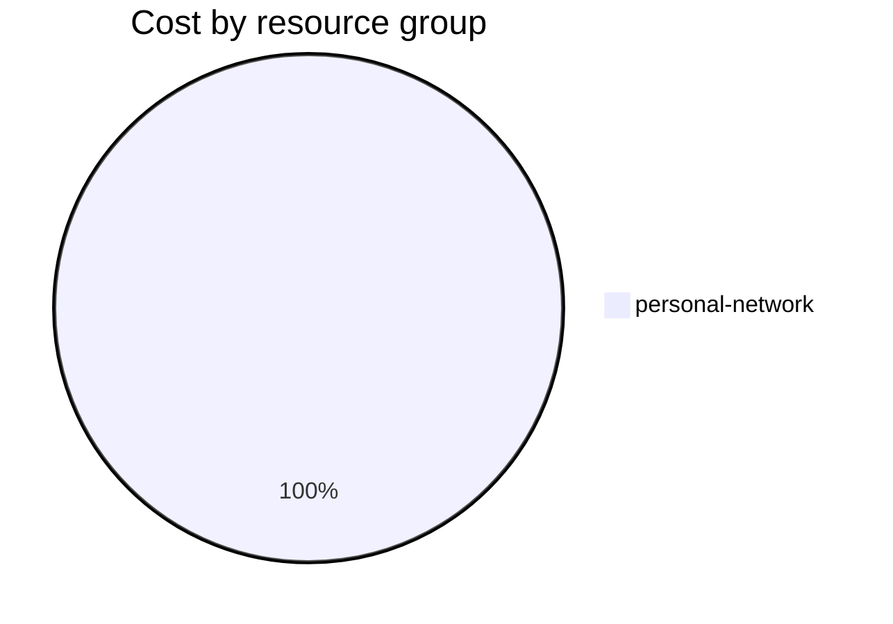

Fetching subscription details...
Fetching cost data...
Fetching forecasted cost data...
Fetching cost data by service name...
Fetching cost data by location...
Fetching cost data by resource group...
# Azure Cost Overview

> Accumulated cost for subscription id `JPF Pay-As-You-Go` from **11/01/2023** to **11/06/2023**

## Totals

|Period|Amount|
|---|---:|
|Today|0.08 USD|
|Yesterday|1.61 USD|
|Last 7 days|8.82 USD|
|Last 30 days|8.82 USD|

```mermaid
gantt
   title Accumulated cost
   dateFormat  X
   axisFormat %s
   section 01 Nov
   USD 1.79 :0, 179
   section 02 Nov
   USD 3.47 :0, 347
   section 03 Nov
   USD 5.39 :0, 539
   section 04 Nov
   USD 7.14 :0, 714
   section 05 Nov
   USD 8.75 :0, 875
   section 06 Nov
   USD 8.82 :0, 882
   section 07 Nov
   USD 10.55 : done, 0, 1055
   section 08 Nov
   USD 12.28 : done, 0, 1228
   section 09 Nov
   USD 14.01 : done, 0, 1401
   section 10 Nov
   USD 15.82 : done, 0, 1582
   section 11 Nov
   USD 17.56 : done, 0, 1756
   section 12 Nov
   USD 19.05 : done, 0, 1905
   section 13 Nov
   USD 20.67 : done, 0, 2067
   section 14 Nov
   USD 22.38 : done, 0, 2238
   section 15 Nov
   USD 24.11 : done, 0, 2411
   section 16 Nov
   USD 25.82 : done, 0, 2582
   section 17 Nov
   USD 27.62 : done, 0, 2762
   section 18 Nov
   USD 29.35 : done, 0, 2935
   section 19 Nov
   USD 30.82 : done, 0, 3082
   section 20 Nov
   USD 32.43 : done, 0, 3243
   section 21 Nov
   USD 34.14 : done, 0, 3414
   section 22 Nov
   USD 35.85 : done, 0, 3585
   section 23 Nov
   USD 37.55 : done, 0, 3755
   section 24 Nov
   USD 39.34 : done, 0, 3934
   section 25 Nov
   USD 41.06 : done, 0, 4106
   section 26 Nov
   USD 42.52 : done, 0, 4252
   section 27 Nov
   USD 44.12 : done, 0, 4412
   section 28 Nov
   USD 45.81 : done, 0, 4581
   section 29 Nov
   USD 47.51 : done, 0, 4751
   section 30 Nov
   USD 49.20 : done, 0, 4920
```

## By Service Name

|Service|Amount|
|---|---:|
|Storage|4.28 USD|
|Virtual Machines|1.95 USD|
|Bandwidth|1.32 USD|
|Virtual Network|1.19 USD|
|Azure DNS|0.08 USD|

## By Location

|Location|Amount|
|---|---:|
|US North Central|8.74 USD|
|Unknown|0.08 USD|

## By Resource Group

|Resource Group|Amount|
|---|---:|
|personal-network|8.82 USD|

Generated at 2023-11-06 11:06:15 for subscription with id `4913be3f-a345-4652-9bba-767418dd25e3`
