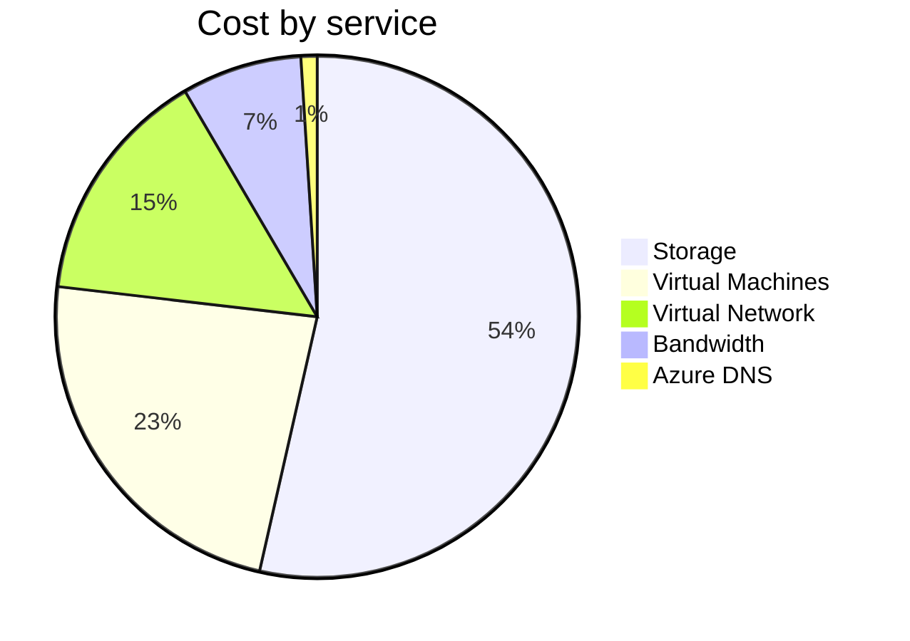
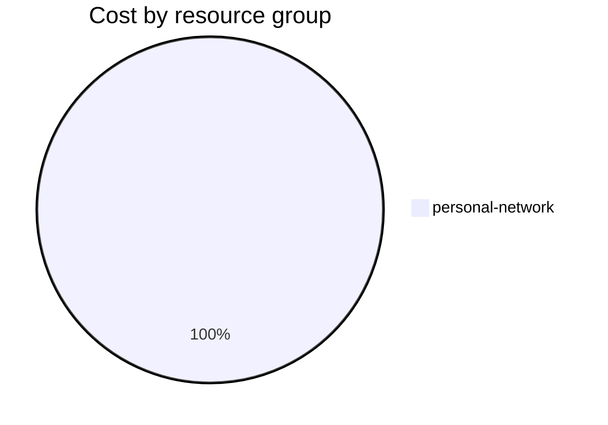

Fetching subscription details...
Fetching cost data...
Fetching forecasted cost data...
Fetching cost data by service name...
Fetching cost data by location...
Fetching cost data by resource group...
# Azure Cost Overview

> Accumulated cost for subscription id `JPF Pay-As-You-Go` from **11/01/2023** to **11/25/2023**

## Totals

|Period|Amount|
|---|---:|
|Today|0.09 USD|
|Yesterday|1.37 USD|
|Last 7 days|10.63 USD|
|Last 30 days|38.92 USD|

```mermaid
gantt
   title Accumulated cost
   dateFormat  X
   axisFormat %s
   section 01 Nov
   USD 1.83 :0, 183
   section 02 Nov
   USD 3.53 :0, 353
   section 03 Nov
   USD 5.51 :0, 551
   section 04 Nov
   USD 7.30 :0, 730
   section 05 Nov
   USD 9.02 :0, 902
   section 06 Nov
   USD 10.82 :0, 1082
   section 07 Nov
   USD 12.56 :0, 1256
   section 08 Nov
   USD 14.39 :0, 1439
   section 09 Nov
   USD 16.18 :0, 1618
   section 10 Nov
   USD 17.70 :0, 1770
   section 11 Nov
   USD 19.21 :0, 1921
   section 12 Nov
   USD 20.73 :0, 2073
   section 13 Nov
   USD 22.25 :0, 2225
   section 14 Nov
   USD 23.74 :0, 2374
   section 15 Nov
   USD 25.26 :0, 2526
   section 16 Nov
   USD 26.77 :0, 2677
   section 17 Nov
   USD 28.29 :0, 2829
   section 18 Nov
   USD 29.80 :0, 2980
   section 19 Nov
   USD 31.31 :0, 3131
   section 20 Nov
   USD 32.84 :0, 3284
   section 21 Nov
   USD 34.40 :0, 3440
   section 22 Nov
   USD 35.91 :0, 3591
   section 23 Nov
   USD 37.45 :0, 3745
   section 24 Nov
   USD 38.82 :0, 3882
   section 25 Nov
   USD 38.92 :0, 3892
   section 26 Nov
   USD 40.31 : done, 0, 4031
   section 27 Nov
   USD 41.75 : done, 0, 4175
   section 28 Nov
   USD 43.24 : done, 0, 4324
   section 29 Nov
   USD 44.75 : done, 0, 4475
   section 30 Nov
   USD 46.22 : done, 0, 4622
```

## By Service Name

|Service|Amount|
|---|---:|
|Storage|20.84 USD|
|Virtual Machines|9.07 USD|
|Virtual Network|5.73 USD|
|Bandwidth|2.89 USD|
|Azure DNS|0.39 USD|

## By Location

|Location|Amount|
|---|---:|
|US North Central|38.53 USD|
|Unknown|0.39 USD|

## By Resource Group

|Resource Group|Amount|
|---|---:|
|personal-network|38.92 USD|

Generated at 2023-11-25 11:07:09 for subscription with id `4913be3f-a345-4652-9bba-767418dd25e3`
