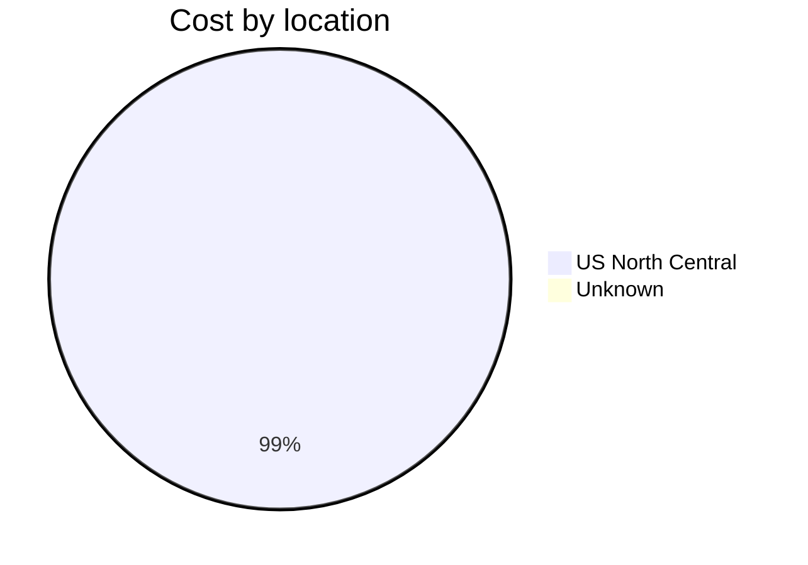
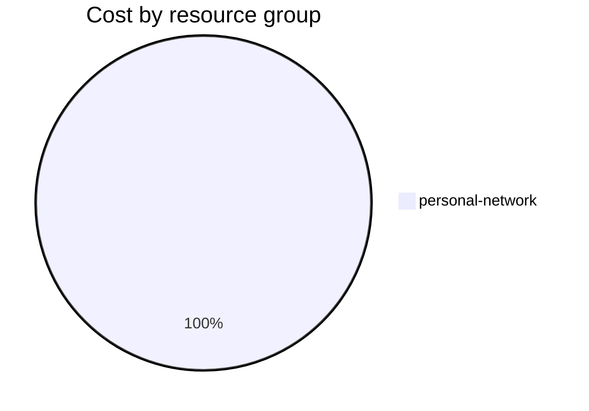

Fetching subscription details...
Fetching cost data...
Fetching forecasted cost data...
Fetching cost data by service name...
Fetching cost data by location...
Fetching cost data by resource group...
# Azure Cost Overview

> Accumulated cost for subscription id `JPF Pay-As-You-Go` from **02/01/2024** to **02/11/2024**

## Totals

|Period|Amount|
|---|---:|
|Today|0.09 USD|
|Yesterday|1.43 USD|
|Last 7 days|15.56 USD|
|Last 30 days|23.38 USD|

```mermaid
gantt
   title Accumulated cost
   dateFormat  X
   axisFormat %s
   section 01 Feb
   USD 2.32 :0, 232
   section 02 Feb
   USD 5.34 :0, 534
   section 03 Feb
   USD 7.82 :0, 782
   section 04 Feb
   USD 10.18 :0, 1018
   section 05 Feb
   USD 12.59 :0, 1259
   section 06 Feb
   USD 14.75 :0, 1475
   section 07 Feb
   USD 17.01 :0, 1701
   section 08 Feb
   USD 19.77 :0, 1977
   section 09 Feb
   USD 21.86 :0, 2186
   section 10 Feb
   USD 23.29 :0, 2329
   section 11 Feb
   USD 23.38 :0, 2338
   section 12 Feb
   USD 25.55 : done, 0, 2555
   section 13 Feb
   USD 27.93 : done, 0, 2793
   section 14 Feb
   USD 30.20 : done, 0, 3020
   section 15 Feb
   USD 32.68 : done, 0, 3268
   section 16 Feb
   USD 35.14 : done, 0, 3514
   section 17 Feb
   USD 38.18 : done, 0, 3818
   section 18 Feb
   USD 40.62 : done, 0, 4062
   section 19 Feb
   USD 42.84 : done, 0, 4284
   section 20 Feb
   USD 45.27 : done, 0, 4527
   section 21 Feb
   USD 47.60 : done, 0, 4760
   section 22 Feb
   USD 50.13 : done, 0, 5013
   section 23 Feb
   USD 52.65 : done, 0, 5265
   section 24 Feb
   USD 55.74 : done, 0, 5574
   section 25 Feb
   USD 58.24 : done, 0, 5824
   section 26 Feb
   USD 60.51 : done, 0, 6051
   section 27 Feb
   USD 63.00 : done, 0, 6300
   section 28 Feb
   USD 65.38 : done, 0, 6538
   section 29 Feb
   USD 67.96 : done, 0, 6796
```

## By Service Name

|Service|Amount|
|---|---:|
|Storage|9.09 USD|
|Bandwidth|8.16 USD|
|Virtual Machines|3.59 USD|
|Virtual Network|2.38 USD|
|Azure DNS|0.16 USD|

## By Location

|Location|Amount|
|---|---:|
|US North Central|23.22 USD|
|Unknown|0.16 USD|

## By Resource Group

|Resource Group|Amount|
|---|---:|
|personal-network|23.38 USD|

Generated at 2024-02-11 11:07:44 for subscription with id `4913be3f-a345-4652-9bba-767418dd25e3`
