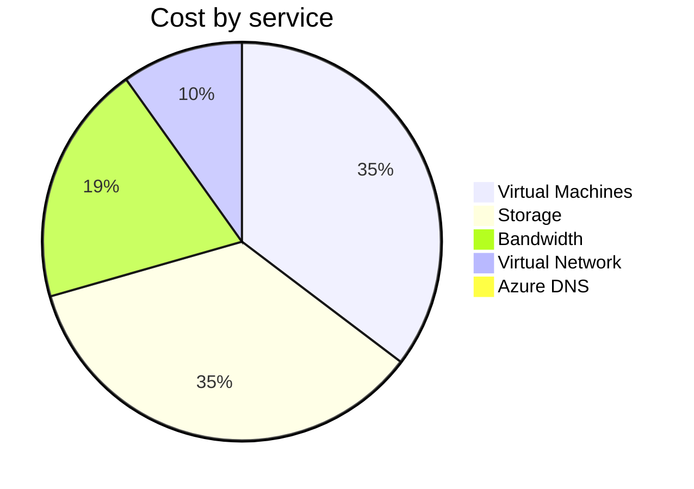
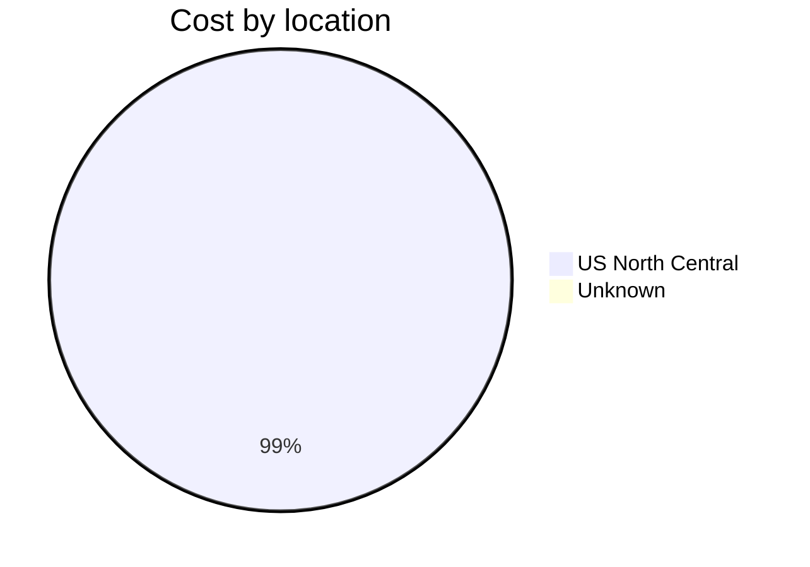
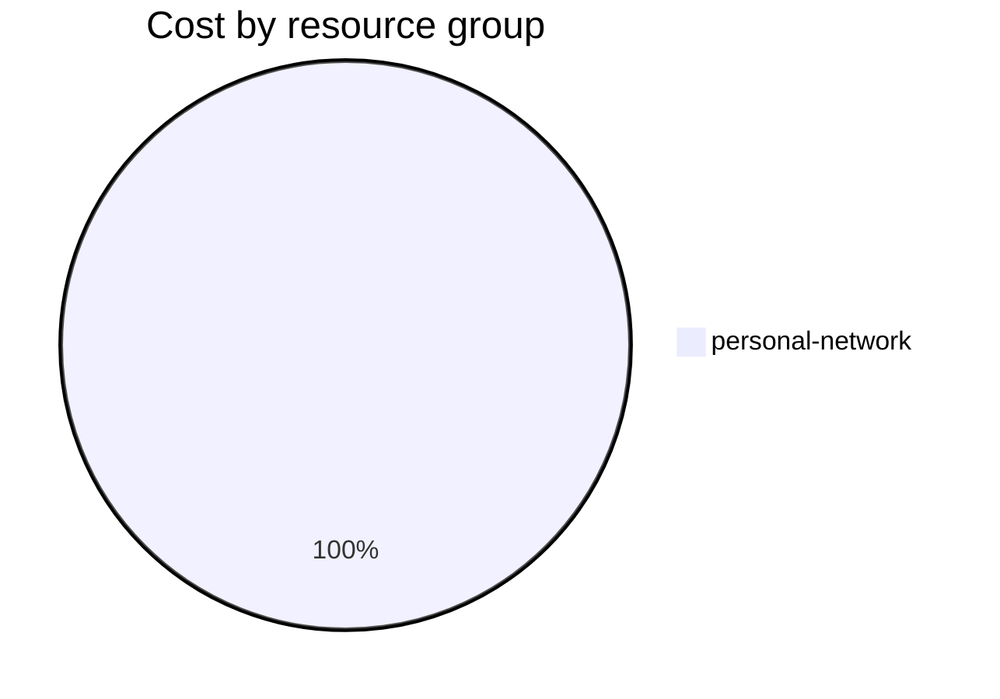

Fetching subscription details...
Fetching cost data...
Fetching forecasted cost data...
Fetching cost data by service name...
Fetching cost data by location...
Fetching cost data by resource group...
# Azure Cost Overview

> Accumulated cost for subscription id `JPF Pay-As-You-Go` from **01/01/2024** to **01/07/2024**

## Totals

|Period|Amount|
|---|---:|
|Today|0.21 USD|
|Yesterday|2.54 USD|
|Last 7 days|14.70 USD|
|Last 30 days|14.70 USD|

```mermaid
gantt
   title Accumulated cost
   dateFormat  X
   axisFormat %s
   section 01 Jan
   USD 2.37 :0, 237
   section 02 Jan
   USD 5.16 :0, 516
   section 03 Jan
   USD 7.35 :0, 735
   section 04 Jan
   USD 9.64 :0, 964
   section 05 Jan
   USD 11.95 :0, 1195
   section 06 Jan
   USD 14.49 :0, 1449
   section 07 Jan
   USD 14.70 :0, 1470
   section 08 Jan
   USD 17.11 : done, 0, 1711
   section 09 Jan
   USD 19.53 : done, 0, 1953
   section 10 Jan
   USD 21.66 : done, 0, 2166
   section 11 Jan
   USD 23.78 : done, 0, 2378
   section 12 Jan
   USD 25.80 : done, 0, 2580
   section 13 Jan
   USD 27.97 : done, 0, 2797
   section 14 Jan
   USD 30.23 : done, 0, 3023
   section 15 Jan
   USD 32.64 : done, 0, 3264
   section 16 Jan
   USD 35.06 : done, 0, 3506
   section 17 Jan
   USD 37.19 : done, 0, 3719
   section 18 Jan
   USD 39.31 : done, 0, 3931
   section 19 Jan
   USD 41.33 : done, 0, 4133
   section 20 Jan
   USD 43.50 : done, 0, 4350
   section 21 Jan
   USD 45.76 : done, 0, 4576
   section 22 Jan
   USD 48.17 : done, 0, 4817
   section 23 Jan
   USD 50.59 : done, 0, 5059
   section 24 Jan
   USD 52.72 : done, 0, 5272
   section 25 Jan
   USD 54.85 : done, 0, 5485
   section 26 Jan
   USD 56.87 : done, 0, 5687
   section 27 Jan
   USD 59.04 : done, 0, 5904
   section 28 Jan
   USD 61.29 : done, 0, 6129
   section 29 Jan
   USD 63.71 : done, 0, 6371
   section 30 Jan
   USD 66.13 : done, 0, 6613
   section 31 Jan
   USD 68.26 : done, 0, 6826
```

## By Service Name

|Service|Amount|
|---|---:|
|Virtual Machines|5.16 USD|
|Storage|5.15 USD|
|Bandwidth|2.86 USD|
|Virtual Network|1.44 USD|
|Azure DNS|0.10 USD|

## By Location

|Location|Amount|
|---|---:|
|US North Central|14.60 USD|
|Unknown|0.10 USD|

## By Resource Group

|Resource Group|Amount|
|---|---:|
|personal-network|14.70 USD|

Generated at 2024-01-07 11:07:39 for subscription with id `4913be3f-a345-4652-9bba-767418dd25e3`
