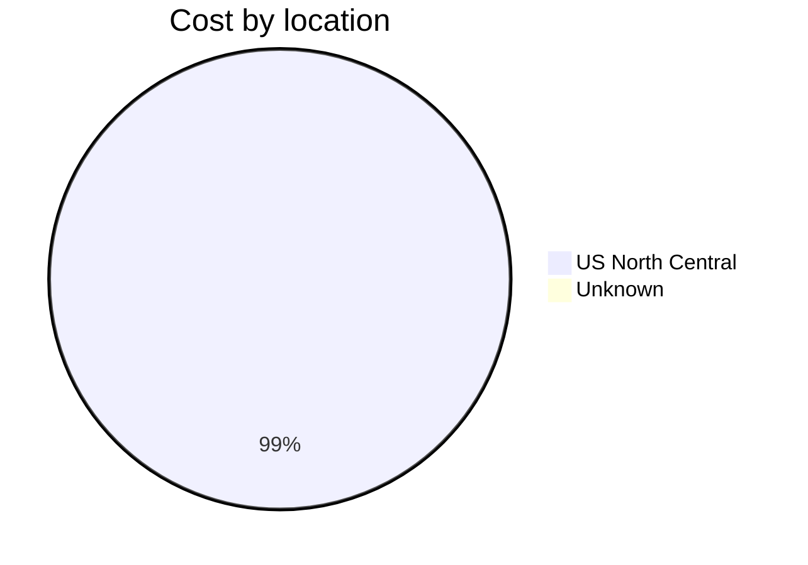
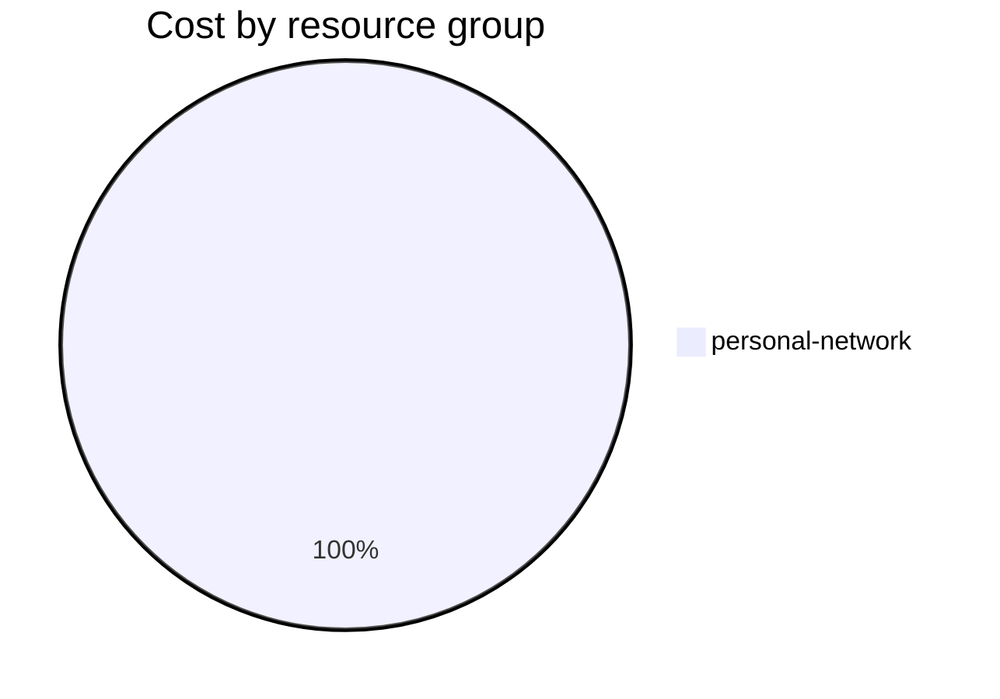

Fetching subscription details...
Fetching cost data...
Fetching forecasted cost data...
Fetching cost data by service name...
Fetching cost data by location...
Fetching cost data by resource group...
# Azure Cost Overview

> Accumulated cost for subscription id `JPF Pay-As-You-Go` from **10/01/2023** to **10/22/2023**

## Totals

|Period|Amount|
|---|---:|
|Today|0.12 USD|
|Yesterday|1.45 USD|
|Last 7 days|10.82 USD|
|Last 30 days|36.19 USD|

```mermaid
gantt
   title Accumulated cost
   dateFormat  X
   axisFormat %s
   section 01 Oct
   USD 3.16 :0, 316
   section 02 Oct
   USD 5.72 :0, 572
   section 03 Oct
   USD 7.55 :0, 755
   section 04 Oct
   USD 9.41 :0, 941
   section 05 Oct
   USD 11.15 :0, 1115
   section 06 Oct
   USD 13.05 :0, 1305
   section 07 Oct
   USD 14.85 :0, 1485
   section 08 Oct
   USD 16.35 :0, 1635
   section 09 Oct
   USD 17.95 :0, 1795
   section 10 Oct
   USD 19.44 :0, 1944
   section 11 Oct
   USD 20.93 :0, 2093
   section 12 Oct
   USD 22.43 :0, 2243
   section 13 Oct
   USD 23.93 :0, 2393
   section 14 Oct
   USD 25.37 :0, 2537
   section 15 Oct
   USD 26.82 :0, 2682
   section 16 Oct
   USD 28.35 :0, 2835
   section 17 Oct
   USD 29.91 :0, 2991
   section 18 Oct
   USD 31.48 :0, 3148
   section 19 Oct
   USD 33.04 :0, 3304
   section 20 Oct
   USD 34.62 :0, 3462
   section 21 Oct
   USD 36.07 :0, 3607
   section 22 Oct
   USD 36.19 :0, 3619
   section 23 Oct
   USD 37.16 : done, 0, 3716
   section 24 Oct
   USD 37.68 : done, 0, 3768
   section 25 Oct
   USD 38.13 : done, 0, 3813
   section 26 Oct
   USD 38.44 : done, 0, 3844
   section 27 Oct
   USD 38.92 : done, 0, 3892
   section 28 Oct
   USD 39.83 : done, 0, 3983
   section 29 Oct
   USD 40.53 : done, 0, 4053
   section 30 Oct
   USD 40.95 : done, 0, 4095
   section 31 Oct
   USD 40.95 : done, 0, 4095
```

## By Service Name

|Service|Amount|
|---|---:|
|Storage|19.70 USD|
|Virtual Machines|7.60 USD|
|Virtual Network|5.02 USD|
|Bandwidth|3.53 USD|
|Azure DNS|0.34 USD|

## By Location

|Location|Amount|
|---|---:|
|US North Central|35.85 USD|
|Unknown|0.34 USD|

## By Resource Group

|Resource Group|Amount|
|---|---:|
|personal-network|36.19 USD|

Generated at 2023-10-22 11:08:14 for subscription with id `4913be3f-a345-4652-9bba-767418dd25e3`
