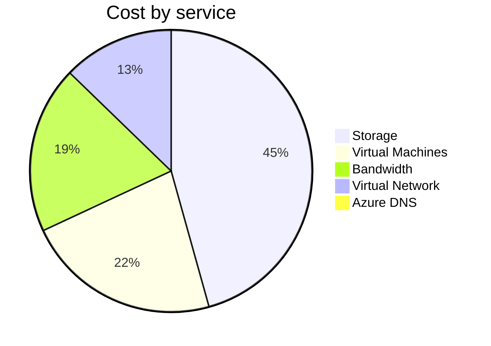
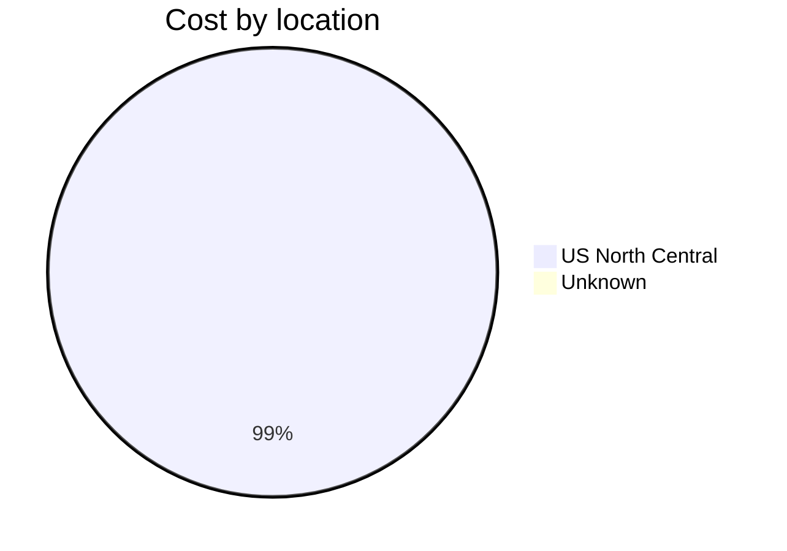
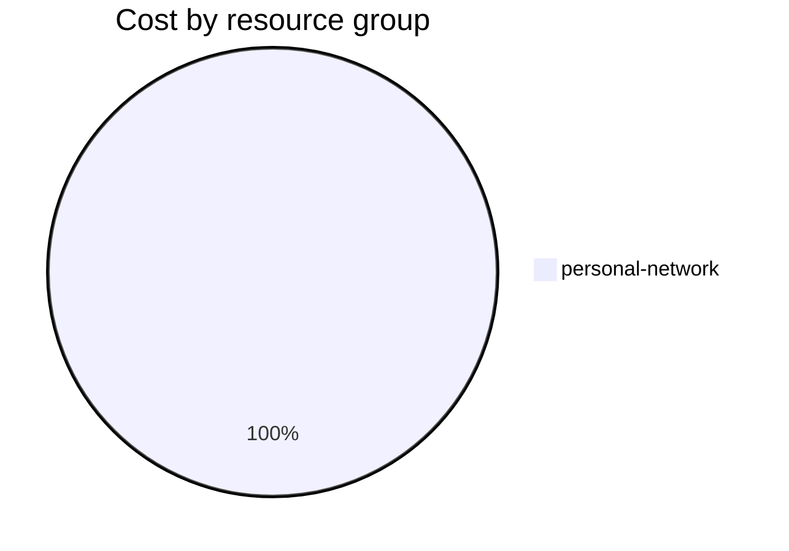

Fetching subscription details...
Fetching cost data...
Fetching forecasted cost data...
Fetching cost data by service name...
Fetching cost data by location...
Fetching cost data by resource group...
# Azure Cost Overview

> Accumulated cost for subscription id `JPF Pay-As-You-Go` from **01/01/2024** to **01/14/2024**

## Totals

|Period|Amount|
|---|---:|
|Today|0.10 USD|
|Yesterday|1.49 USD|
|Last 7 days|12.20 USD|
|Last 30 days|24.60 USD|

```mermaid
gantt
   title Accumulated cost
   dateFormat  X
   axisFormat %s
   section 01 Jan
   USD 2.01 :0, 201
   section 02 Jan
   USD 4.48 :0, 448
   section 03 Jan
   USD 6.29 :0, 629
   section 04 Jan
   USD 8.20 :0, 820
   section 05 Jan
   USD 10.14 :0, 1014
   section 06 Jan
   USD 12.40 :0, 1240
   section 07 Jan
   USD 14.14 :0, 1414
   section 08 Jan
   USD 16.56 :0, 1656
   section 09 Jan
   USD 18.46 :0, 1846
   section 10 Jan
   USD 19.98 :0, 1998
   section 11 Jan
   USD 21.50 :0, 2150
   section 12 Jan
   USD 23.01 :0, 2301
   section 13 Jan
   USD 24.50 :0, 2450
   section 14 Jan
   USD 24.60 :0, 2460
   section 15 Jan
   USD 26.81 : done, 0, 2681
   section 16 Jan
   USD 29.07 : done, 0, 2907
   section 17 Jan
   USD 30.86 : done, 0, 3086
   section 18 Jan
   USD 32.66 : done, 0, 3266
   section 19 Jan
   USD 34.49 : done, 0, 3449
   section 20 Jan
   USD 36.72 : done, 0, 3672
   section 21 Jan
   USD 38.76 : done, 0, 3876
   section 22 Jan
   USD 41.04 : done, 0, 4104
   section 23 Jan
   USD 43.37 : done, 0, 4337
   section 24 Jan
   USD 45.24 : done, 0, 4524
   section 25 Jan
   USD 47.11 : done, 0, 4711
   section 26 Jan
   USD 49.02 : done, 0, 4902
   section 27 Jan
   USD 51.32 : done, 0, 5132
   section 28 Jan
   USD 53.43 : done, 0, 5343
   section 29 Jan
   USD 55.79 : done, 0, 5579
   section 30 Jan
   USD 58.20 : done, 0, 5820
   section 31 Jan
   USD 60.14 : done, 0, 6014
```

## By Service Name

|Service|Amount|
|---|---:|
|Storage|11.14 USD|
|Virtual Machines|5.46 USD|
|Bandwidth|4.68 USD|
|Virtual Network|3.11 USD|
|Azure DNS|0.21 USD|

## By Location

|Location|Amount|
|---|---:|
|US North Central|24.39 USD|
|Unknown|0.21 USD|

## By Resource Group

|Resource Group|Amount|
|---|---:|
|personal-network|24.60 USD|

Generated at 2024-01-14 11:04:48 for subscription with id `4913be3f-a345-4652-9bba-767418dd25e3`
