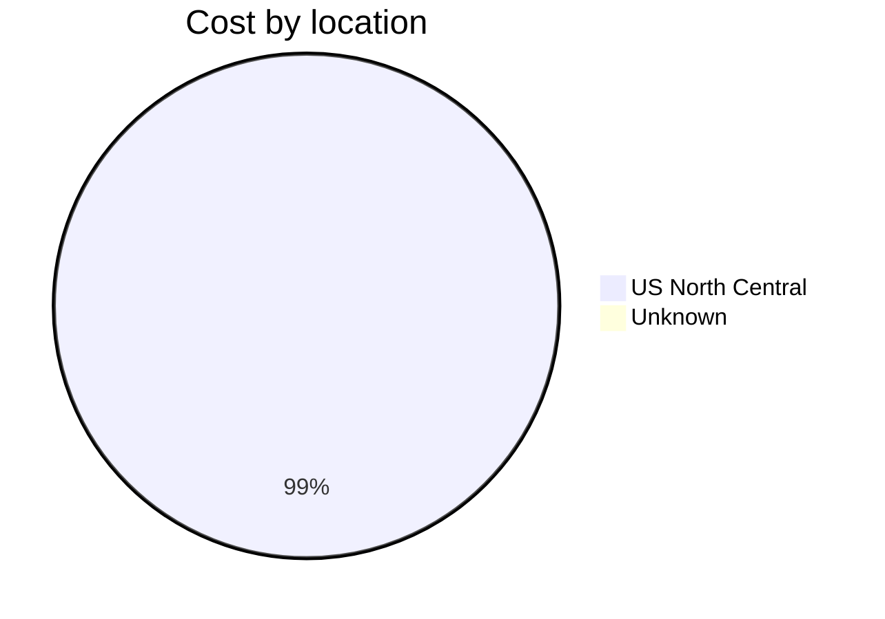
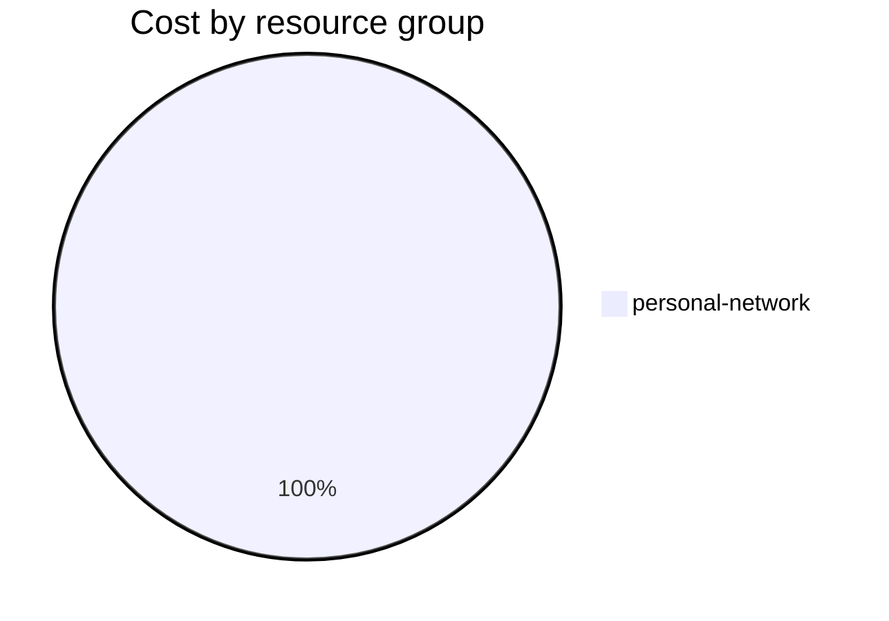

Fetching subscription details...
Fetching cost data...
Fetching forecasted cost data...
Fetching cost data by service name...
Fetching cost data by location...
Fetching cost data by resource group...
# Azure Cost Overview

> Accumulated cost for subscription id `JPF Pay-As-You-Go` from **11/01/2023** to **11/10/2023**

## Totals

|Period|Amount|
|---|---:|
|Today|0.09 USD|
|Yesterday|1.75 USD|
|Last 7 days|12.69 USD|
|Last 30 days|16.23 USD|

```mermaid
gantt
   title Accumulated cost
   dateFormat  X
   axisFormat %s
   section 01 Nov
   USD 1.83 :0, 183
   section 02 Nov
   USD 3.54 :0, 354
   section 03 Nov
   USD 5.51 :0, 551
   section 04 Nov
   USD 7.30 :0, 730
   section 05 Nov
   USD 9.02 :0, 902
   section 06 Nov
   USD 10.82 :0, 1082
   section 07 Nov
   USD 12.56 :0, 1256
   section 08 Nov
   USD 14.39 :0, 1439
   section 09 Nov
   USD 16.14 :0, 1614
   section 10 Nov
   USD 16.23 :0, 1623
   section 11 Nov
   USD 17.91 : done, 0, 1791
   section 12 Nov
   USD 19.44 : done, 0, 1944
   section 13 Nov
   USD 21.18 : done, 0, 2118
   section 14 Nov
   USD 22.94 : done, 0, 2294
   section 15 Nov
   USD 24.77 : done, 0, 2477
   section 16 Nov
   USD 26.53 : done, 0, 2653
   section 17 Nov
   USD 28.39 : done, 0, 2839
   section 18 Nov
   USD 30.06 : done, 0, 3006
   section 19 Nov
   USD 31.58 : done, 0, 3158
   section 20 Nov
   USD 33.30 : done, 0, 3330
   section 21 Nov
   USD 35.06 : done, 0, 3506
   section 22 Nov
   USD 36.87 : done, 0, 3687
   section 23 Nov
   USD 38.62 : done, 0, 3862
   section 24 Nov
   USD 40.47 : done, 0, 4047
   section 25 Nov
   USD 42.12 : done, 0, 4212
   section 26 Nov
   USD 43.63 : done, 0, 4363
   section 27 Nov
   USD 45.34 : done, 0, 4534
   section 28 Nov
   USD 47.08 : done, 0, 4708
   section 29 Nov
   USD 48.88 : done, 0, 4888
   section 30 Nov
   USD 50.62 : done, 0, 5062
```

## By Service Name

|Service|Amount|
|---|---:|
|Storage|7.80 USD|
|Virtual Machines|3.46 USD|
|Bandwidth|2.66 USD|
|Virtual Network|2.16 USD|
|Azure DNS|0.14 USD|

## By Location

|Location|Amount|
|---|---:|
|US North Central|16.08 USD|
|Unknown|0.14 USD|

## By Resource Group

|Resource Group|Amount|
|---|---:|
|personal-network|16.23 USD|

Generated at 2023-11-10 11:05:08 for subscription with id `4913be3f-a345-4652-9bba-767418dd25e3`
