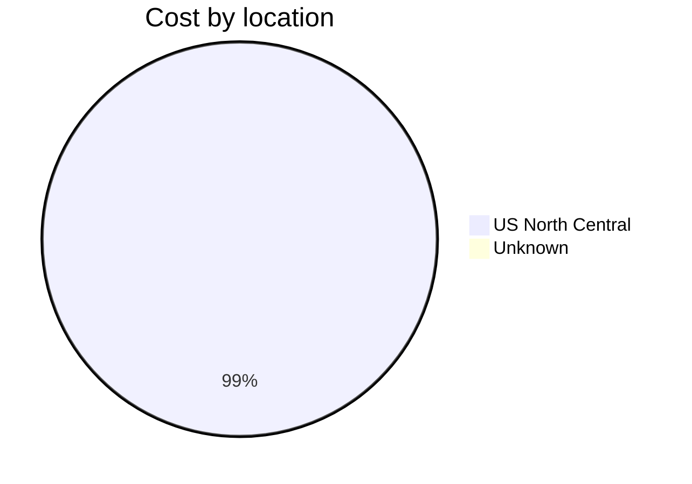
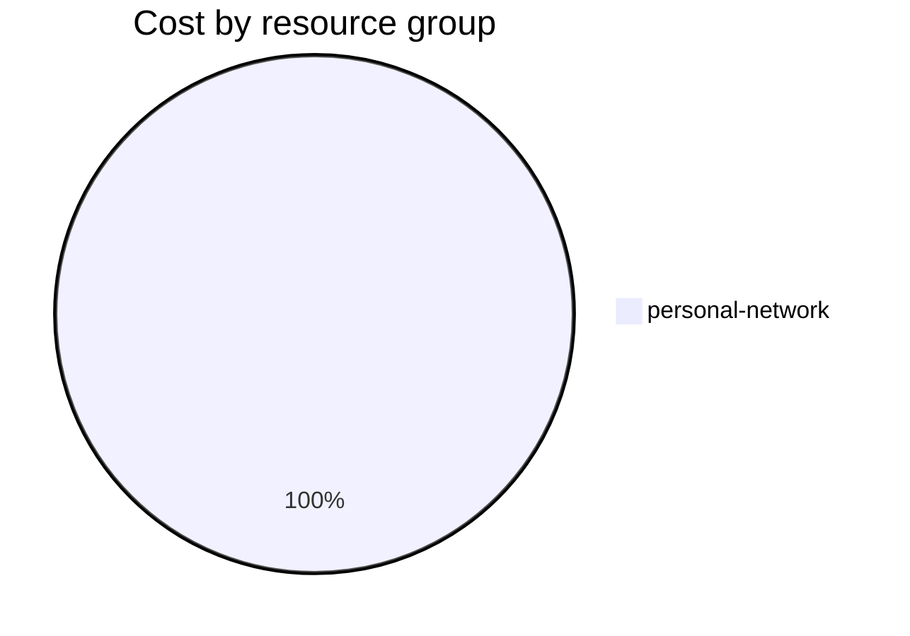

Fetching subscription details...
Fetching cost data...
Fetching forecasted cost data...
Fetching cost data by service name...
Fetching cost data by location...
Fetching cost data by resource group...
# Azure Cost Overview

> Accumulated cost for subscription id `JPF Pay-As-You-Go` from **11/01/2023** to **11/27/2023**

## Totals

|Period|Amount|
|---|---:|
|Today|0.09 USD|
|Yesterday|1.48 USD|
|Last 7 days|11.21 USD|
|Last 30 days|43.00 USD|

```mermaid
gantt
   title Accumulated cost
   dateFormat  X
   axisFormat %s
   section 01 Nov
   USD 1.83 :0, 183
   section 02 Nov
   USD 3.53 :0, 353
   section 03 Nov
   USD 5.51 :0, 551
   section 04 Nov
   USD 7.30 :0, 730
   section 05 Nov
   USD 9.02 :0, 902
   section 06 Nov
   USD 10.82 :0, 1082
   section 07 Nov
   USD 12.56 :0, 1256
   section 08 Nov
   USD 14.39 :0, 1439
   section 09 Nov
   USD 16.19 :0, 1619
   section 10 Nov
   USD 17.75 :0, 1775
   section 11 Nov
   USD 19.31 :0, 1931
   section 12 Nov
   USD 20.90 :0, 2090
   section 13 Nov
   USD 22.49 :0, 2249
   section 14 Nov
   USD 23.99 :0, 2399
   section 15 Nov
   USD 25.56 :0, 2556
   section 16 Nov
   USD 27.11 :0, 2711
   section 17 Nov
   USD 28.68 :0, 2868
   section 18 Nov
   USD 30.23 :0, 3023
   section 19 Nov
   USD 31.79 :0, 3179
   section 20 Nov
   USD 33.38 :0, 3338
   section 21 Nov
   USD 35.07 :0, 3507
   section 22 Nov
   USD 36.63 :0, 3663
   section 23 Nov
   USD 38.26 :0, 3826
   section 24 Nov
   USD 39.84 :0, 3984
   section 25 Nov
   USD 41.43 :0, 4143
   section 26 Nov
   USD 42.91 :0, 4291
   section 27 Nov
   USD 43.00 :0, 4300
   section 28 Nov
   USD 44.63 : done, 0, 4463
   section 29 Nov
   USD 46.25 : done, 0, 4625
   section 30 Nov
   USD 47.82 : done, 0, 4782
```

## By Service Name

|Service|Amount|
|---|---:|
|Storage|22.65 USD|
|Virtual Machines|9.82 USD|
|Virtual Network|6.23 USD|
|Bandwidth|3.87 USD|
|Azure DNS|0.42 USD|

## By Location

|Location|Amount|
|---|---:|
|US North Central|42.58 USD|
|Unknown|0.42 USD|

## By Resource Group

|Resource Group|Amount|
|---|---:|
|personal-network|43.00 USD|

Generated at 2023-11-27 11:07:15 for subscription with id `4913be3f-a345-4652-9bba-767418dd25e3`
