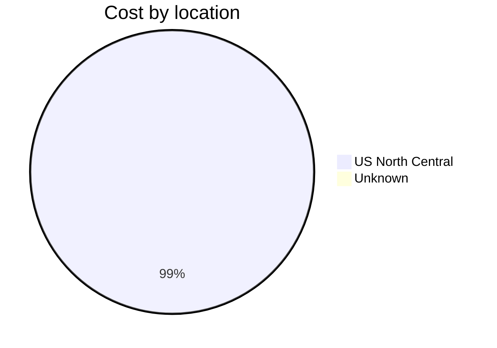
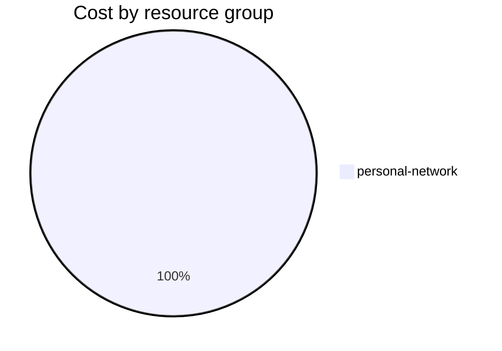

Fetching subscription details...
Fetching cost data...
Fetching forecasted cost data...
Fetching cost data by service name...
Fetching cost data by location...
Fetching cost data by resource group...
# Azure Cost Overview

> Accumulated cost for subscription id `JPF Pay-As-You-Go` from **01/01/2024** to **01/09/2024**

## Totals

|Period|Amount|
|---|---:|
|Today|0.10 USD|
|Yesterday|2.35 USD|
|Last 7 days|14.51 USD|
|Last 30 days|16.51 USD|

```mermaid
gantt
   title Accumulated cost
   dateFormat  X
   axisFormat %s
   section 01 Jan
   USD 2.00 :0, 200
   section 02 Jan
   USD 4.44 :0, 444
   section 03 Jan
   USD 6.24 :0, 624
   section 04 Jan
   USD 8.15 :0, 815
   section 05 Jan
   USD 10.08 :0, 1008
   section 06 Jan
   USD 12.32 :0, 1232
   section 07 Jan
   USD 14.06 :0, 1406
   section 08 Jan
   USD 16.41 :0, 1641
   section 09 Jan
   USD 16.51 :0, 1651
   section 10 Jan
   USD 18.20 : done, 0, 1820
   section 11 Jan
   USD 19.89 : done, 0, 1989
   section 12 Jan
   USD 21.63 : done, 0, 2163
   section 13 Jan
   USD 23.58 : done, 0, 2358
   section 14 Jan
   USD 25.37 : done, 0, 2537
   section 15 Jan
   USD 27.36 : done, 0, 2736
   section 16 Jan
   USD 29.36 : done, 0, 2936
   section 17 Jan
   USD 31.03 : done, 0, 3103
   section 18 Jan
   USD 32.72 : done, 0, 3272
   section 19 Jan
   USD 34.44 : done, 0, 3444
   section 20 Jan
   USD 36.39 : done, 0, 3639
   section 21 Jan
   USD 38.17 : done, 0, 3817
   section 22 Jan
   USD 40.15 : done, 0, 4015
   section 23 Jan
   USD 42.13 : done, 0, 4213
   section 24 Jan
   USD 43.80 : done, 0, 4380
   section 25 Jan
   USD 45.47 : done, 0, 4547
   section 26 Jan
   USD 47.18 : done, 0, 4718
   section 27 Jan
   USD 49.11 : done, 0, 4911
   section 28 Jan
   USD 50.89 : done, 0, 5089
   section 29 Jan
   USD 52.85 : done, 0, 5285
   section 30 Jan
   USD 54.83 : done, 0, 5483
   section 31 Jan
   USD 56.48 : done, 0, 5648
```

## By Service Name

|Service|Amount|
|---|---:|
|Storage|6.87 USD|
|Bandwidth|4.20 USD|
|Virtual Machines|3.40 USD|
|Virtual Network|1.91 USD|
|Azure DNS|0.13 USD|

## By Location

|Location|Amount|
|---|---:|
|US North Central|16.38 USD|
|Unknown|0.13 USD|

## By Resource Group

|Resource Group|Amount|
|---|---:|
|personal-network|16.51 USD|

Generated at 2024-01-09 11:08:12 for subscription with id `4913be3f-a345-4652-9bba-767418dd25e3`
