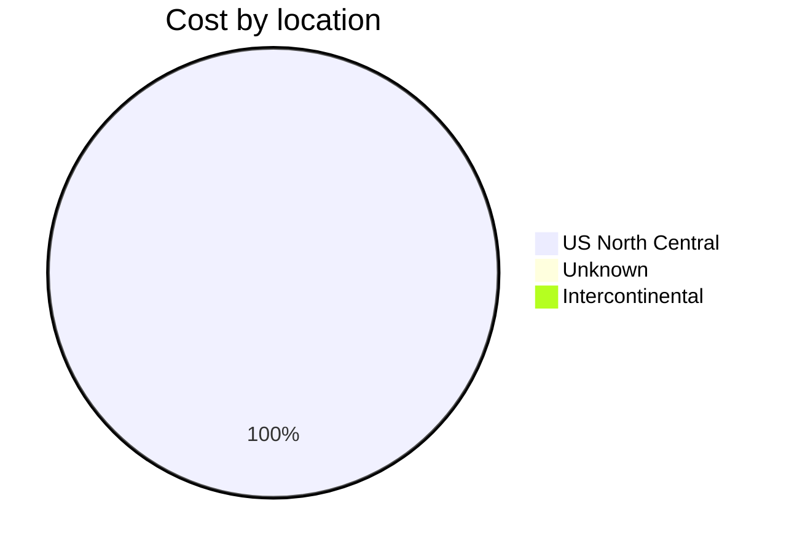
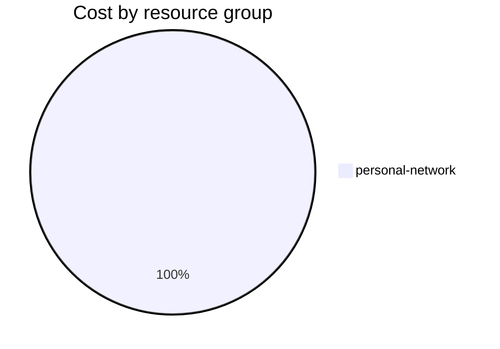

Fetching subscription details...
Fetching cost data...
Fetching forecasted cost data...
Fetching cost data by service name...
Fetching cost data by location...
Fetching cost data by resource group...
# Azure Cost Overview

> Accumulated cost for subscription id `JPF Pay-As-You-Go` from **09/01/2023** to **09/27/2023**

## Totals

|Period|Amount|
|---|---:|
|Today|0.03 USD|
|Yesterday|2.91 USD|
|Last 7 days|21.92 USD|
|Last 30 days|225.98 USD|

```mermaid
gantt
   title Accumulated cost
   dateFormat  X
   axisFormat %s
   section 01 Sep
   USD 3.20 :0, 320
   section 02 Sep
   USD 6.19 :0, 619
   section 03 Sep
   USD 9.27 :0, 927
   section 04 Sep
   USD 12.30 :0, 1230
   section 05 Sep
   USD 15.47 :0, 1547
   section 06 Sep
   USD 18.50 :0, 1850
   section 07 Sep
   USD 21.60 :0, 2160
   section 08 Sep
   USD 24.70 :0, 2470
   section 09 Sep
   USD 27.71 :0, 2771
   section 10 Sep
   USD 30.60 :0, 3060
   section 11 Sep
   USD 33.57 :0, 3357
   section 12 Sep
   USD 46.20 :0, 4620
   section 13 Sep
   USD 92.52 :0, 9252
   section 14 Sep
   USD 127.13 :0, 12713
   section 15 Sep
   USD 132.88 :0, 13288
   section 16 Sep
   USD 146.16 :0, 14616
   section 17 Sep
   USD 173.86 :0, 17386
   section 18 Sep
   USD 188.85 :0, 18885
   section 19 Sep
   USD 204.06 :0, 20406
   section 20 Sep
   USD 207.17 :0, 20717
   section 21 Sep
   USD 210.45 :0, 21045
   section 22 Sep
   USD 214.11 :0, 21411
   section 23 Sep
   USD 217.04 :0, 21704
   section 24 Sep
   USD 220.01 :0, 22001
   section 25 Sep
   USD 223.04 :0, 22304
   section 26 Sep
   USD 225.95 :0, 22595
   section 27 Sep
   USD 225.98 :0, 22598
   section 28 Sep
   USD 238.83 : done, 0, 23883
   section 29 Sep
   USD 252.25 : done, 0, 25225
   section 30 Sep
   USD 265.56 : done, 0, 26556
```

## By Service Name

|Service|Amount|
|---|---:|
|Storage|196.46 USD|
|Virtual Machines|9.56 USD|
|Virtual Network|8.78 USD|
|Bandwidth|7.05 USD|
|Security Center|3.70 USD|
|Azure DNS|0.42 USD|
|Advanced Threat Protection|0.00 USD|

## By Location

|Location|Amount|
|---|---:|
|US North Central|225.56 USD|
|Unknown|0.42 USD|
|Intercontinental|0.00 USD|

## By Resource Group

|Resource Group|Amount|
|---|---:|
|personal-network|225.98 USD|

Generated at 2023-09-27 11:08:24 for subscription with id `4913be3f-a345-4652-9bba-767418dd25e3`
