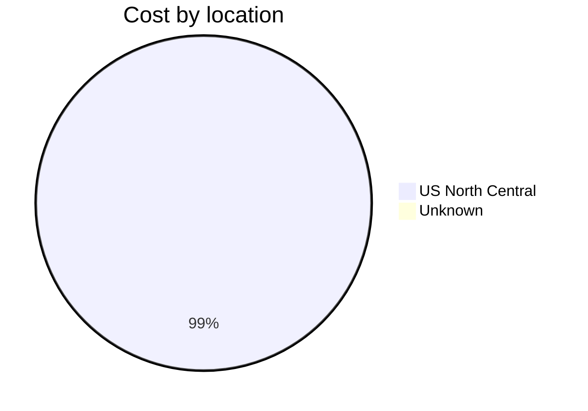
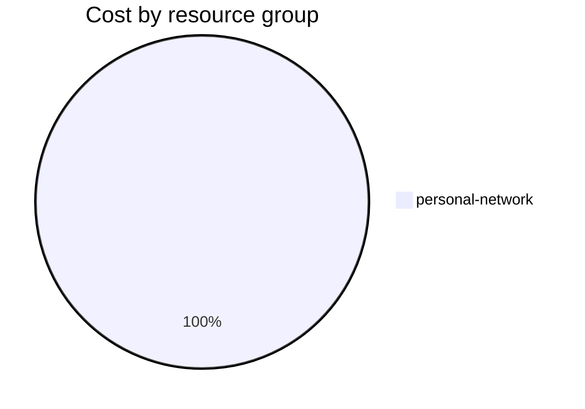

Fetching subscription details...
Fetching cost data...
Fetching forecasted cost data...
Fetching cost data by service name...
Fetching cost data by location...
Fetching cost data by resource group...
# Azure Cost Overview

> Accumulated cost for subscription id `JPF Pay-As-You-Go` from **12/01/2023** to **12/15/2023**

## Totals

|Period|Amount|
|---|---:|
|Today|0.10 USD|
|Yesterday|1.33 USD|
|Last 7 days|10.76 USD|
|Last 30 days|23.71 USD|

```mermaid
gantt
   title Accumulated cost
   dateFormat  X
   axisFormat %s
   section 01 Dec
   USD 1.75 :0, 175
   section 02 Dec
   USD 3.60 :0, 360
   section 03 Dec
   USD 5.81 :0, 581
   section 04 Dec
   USD 7.40 :0, 740
   section 05 Dec
   USD 8.97 :0, 897
   section 06 Dec
   USD 11.15 :0, 1115
   section 07 Dec
   USD 12.94 :0, 1294
   section 08 Dec
   USD 14.43 :0, 1443
   section 09 Dec
   USD 16.17 :0, 1617
   section 10 Dec
   USD 17.72 :0, 1772
   section 11 Dec
   USD 19.25 :0, 1925
   section 12 Dec
   USD 20.77 :0, 2077
   section 13 Dec
   USD 22.28 :0, 2228
   section 14 Dec
   USD 23.61 :0, 2361
   section 15 Dec
   USD 23.71 :0, 2371
   section 16 Dec
   USD 25.38 : done, 0, 2538
   section 17 Dec
   USD 26.94 : done, 0, 2694
   section 18 Dec
   USD 28.39 : done, 0, 2839
   section 19 Dec
   USD 30.13 : done, 0, 3013
   section 20 Dec
   USD 31.74 : done, 0, 3174
   section 21 Dec
   USD 33.32 : done, 0, 3332
   section 22 Dec
   USD 34.92 : done, 0, 3492
   section 23 Dec
   USD 36.53 : done, 0, 3653
   section 24 Dec
   USD 38.03 : done, 0, 3803
   section 25 Dec
   USD 39.43 : done, 0, 3943
   section 26 Dec
   USD 41.11 : done, 0, 4111
   section 27 Dec
   USD 42.66 : done, 0, 4266
   section 28 Dec
   USD 44.19 : done, 0, 4419
   section 29 Dec
   USD 45.72 : done, 0, 4572
   section 30 Dec
   USD 47.28 : done, 0, 4728
   section 31 Dec
   USD 48.72 : done, 0, 4872
```

## By Service Name

|Service|Amount|
|---|---:|
|Storage|11.86 USD|
|Virtual Machines|5.60 USD|
|Virtual Network|3.32 USD|
|Bandwidth|2.71 USD|
|Azure DNS|0.22 USD|

## By Location

|Location|Amount|
|---|---:|
|US North Central|23.49 USD|
|Unknown|0.22 USD|

## By Resource Group

|Resource Group|Amount|
|---|---:|
|personal-network|23.71 USD|

Generated at 2023-12-15 11:07:18 for subscription with id `4913be3f-a345-4652-9bba-767418dd25e3`
