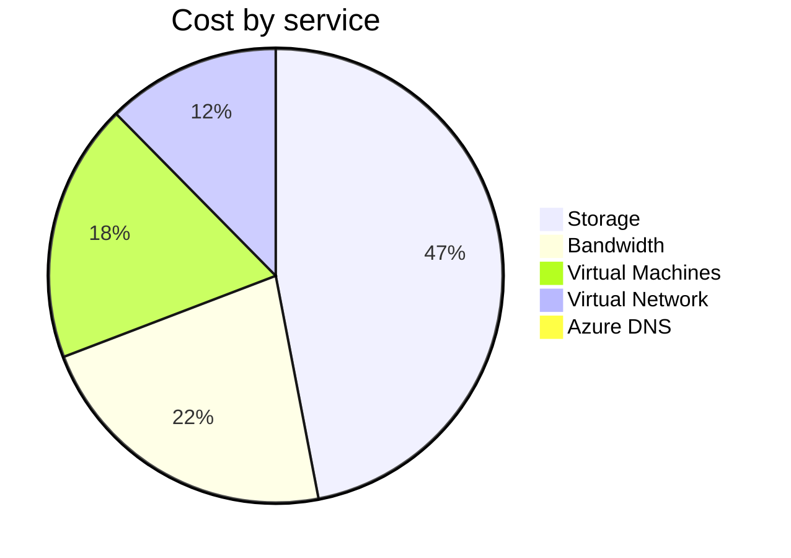
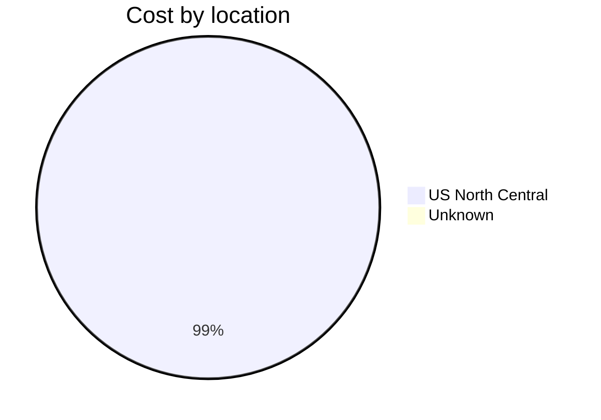
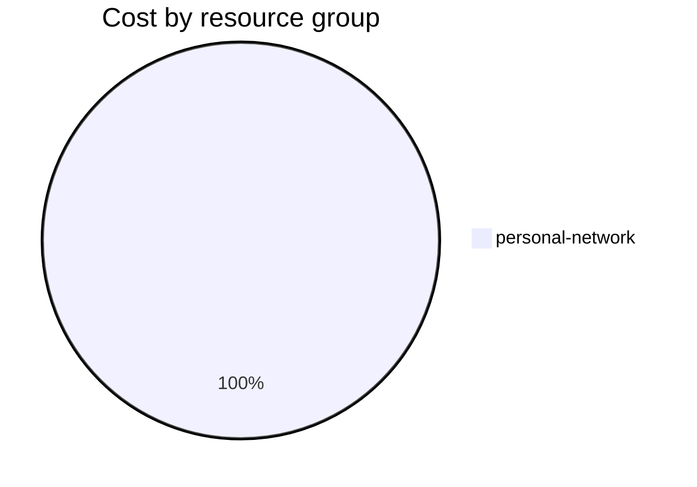

Fetching subscription details...
Fetching cost data...
Fetching forecasted cost data...
Fetching cost data by service name...
Fetching cost data by location...
Fetching cost data by resource group...
# Azure Cost Overview

> Accumulated cost for subscription id `JPF Pay-As-You-Go` from **02/01/2024** to **02/20/2024**

## Totals

|Period|Amount|
|---|---:|
|Today|0.12 USD|
|Yesterday|1.46 USD|
|Last 7 days|10.68 USD|
|Last 30 days|37.05 USD|

```mermaid
gantt
   title Accumulated cost
   dateFormat  X
   axisFormat %s
   section 01 Feb
   USD 2.32 :0, 232
   section 02 Feb
   USD 5.35 :0, 535
   section 03 Feb
   USD 7.82 :0, 782
   section 04 Feb
   USD 10.18 :0, 1018
   section 05 Feb
   USD 12.59 :0, 1259
   section 06 Feb
   USD 14.76 :0, 1476
   section 07 Feb
   USD 17.01 :0, 1701
   section 08 Feb
   USD 19.77 :0, 1977
   section 09 Feb
   USD 21.86 :0, 2186
   section 10 Feb
   USD 23.39 :0, 2339
   section 11 Feb
   USD 24.88 :0, 2488
   section 12 Feb
   USD 26.37 :0, 2637
   section 13 Feb
   USD 27.90 :0, 2790
   section 14 Feb
   USD 29.42 :0, 2942
   section 15 Feb
   USD 30.93 :0, 3093
   section 16 Feb
   USD 32.45 :0, 3245
   section 17 Feb
   USD 33.96 :0, 3396
   section 18 Feb
   USD 35.47 :0, 3547
   section 19 Feb
   USD 36.93 :0, 3693
   section 20 Feb
   USD 37.05 :0, 3705
   section 21 Feb
   USD 38.32 : done, 0, 3832
   section 22 Feb
   USD 39.84 : done, 0, 3984
   section 23 Feb
   USD 41.50 : done, 0, 4150
   section 24 Feb
   USD 42.83 : done, 0, 4283
   section 25 Feb
   USD 44.30 : done, 0, 4430
   section 26 Feb
   USD 45.45 : done, 0, 4545
   section 27 Feb
   USD 46.83 : done, 0, 4683
   section 28 Feb
   USD 47.87 : done, 0, 4787
   section 29 Feb
   USD 49.16 : done, 0, 4916
```

## By Service Name

|Service|Amount|
|---|---:|
|Storage|17.26 USD|
|Bandwidth|8.16 USD|
|Virtual Machines|6.77 USD|
|Virtual Network|4.55 USD|
|Azure DNS|0.31 USD|

## By Location

|Location|Amount|
|---|---:|
|US North Central|36.74 USD|
|Unknown|0.31 USD|

## By Resource Group

|Resource Group|Amount|
|---|---:|
|personal-network|37.05 USD|

Generated at 2024-02-20 11:07:20 for subscription with id `4913be3f-a345-4652-9bba-767418dd25e3`
