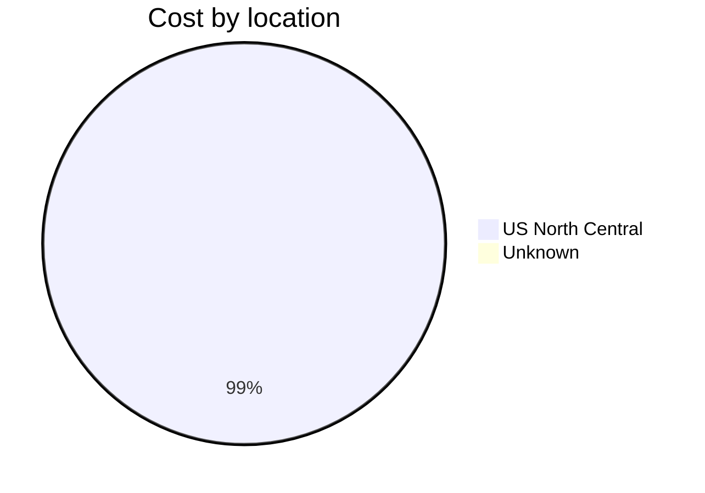
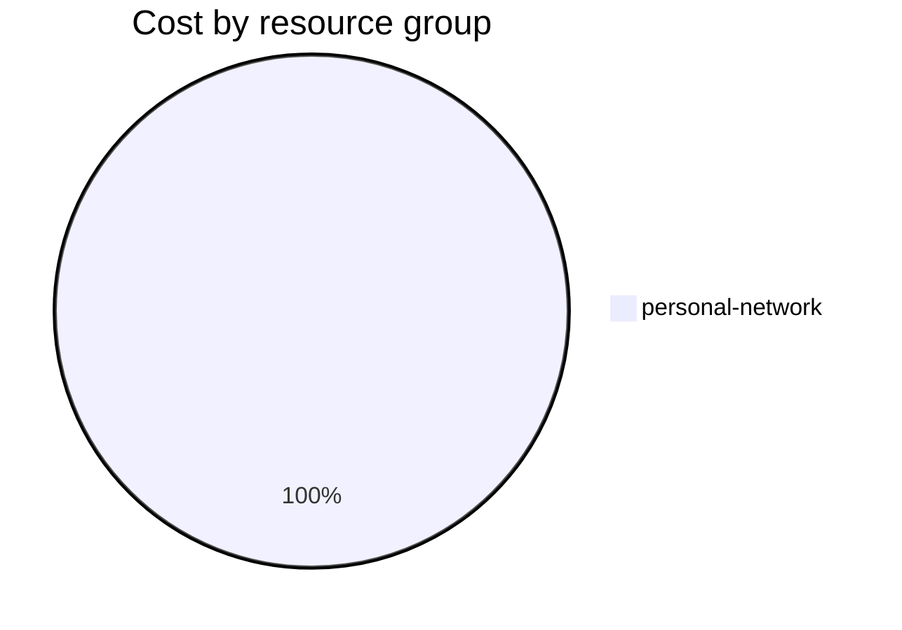

Fetching subscription details...
Fetching cost data...
Fetching forecasted cost data...
Fetching cost data by service name...
Fetching cost data by location...
Fetching cost data by resource group...
# Azure Cost Overview

> Accumulated cost for subscription id `JPF Pay-As-You-Go` from **12/01/2023** to **12/29/2023**

## Totals

|Period|Amount|
|---|---:|
|Today|0.08 USD|
|Yesterday|1.48 USD|
|Last 7 days|10.46 USD|
|Last 30 days|45.51 USD|

## By Service Name

|Service|Amount|
|---|---:|
|Storage|23.72 USD|
|Virtual Machines|11.08 USD|
|Virtual Network|6.72 USD|
|Bandwidth|3.54 USD|
|Azure DNS|0.45 USD|

## By Location

|Location|Amount|
|---|---:|
|US North Central|45.06 USD|
|Unknown|0.45 USD|

## By Resource Group

|Resource Group|Amount|
|---|---:|
|personal-network|45.51 USD|

Generated at 2023-12-29 11:08:03 for subscription with id `4913be3f-a345-4652-9bba-767418dd25e3`
