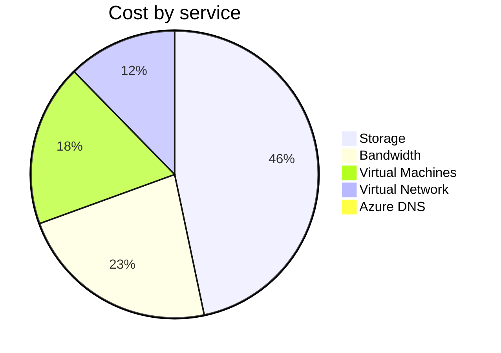
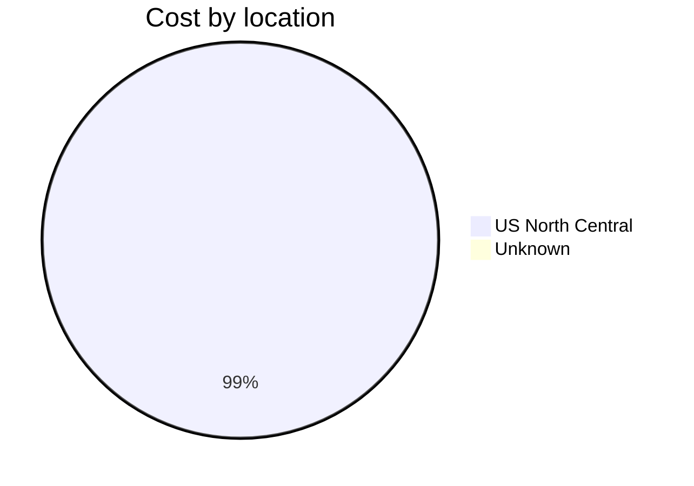
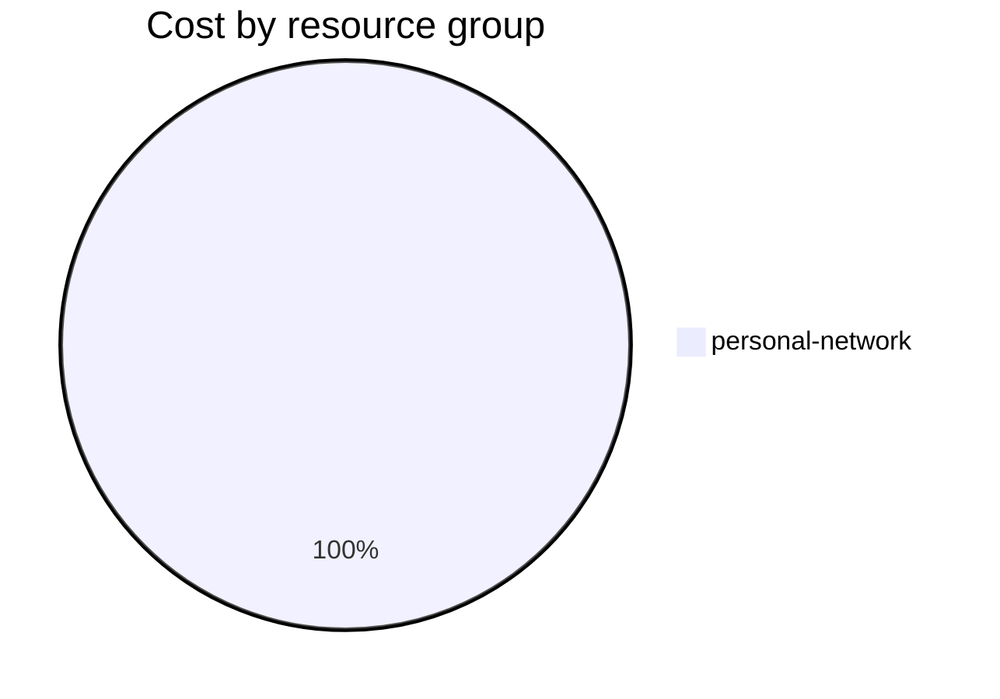

Fetching subscription details...
Fetching cost data...
Fetching forecasted cost data...
Fetching cost data by service name...
Fetching cost data by location...
Fetching cost data by resource group...
# Azure Cost Overview

> Accumulated cost for subscription id `JPF Pay-As-You-Go` from **02/01/2024** to **02/21/2024**

## Totals

|Period|Amount|
|---|---:|
|Today|0.09 USD|
|Yesterday|1.54 USD|
|Last 7 days|11.10 USD|
|Last 30 days|39.23 USD|

```mermaid
gantt
   title Accumulated cost
   dateFormat  X
   axisFormat %s
   section 01 Feb
   USD 2.32 :0, 232
   section 02 Feb
   USD 5.35 :0, 535
   section 03 Feb
   USD 7.82 :0, 782
   section 04 Feb
   USD 10.18 :0, 1018
   section 05 Feb
   USD 12.59 :0, 1259
   section 06 Feb
   USD 14.76 :0, 1476
   section 07 Feb
   USD 17.01 :0, 1701
   section 08 Feb
   USD 19.77 :0, 1977
   section 09 Feb
   USD 21.87 :0, 2187
   section 10 Feb
   USD 23.50 :0, 2350
   section 11 Feb
   USD 25.00 :0, 2500
   section 12 Feb
   USD 26.48 :0, 2648
   section 13 Feb
   USD 28.13 :0, 2813
   section 14 Feb
   USD 29.73 :0, 2973
   section 15 Feb
   USD 31.30 :0, 3130
   section 16 Feb
   USD 32.93 :0, 3293
   section 17 Feb
   USD 34.46 :0, 3446
   section 18 Feb
   USD 36.03 :0, 3603
   section 19 Feb
   USD 37.60 :0, 3760
   section 20 Feb
   USD 39.14 :0, 3914
   section 21 Feb
   USD 39.23 :0, 3923
   section 22 Feb
   USD 40.91 : done, 0, 4091
   section 23 Feb
   USD 42.74 : done, 0, 4274
   section 24 Feb
   USD 44.29 : done, 0, 4429
   section 25 Feb
   USD 45.62 : done, 0, 4562
   section 26 Feb
   USD 46.63 : done, 0, 4663
   section 27 Feb
   USD 48.18 : done, 0, 4818
   section 28 Feb
   USD 49.39 : done, 0, 4939
   section 29 Feb
   USD 50.85 : done, 0, 5085
```

## By Service Name

|Service|Amount|
|---|---:|
|Storage|18.17 USD|
|Bandwidth|8.85 USD|
|Virtual Machines|7.10 USD|
|Virtual Network|4.79 USD|
|Azure DNS|0.32 USD|

## By Location

|Location|Amount|
|---|---:|
|US North Central|38.91 USD|
|Unknown|0.32 USD|

## By Resource Group

|Resource Group|Amount|
|---|---:|
|personal-network|39.23 USD|

Generated at 2024-02-21 11:08:21 for subscription with id `4913be3f-a345-4652-9bba-767418dd25e3`
