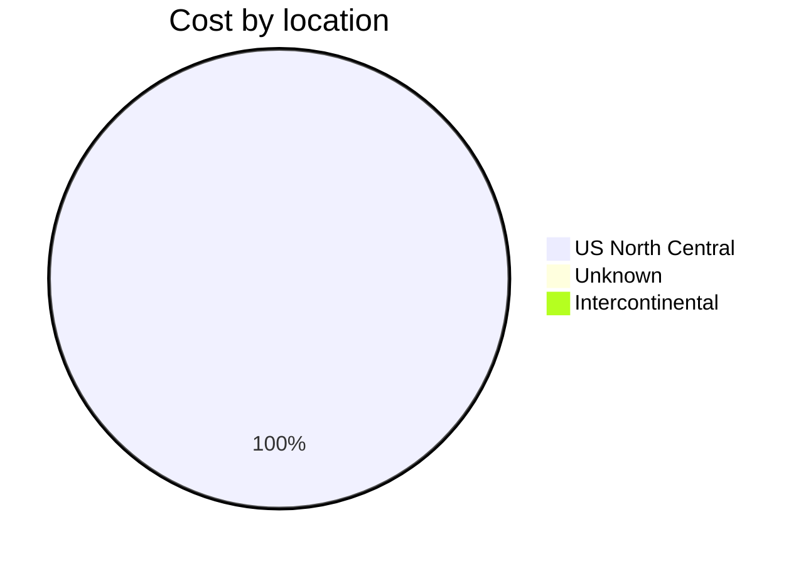
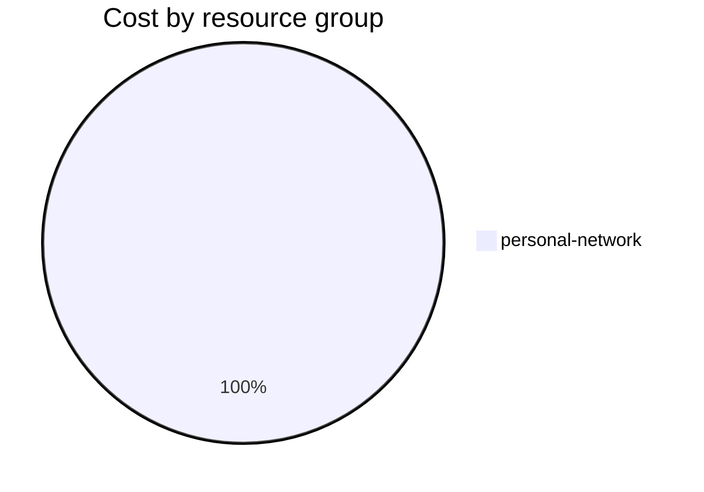

Fetching subscription details...
Fetching cost data...
Fetching forecasted cost data...
Fetching cost data by service name...
Fetching cost data by location...
Fetching cost data by resource group...
# Azure Cost Overview

> Accumulated cost for subscription id `JPF Pay-As-You-Go` from **09/01/2023** to **09/30/2023**

## Totals

|Period|Amount|
|---|---:|
|Today|0.10 USD|
|Yesterday|2.90 USD|
|Last 7 days|21.30 USD|
|Last 30 days|236.27 USD|

```mermaid
gantt
   title Accumulated cost
   dateFormat  X
   axisFormat %s
   section 01 Sep
   USD 3.20 :0, 320
   section 02 Sep
   USD 6.19 :0, 619
   section 03 Sep
   USD 9.27 :0, 927
   section 04 Sep
   USD 12.30 :0, 1230
   section 05 Sep
   USD 15.47 :0, 1547
   section 06 Sep
   USD 18.50 :0, 1850
   section 07 Sep
   USD 21.60 :0, 2160
   section 08 Sep
   USD 24.70 :0, 2470
   section 09 Sep
   USD 27.71 :0, 2771
   section 10 Sep
   USD 30.64 :0, 3064
   section 11 Sep
   USD 33.66 :0, 3366
   section 12 Sep
   USD 46.30 :0, 4630
   section 13 Sep
   USD 92.67 :0, 9267
   section 14 Sep
   USD 127.33 :0, 12733
   section 15 Sep
   USD 133.11 :0, 13311
   section 16 Sep
   USD 146.46 :0, 14646
   section 17 Sep
   USD 174.21 :0, 17421
   section 18 Sep
   USD 189.31 :0, 18931
   section 19 Sep
   USD 204.58 :0, 20458
   section 20 Sep
   USD 207.75 :0, 20775
   section 21 Sep
   USD 211.12 :0, 21112
   section 22 Sep
   USD 214.97 :0, 21497
   section 23 Sep
   USD 217.93 :0, 21793
   section 24 Sep
   USD 220.93 :0, 22093
   section 25 Sep
   USD 224.00 :0, 22400
   section 26 Sep
   USD 227.06 :0, 22706
   section 27 Sep
   USD 230.09 :0, 23009
   section 28 Sep
   USD 233.27 :0, 23327
   section 29 Sep
   USD 236.17 :0, 23617
   section 30 Sep
   USD 236.27 :0, 23627
```

## By Service Name

|Service|Amount|
|---|---:|
|Storage|203.16 USD|
|Virtual Machines|10.68 USD|
|Virtual Network|9.50 USD|
|Bandwidth|8.76 USD|
|Security Center|3.70 USD|
|Azure DNS|0.47 USD|
|Advanced Threat Protection|0.00 USD|

## By Location

|Location|Amount|
|---|---:|
|US North Central|235.80 USD|
|Unknown|0.47 USD|
|Intercontinental|0.00 USD|

## By Resource Group

|Resource Group|Amount|
|---|---:|
|personal-network|236.27 USD|

Generated at 2023-09-30 11:05:57 for subscription with id `4913be3f-a345-4652-9bba-767418dd25e3`
