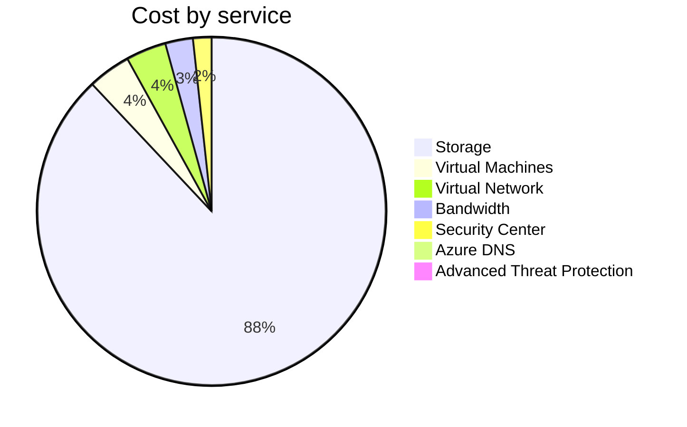
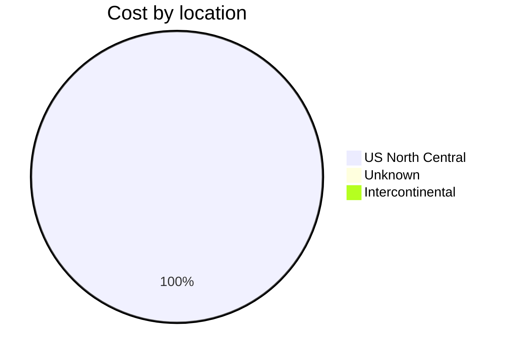
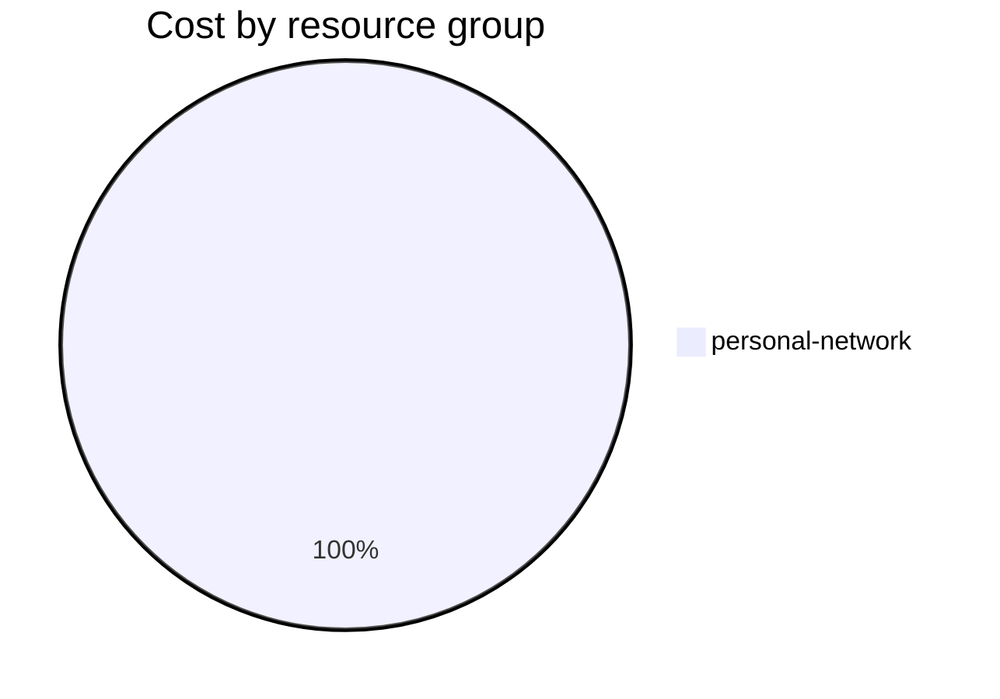

Fetching subscription details...
Fetching cost data...
Fetching forecasted cost data...
Fetching cost data by service name...
Fetching cost data by location...
Fetching cost data by resource group...
# Azure Cost Overview

> Accumulated cost for subscription id `JPF Pay-As-You-Go` from **09/01/2023** to **09/24/2023**

## Totals

|Period|Amount|
|---|---:|
|Today|0.09 USD|
|Yesterday|2.81 USD|
|Last 7 days|70.19 USD|
|Last 30 days|216.01 USD|

```mermaid
gantt
   title Accumulated cost
   dateFormat  X
   axisFormat %s
   section 01 Sep
   USD 3.20 :0, 320
   section 02 Sep
   USD 6.19 :0, 619
   section 03 Sep
   USD 9.27 :0, 927
   section 04 Sep
   USD 12.30 :0, 1230
   section 05 Sep
   USD 15.47 :0, 1547
   section 06 Sep
   USD 18.50 :0, 1850
   section 07 Sep
   USD 21.60 :0, 2160
   section 08 Sep
   USD 24.70 :0, 2470
   section 09 Sep
   USD 27.70 :0, 2770
   section 10 Sep
   USD 30.56 :0, 3056
   section 11 Sep
   USD 33.48 :0, 3348
   section 12 Sep
   USD 46.08 :0, 4608
   section 13 Sep
   USD 92.35 :0, 9235
   section 14 Sep
   USD 126.91 :0, 12691
   section 15 Sep
   USD 132.61 :0, 13261
   section 16 Sep
   USD 145.83 :0, 14583
   section 17 Sep
   USD 173.45 :0, 17345
   section 18 Sep
   USD 188.31 :0, 18831
   section 19 Sep
   USD 203.47 :0, 20347
   section 20 Sep
   USD 206.51 :0, 20651
   section 21 Sep
   USD 209.67 :0, 20967
   section 22 Sep
   USD 213.12 :0, 21312
   section 23 Sep
   USD 215.93 :0, 21593
   section 24 Sep
   USD 216.01 :0, 21601
   section 25 Sep
   USD 231.80 : done, 0, 23180
   section 26 Sep
   USD 252.95 : done, 0, 25295
   section 27 Sep
   USD 269.75 : done, 0, 26975
   section 28 Sep
   USD 287.14 : done, 0, 28714
   section 29 Sep
   USD 305.12 : done, 0, 30512
   section 30 Sep
   USD 323.53 : done, 0, 32353
```

## By Service Name

|Service|Amount|
|---|---:|
|Storage|189.79 USD|
|Virtual Machines|8.57 USD|
|Virtual Network|8.06 USD|
|Bandwidth|5.53 USD|
|Security Center|3.70 USD|
|Azure DNS|0.37 USD|
|Advanced Threat Protection|0.00 USD|

## By Location

|Location|Amount|
|---|---:|
|US North Central|215.64 USD|
|Unknown|0.37 USD|
|Intercontinental|0.00 USD|

## By Resource Group

|Resource Group|Amount|
|---|---:|
|personal-network|216.01 USD|

Generated at 2023-09-24 11:07:00 for subscription with id `4913be3f-a345-4652-9bba-767418dd25e3`
