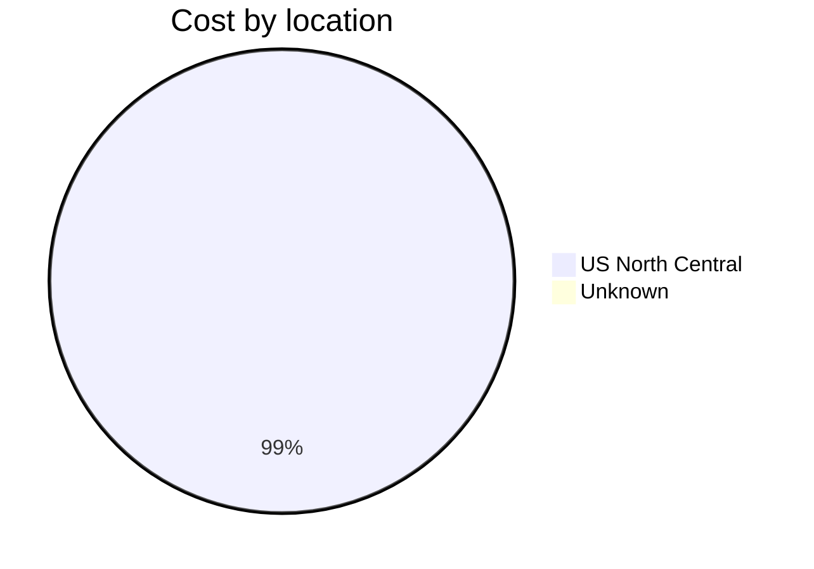
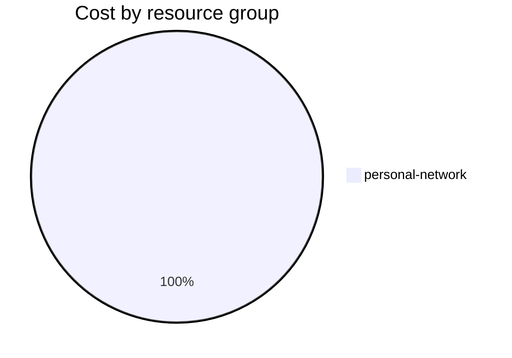

Fetching subscription details...
Fetching cost data...
Fetching forecasted cost data...
Fetching cost data by service name...
Fetching cost data by location...
Fetching cost data by resource group...
# Azure Cost Overview

> Accumulated cost for subscription id `JPF Pay-As-You-Go` from **11/01/2023** to **11/18/2023**

## Totals

|Period|Amount|
|---|---:|
|Today|0.09 USD|
|Yesterday|1.42 USD|
|Last 7 days|10.51 USD|
|Last 30 days|28.19 USD|

## By Service Name

|Service|Amount|
|---|---:|
|Storage|14.73 USD|
|Virtual Machines|6.46 USD|
|Virtual Network|4.07 USD|
|Bandwidth|2.66 USD|
|Azure DNS|0.27 USD|

## By Location

|Location|Amount|
|---|---:|
|US North Central|27.92 USD|
|Unknown|0.27 USD|

## By Resource Group

|Resource Group|Amount|
|---|---:|
|personal-network|28.19 USD|

Generated at 2023-11-18 11:06:59 for subscription with id `4913be3f-a345-4652-9bba-767418dd25e3`
