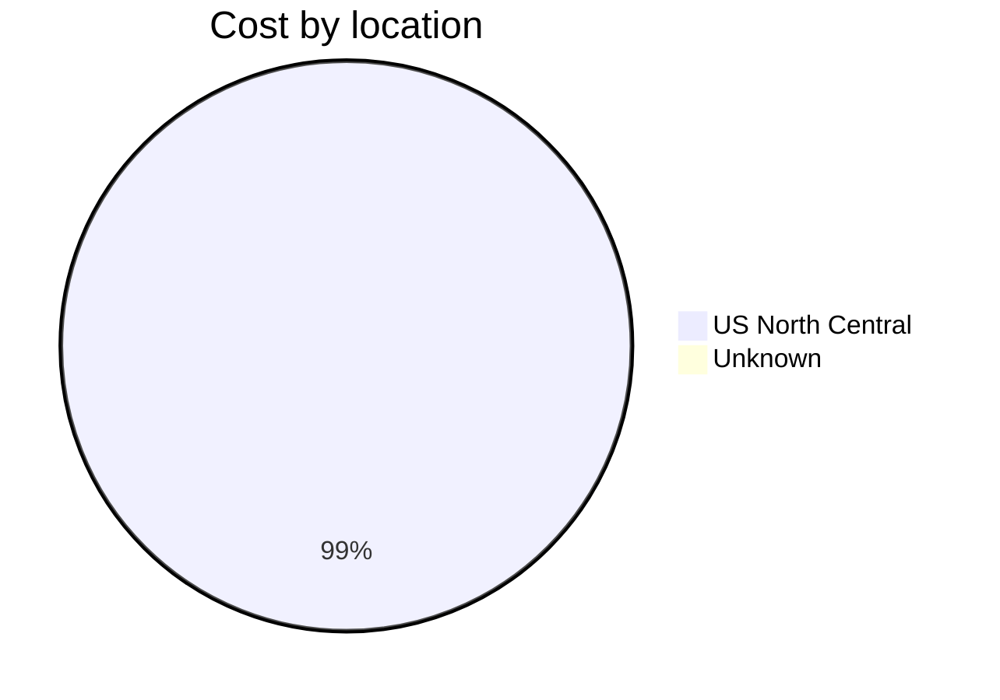
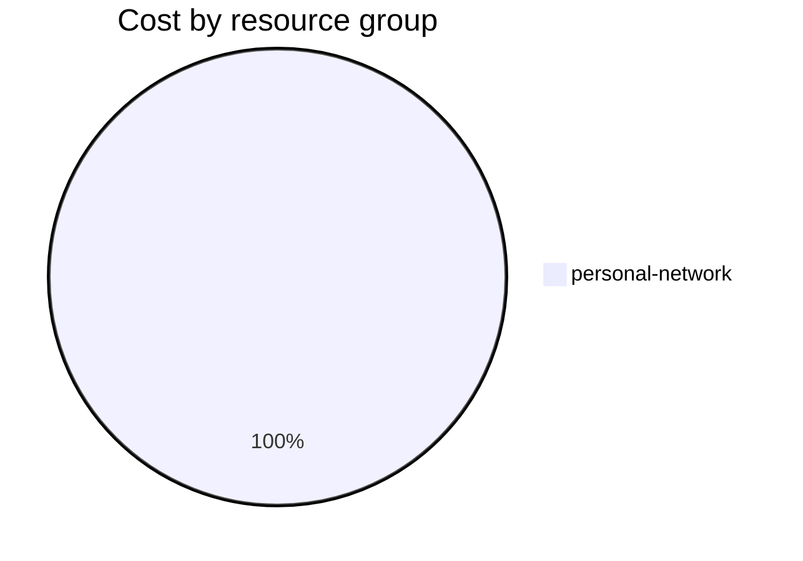

Fetching subscription details...
Fetching cost data...
Fetching forecasted cost data...
Fetching cost data by service name...
Fetching cost data by location...
Fetching cost data by resource group...
# Azure Cost Overview

> Accumulated cost for subscription id `JPF Pay-As-You-Go` from **12/01/2023** to **12/30/2023**

## Totals

|Period|Amount|
|---|---:|
|Today|0.08 USD|
|Yesterday|1.56 USD|
|Last 7 days|10.58 USD|
|Last 30 days|47.73 USD|

```mermaid
gantt
   title Accumulated cost
   dateFormat  X
   axisFormat %s
   section 01 Dec
   USD 1.75 :0, 175
   section 02 Dec
   USD 3.60 :0, 360
   section 03 Dec
   USD 5.81 :0, 581
   section 04 Dec
   USD 7.40 :0, 740
   section 05 Dec
   USD 8.97 :0, 897
   section 06 Dec
   USD 11.15 :0, 1115
   section 07 Dec
   USD 12.94 :0, 1294
   section 08 Dec
   USD 14.43 :0, 1443
   section 09 Dec
   USD 16.18 :0, 1618
   section 10 Dec
   USD 18.05 :0, 1805
   section 11 Dec
   USD 19.89 :0, 1989
   section 12 Dec
   USD 21.50 :0, 2150
   section 13 Dec
   USD 23.10 :0, 2310
   section 14 Dec
   USD 24.69 :0, 2469
   section 15 Dec
   USD 26.18 :0, 2618
   section 16 Dec
   USD 27.73 :0, 2773
   section 17 Dec
   USD 29.30 :0, 2930
   section 18 Dec
   USD 30.95 :0, 3095
   section 19 Dec
   USD 32.65 :0, 3265
   section 20 Dec
   USD 34.15 :0, 3415
   section 21 Dec
   USD 35.64 :0, 3564
   section 22 Dec
   USD 37.15 :0, 3715
   section 23 Dec
   USD 38.63 :0, 3863
   section 24 Dec
   USD 40.10 :0, 4010
   section 25 Dec
   USD 41.58 :0, 4158
   section 26 Dec
   USD 43.05 :0, 4305
   section 27 Dec
   USD 44.56 :0, 4456
   section 28 Dec
   USD 46.09 :0, 4609
   section 29 Dec
   USD 47.65 :0, 4765
   section 30 Dec
   USD 47.73 :0, 4773
   section 31 Dec
   USD 49.25 : done, 0, 4925
```

## By Service Name

|Service|Amount|
|---|---:|
|Storage|24.57 USD|
|Virtual Machines|11.47 USD|
|Virtual Network|6.95 USD|
|Bandwidth|4.28 USD|
|Azure DNS|0.47 USD|

## By Location

|Location|Amount|
|---|---:|
|US North Central|47.27 USD|
|Unknown|0.47 USD|

## By Resource Group

|Resource Group|Amount|
|---|---:|
|personal-network|47.73 USD|

Generated at 2023-12-30 11:07:16 for subscription with id `4913be3f-a345-4652-9bba-767418dd25e3`
