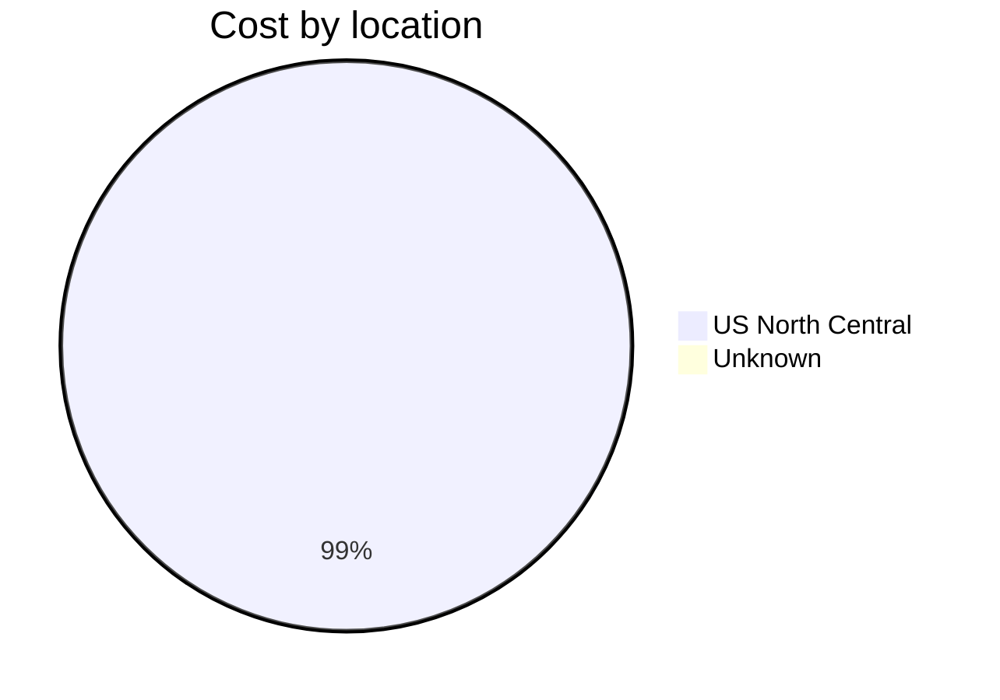
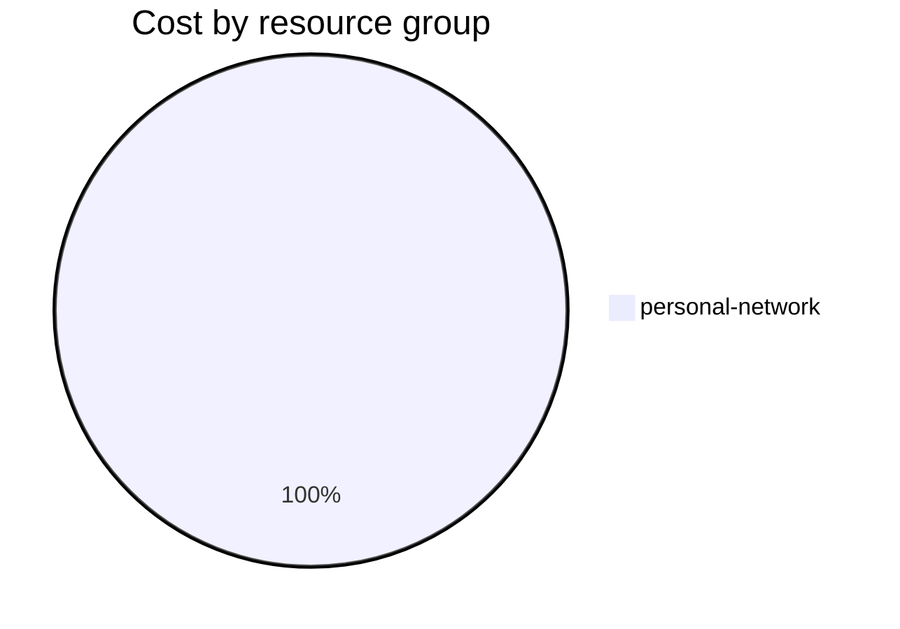

Fetching subscription details...
Fetching cost data...
Fetching forecasted cost data...
Fetching cost data by service name...
Fetching cost data by location...
Fetching cost data by resource group...
# Azure Cost Overview

> Accumulated cost for subscription id `JPF Pay-As-You-Go` from **01/01/2024** to **01/21/2024**

## Totals

|Period|Amount|
|---|---:|
|Today|0.02 USD|
|Yesterday|1.23 USD|
|Last 7 days|11.06 USD|
|Last 30 days|36.05 USD|

```mermaid
gantt
   title Accumulated cost
   dateFormat  X
   axisFormat %s
   section 01 Jan
   USD 2.01 :0, 201
   section 02 Jan
   USD 4.48 :0, 448
   section 03 Jan
   USD 6.29 :0, 629
   section 04 Jan
   USD 8.20 :0, 820
   section 05 Jan
   USD 10.14 :0, 1014
   section 06 Jan
   USD 12.40 :0, 1240
   section 07 Jan
   USD 14.14 :0, 1414
   section 08 Jan
   USD 16.56 :0, 1656
   section 09 Jan
   USD 18.47 :0, 1847
   section 10 Jan
   USD 20.03 :0, 2003
   section 11 Jan
   USD 21.64 :0, 2164
   section 12 Jan
   USD 23.25 :0, 2325
   section 13 Jan
   USD 24.99 :0, 2499
   section 14 Jan
   USD 26.50 :0, 2650
   section 15 Jan
   USD 28.03 :0, 2803
   section 16 Jan
   USD 29.87 :0, 2987
   section 17 Jan
   USD 31.53 :0, 3153
   section 18 Jan
   USD 33.17 :0, 3317
   section 19 Jan
   USD 34.81 :0, 3481
   section 20 Jan
   USD 36.04 :0, 3604
   section 21 Jan
   USD 36.05 :0, 3605
   section 22 Jan
   USD 37.92 : done, 0, 3792
   section 23 Jan
   USD 39.88 : done, 0, 3988
   section 24 Jan
   USD 41.59 : done, 0, 4159
   section 25 Jan
   USD 43.31 : done, 0, 4331
   section 26 Jan
   USD 45.06 : done, 0, 4506
   section 27 Jan
   USD 47.16 : done, 0, 4716
   section 28 Jan
   USD 48.88 : done, 0, 4888
   section 29 Jan
   USD 50.76 : done, 0, 5076
   section 30 Jan
   USD 52.75 : done, 0, 5275
   section 31 Jan
   USD 54.47 : done, 0, 5447
```

## By Service Name

|Service|Amount|
|---|---:|
|Storage|16.85 USD|
|Virtual Machines|8.27 USD|
|Bandwidth|5.91 USD|
|Virtual Network|4.71 USD|
|Azure DNS|0.32 USD|

## By Location

|Location|Amount|
|---|---:|
|US North Central|35.74 USD|
|Unknown|0.32 USD|

## By Resource Group

|Resource Group|Amount|
|---|---:|
|personal-network|36.05 USD|

Generated at 2024-01-21 11:04:30 for subscription with id `4913be3f-a345-4652-9bba-767418dd25e3`
