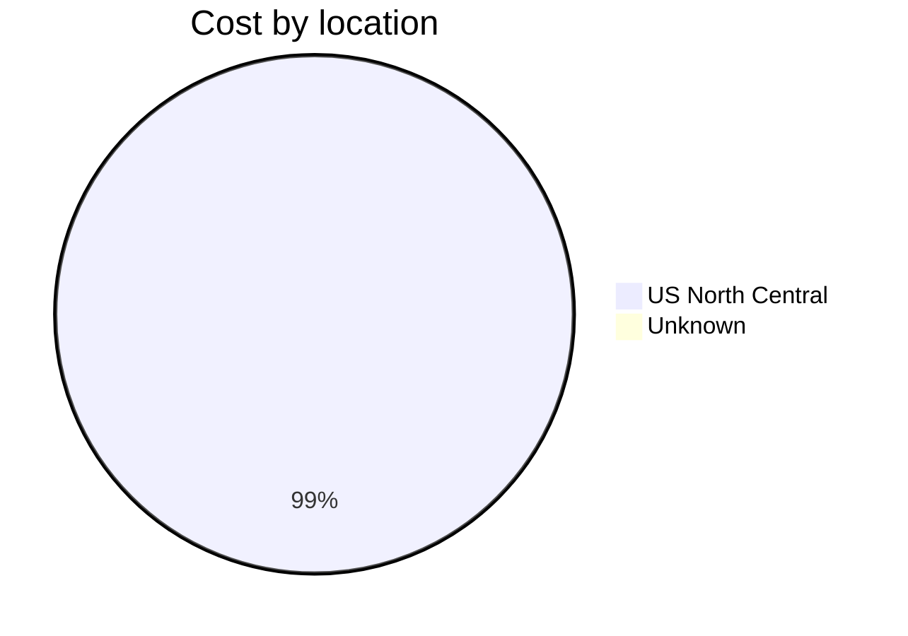
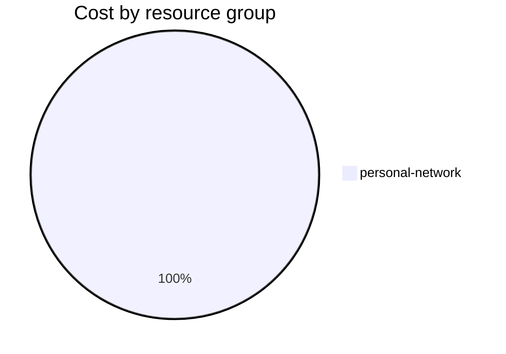

Fetching subscription details...
Fetching cost data...
Fetching forecasted cost data...
Fetching cost data by service name...
Fetching cost data by location...
Fetching cost data by resource group...
# Azure Cost Overview

> Accumulated cost for subscription id `JPF Pay-As-You-Go` from **11/01/2023** to **11/12/2023**

## Totals

|Period|Amount|
|---|---:|
|Today|0.09 USD|
|Yesterday|1.46 USD|
|Last 7 days|11.94 USD|
|Last 30 days|19.23 USD|

```mermaid
gantt
   title Accumulated cost
   dateFormat  X
   axisFormat %s
   section 01 Nov
   USD 1.83 :0, 183
   section 02 Nov
   USD 3.53 :0, 353
   section 03 Nov
   USD 5.51 :0, 551
   section 04 Nov
   USD 7.30 :0, 730
   section 05 Nov
   USD 9.02 :0, 902
   section 06 Nov
   USD 10.82 :0, 1082
   section 07 Nov
   USD 12.56 :0, 1256
   section 08 Nov
   USD 14.39 :0, 1439
   section 09 Nov
   USD 16.17 :0, 1617
   section 10 Nov
   USD 17.68 :0, 1768
   section 11 Nov
   USD 19.14 :0, 1914
   section 12 Nov
   USD 19.23 :0, 1923
   section 13 Nov
   USD 20.92 : done, 0, 2092
   section 14 Nov
   USD 22.63 : done, 0, 2263
   section 15 Nov
   USD 24.41 : done, 0, 2441
   section 16 Nov
   USD 26.09 : done, 0, 2609
   section 17 Nov
   USD 27.78 : done, 0, 2778
   section 18 Nov
   USD 29.38 : done, 0, 2938
   section 19 Nov
   USD 30.83 : done, 0, 3083
   section 20 Nov
   USD 32.47 : done, 0, 3247
   section 21 Nov
   USD 34.15 : done, 0, 3415
   section 22 Nov
   USD 35.88 : done, 0, 3588
   section 23 Nov
   USD 37.52 : done, 0, 3752
   section 24 Nov
   USD 39.17 : done, 0, 3917
   section 25 Nov
   USD 40.73 : done, 0, 4073
   section 26 Nov
   USD 42.14 : done, 0, 4214
   section 27 Nov
   USD 43.75 : done, 0, 4375
   section 28 Nov
   USD 45.39 : done, 0, 4539
   section 29 Nov
   USD 47.08 : done, 0, 4708
   section 30 Nov
   USD 48.68 : done, 0, 4868
```

## By Service Name

|Service|Amount|
|---|---:|
|Storage|9.55 USD|
|Virtual Machines|4.21 USD|
|Bandwidth|2.66 USD|
|Virtual Network|2.64 USD|
|Azure DNS|0.18 USD|

## By Location

|Location|Amount|
|---|---:|
|US North Central|19.06 USD|
|Unknown|0.18 USD|

## By Resource Group

|Resource Group|Amount|
|---|---:|
|personal-network|19.23 USD|

Generated at 2023-11-12 11:06:03 for subscription with id `4913be3f-a345-4652-9bba-767418dd25e3`
