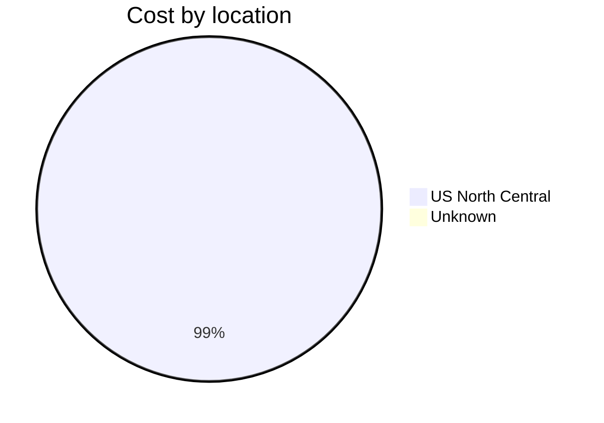
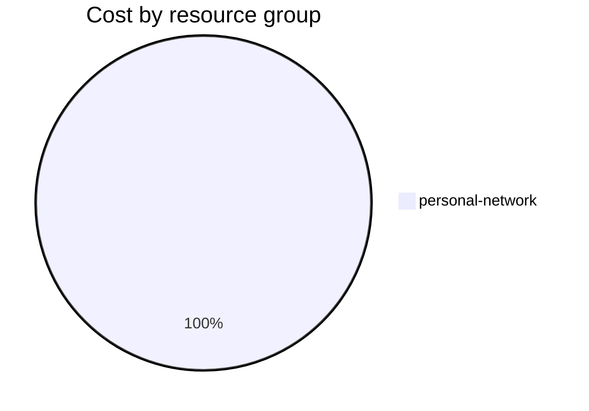

Fetching subscription details...
Fetching cost data...
Fetching forecasted cost data...
Fetching cost data by service name...
Fetching cost data by location...
Fetching cost data by resource group...
# Azure Cost Overview

> Accumulated cost for subscription id `JPF Pay-As-You-Go` from **11/01/2023** to **11/26/2023**

## Totals

|Period|Amount|
|---|---:|
|Today|0.09 USD|
|Yesterday|1.48 USD|
|Last 7 days|11.09 USD|
|Last 30 days|41.22 USD|

```mermaid
gantt
   title Accumulated cost
   dateFormat  X
   axisFormat %s
   section 01 Nov
   USD 1.83 :0, 183
   section 02 Nov
   USD 3.53 :0, 353
   section 03 Nov
   USD 5.51 :0, 551
   section 04 Nov
   USD 7.30 :0, 730
   section 05 Nov
   USD 9.02 :0, 902
   section 06 Nov
   USD 10.82 :0, 1082
   section 07 Nov
   USD 12.56 :0, 1256
   section 08 Nov
   USD 14.39 :0, 1439
   section 09 Nov
   USD 16.18 :0, 1618
   section 10 Nov
   USD 17.74 :0, 1774
   section 11 Nov
   USD 19.28 :0, 1928
   section 12 Nov
   USD 20.86 :0, 2086
   section 13 Nov
   USD 22.44 :0, 2244
   section 14 Nov
   USD 23.93 :0, 2393
   section 15 Nov
   USD 25.49 :0, 2549
   section 16 Nov
   USD 27.03 :0, 2703
   section 17 Nov
   USD 28.59 :0, 2859
   section 18 Nov
   USD 30.13 :0, 3013
   section 19 Nov
   USD 31.68 :0, 3168
   section 20 Nov
   USD 33.26 :0, 3326
   section 21 Nov
   USD 34.91 :0, 3491
   section 22 Nov
   USD 36.47 :0, 3647
   section 23 Nov
   USD 38.08 :0, 3808
   section 24 Nov
   USD 39.64 :0, 3964
   section 25 Nov
   USD 41.12 :0, 4112
   section 26 Nov
   USD 41.22 :0, 4122
   section 27 Nov
   USD 42.72 : done, 0, 4272
   section 28 Nov
   USD 44.31 : done, 0, 4431
   section 29 Nov
   USD 45.88 : done, 0, 4588
   section 30 Nov
   USD 47.42 : done, 0, 4742
```

## By Service Name

|Service|Amount|
|---|---:|
|Storage|21.76 USD|
|Virtual Machines|9.45 USD|
|Virtual Network|5.98 USD|
|Bandwidth|3.63 USD|
|Azure DNS|0.40 USD|

## By Location

|Location|Amount|
|---|---:|
|US North Central|40.82 USD|
|Unknown|0.40 USD|

## By Resource Group

|Resource Group|Amount|
|---|---:|
|personal-network|41.22 USD|

Generated at 2023-11-26 11:07:46 for subscription with id `4913be3f-a345-4652-9bba-767418dd25e3`
