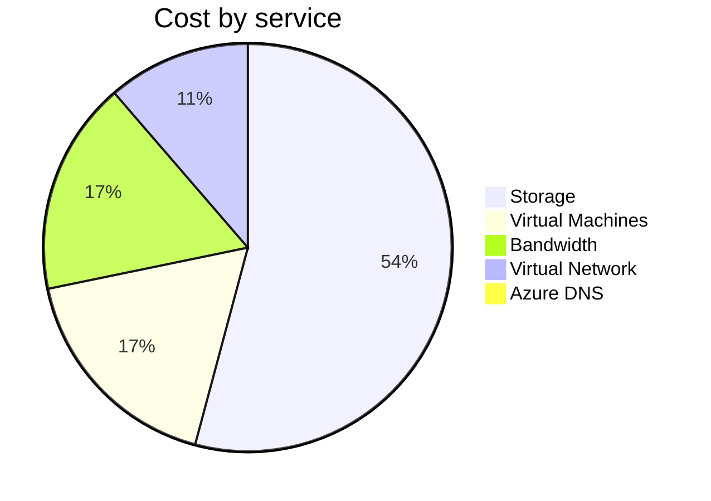
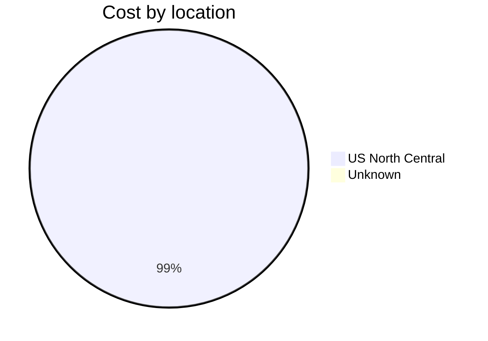
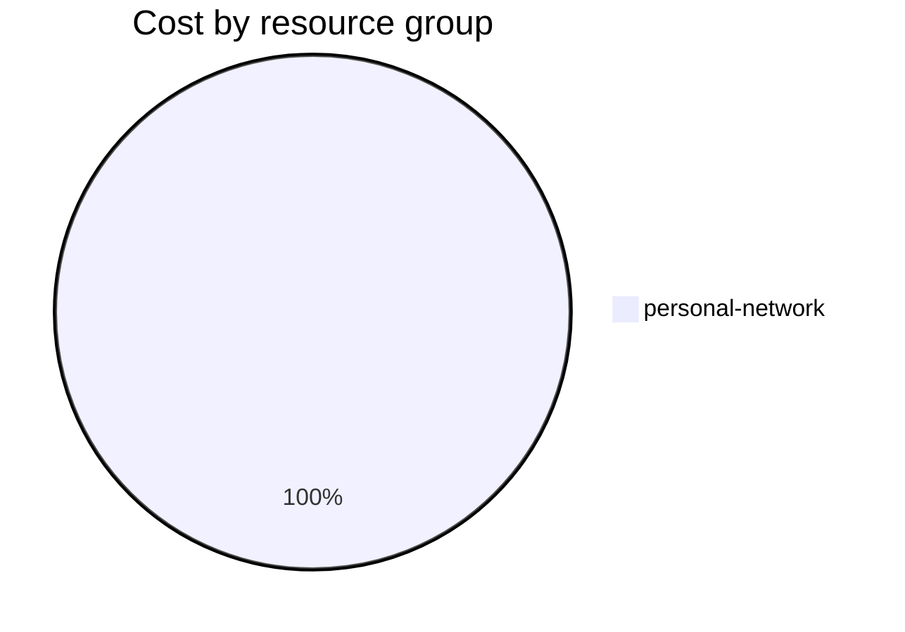

Fetching subscription details...
Fetching cost data...
Fetching forecasted cost data...
Fetching cost data by service name...
Fetching cost data by location...
Fetching cost data by resource group...
# Azure Cost Overview

> Accumulated cost for subscription id `JPF Pay-As-You-Go` from **10/01/2023** to **10/08/2023**

## Totals

|Period|Amount|
|---|---:|
|Today|0.09 USD|
|Yesterday|1.68 USD|
|Last 7 days|14.78 USD|
|Last 30 days|14.78 USD|

```mermaid
gantt
   title Accumulated cost
   dateFormat  X
   axisFormat %s
   section 01 Oct
   USD 3.15 :0, 315
   section 02 Oct
   USD 5.70 :0, 570
   section 03 Oct
   USD 7.54 :0, 754
   section 04 Oct
   USD 9.38 :0, 938
   section 05 Oct
   USD 11.12 :0, 1112
   section 06 Oct
   USD 13.01 :0, 1301
   section 07 Oct
   USD 14.69 :0, 1469
   section 08 Oct
   USD 14.78 :0, 1478
   section 09 Oct
   USD 14.78 : done, 0, 1478
   section 10 Oct
   USD 17.06 : done, 0, 1706
   section 11 Oct
   USD 17.06 : done, 0, 1706
   section 12 Oct
   USD 17.06 : done, 0, 1706
   section 13 Oct
   USD 17.06 : done, 0, 1706
   section 14 Oct
   USD 17.06 : done, 0, 1706
   section 15 Oct
   USD 17.06 : done, 0, 1706
   section 16 Oct
   USD 17.06 : done, 0, 1706
   section 17 Oct
   USD 17.06 : done, 0, 1706
   section 18 Oct
   USD 17.06 : done, 0, 1706
   section 19 Oct
   USD 17.06 : done, 0, 1706
   section 20 Oct
   USD 17.06 : done, 0, 1706
   section 21 Oct
   USD 17.06 : done, 0, 1706
   section 22 Oct
   USD 17.06 : done, 0, 1706
   section 23 Oct
   USD 17.06 : done, 0, 1706
   section 24 Oct
   USD 17.06 : done, 0, 1706
   section 25 Oct
   USD 17.06 : done, 0, 1706
   section 26 Oct
   USD 17.06 : done, 0, 1706
   section 27 Oct
   USD 17.06 : done, 0, 1706
   section 28 Oct
   USD 17.06 : done, 0, 1706
   section 29 Oct
   USD 17.06 : done, 0, 1706
   section 30 Oct
   USD 17.06 : done, 0, 1706
   section 31 Oct
   USD 17.06 : done, 0, 1706
```

## By Service Name

|Service|Amount|
|---|---:|
|Storage|7.94 USD|
|Virtual Machines|2.58 USD|
|Bandwidth|2.48 USD|
|Virtual Network|1.66 USD|
|Azure DNS|0.11 USD|

## By Location

|Location|Amount|
|---|---:|
|US North Central|14.66 USD|
|Unknown|0.11 USD|

## By Resource Group

|Resource Group|Amount|
|---|---:|
|personal-network|14.78 USD|

Generated at 2023-10-08 11:03:55 for subscription with id `4913be3f-a345-4652-9bba-767418dd25e3`
