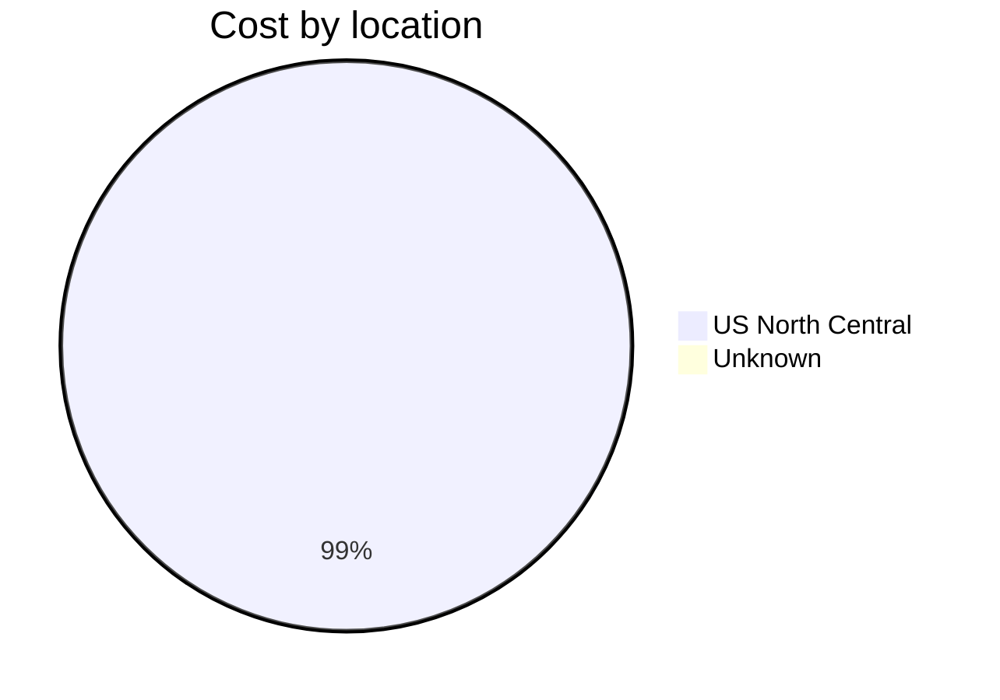
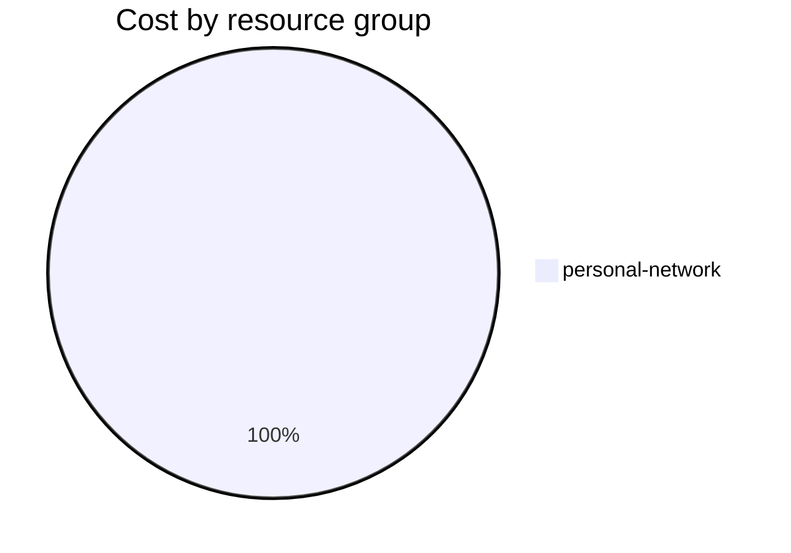

Fetching subscription details...
Fetching cost data...
Fetching forecasted cost data...
Fetching cost data by service name...
Fetching cost data by location...
Fetching cost data by resource group...
# Azure Cost Overview

> Accumulated cost for subscription id `JPF Pay-As-You-Go` from **02/01/2024** to **02/06/2024**

## Totals

|Period|Amount|
|---|---:|
|Today|0.10 USD|
|Yesterday|1.96 USD|
|Last 7 days|11.99 USD|
|Last 30 days|11.99 USD|

```mermaid
gantt
   title Accumulated cost
   dateFormat  X
   axisFormat %s
   section 01 Feb
   USD 2.27 :0, 227
   section 02 Feb
   USD 5.20 :0, 520
   section 03 Feb
   USD 7.62 :0, 762
   section 04 Feb
   USD 9.93 :0, 993
   section 05 Feb
   USD 11.88 :0, 1188
   section 06 Feb
   USD 11.99 :0, 1199
   section 07 Feb
   USD 13.98 : done, 0, 1398
   section 08 Feb
   USD 16.24 : done, 0, 1624
   section 09 Feb
   USD 18.74 : done, 0, 1874
   section 10 Feb
   USD 21.65 : done, 0, 2165
   section 11 Feb
   USD 23.98 : done, 0, 2398
   section 12 Feb
   USD 26.12 : done, 0, 2612
   section 13 Feb
   USD 28.44 : done, 0, 2844
   section 14 Feb
   USD 30.48 : done, 0, 3048
   section 15 Feb
   USD 32.79 : done, 0, 3279
   section 16 Feb
   USD 35.34 : done, 0, 3534
   section 17 Feb
   USD 38.30 : done, 0, 3830
   section 18 Feb
   USD 40.68 : done, 0, 4068
   section 19 Feb
   USD 42.87 : done, 0, 4287
   section 20 Feb
   USD 45.24 : done, 0, 4524
   section 21 Feb
   USD 47.34 : done, 0, 4734
   section 22 Feb
   USD 49.69 : done, 0, 4969
   section 23 Feb
   USD 52.29 : done, 0, 5229
   section 24 Feb
   USD 55.30 : done, 0, 5530
   section 25 Feb
   USD 57.73 : done, 0, 5773
   section 26 Feb
   USD 59.97 : done, 0, 5997
   section 27 Feb
   USD 62.40 : done, 0, 6240
   section 28 Feb
   USD 64.54 : done, 0, 6454
   section 29 Feb
   USD 66.95 : done, 0, 6695
```

## By Service Name

|Service|Amount|
|---|---:|
|Bandwidth|4.51 USD|
|Storage|4.40 USD|
|Virtual Machines|1.85 USD|
|Virtual Network|1.15 USD|
|Azure DNS|0.08 USD|

## By Location

|Location|Amount|
|---|---:|
|US North Central|11.91 USD|
|Unknown|0.08 USD|

## By Resource Group

|Resource Group|Amount|
|---|---:|
|personal-network|11.99 USD|

Generated at 2024-02-06 11:06:38 for subscription with id `4913be3f-a345-4652-9bba-767418dd25e3`
