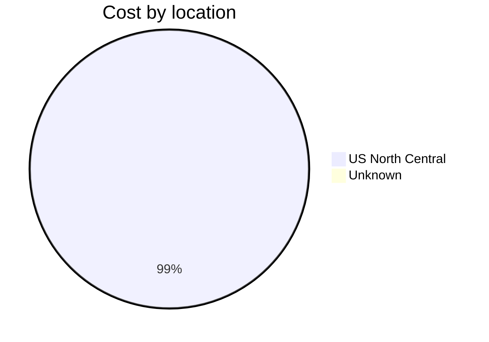
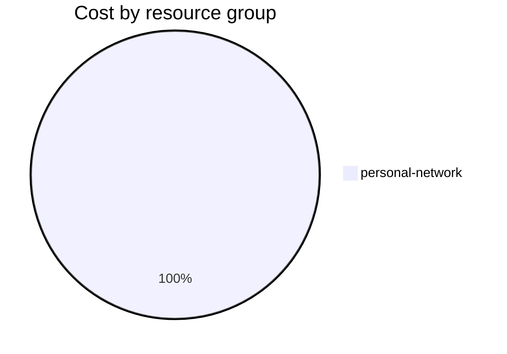

Fetching subscription details...
Fetching cost data...
Fetching forecasted cost data...
Fetching cost data by service name...
Fetching cost data by location...
Fetching cost data by resource group...
# Azure Cost Overview

> Accumulated cost for subscription id `JPF Pay-As-You-Go` from **12/01/2023** to **12/12/2023**

## Totals

|Period|Amount|
|---|---:|
|Today|0.10 USD|
|Yesterday|0.92 USD|
|Last 7 days|11.34 USD|
|Last 30 days|18.74 USD|

```mermaid
gantt
   title Accumulated cost
   dateFormat  X
   axisFormat %s
   section 01 Dec
   USD 1.75 :0, 175
   section 02 Dec
   USD 3.60 :0, 360
   section 03 Dec
   USD 5.81 :0, 581
   section 04 Dec
   USD 7.40 :0, 740
   section 05 Dec
   USD 8.97 :0, 897
   section 06 Dec
   USD 11.15 :0, 1115
   section 07 Dec
   USD 12.94 :0, 1294
   section 08 Dec
   USD 14.43 :0, 1443
   section 09 Dec
   USD 16.17 :0, 1617
   section 10 Dec
   USD 17.72 :0, 1772
   section 11 Dec
   USD 18.64 :0, 1864
   section 12 Dec
   USD 18.74 :0, 1874
   section 13 Dec
   USD 20.50 : done, 0, 2050
   section 14 Dec
   USD 22.23 : done, 0, 2223
   section 15 Dec
   USD 23.98 : done, 0, 2398
   section 16 Dec
   USD 25.75 : done, 0, 2575
   section 17 Dec
   USD 27.44 : done, 0, 2744
   section 18 Dec
   USD 29.14 : done, 0, 2914
   section 19 Dec
   USD 31.00 : done, 0, 3100
   section 20 Dec
   USD 32.75 : done, 0, 3275
   section 21 Dec
   USD 34.47 : done, 0, 3447
   section 22 Dec
   USD 36.20 : done, 0, 3620
   section 23 Dec
   USD 37.95 : done, 0, 3795
   section 24 Dec
   USD 39.63 : done, 0, 3963
   section 25 Dec
   USD 41.32 : done, 0, 4132
   section 26 Dec
   USD 43.17 : done, 0, 4317
   section 27 Dec
   USD 44.90 : done, 0, 4490
   section 28 Dec
   USD 46.60 : done, 0, 4660
   section 29 Dec
   USD 48.32 : done, 0, 4832
   section 30 Dec
   USD 50.06 : done, 0, 5006
   section 31 Dec
   USD 51.72 : done, 0, 5172
```

## By Service Name

|Service|Amount|
|---|---:|
|Storage|8.94 USD|
|Virtual Machines|4.42 USD|
|Bandwidth|2.71 USD|
|Virtual Network|2.51 USD|
|Azure DNS|0.17 USD|

## By Location

|Location|Amount|
|---|---:|
|US North Central|18.57 USD|
|Unknown|0.17 USD|

## By Resource Group

|Resource Group|Amount|
|---|---:|
|personal-network|18.74 USD|

Generated at 2023-12-12 11:08:58 for subscription with id `4913be3f-a345-4652-9bba-767418dd25e3`
