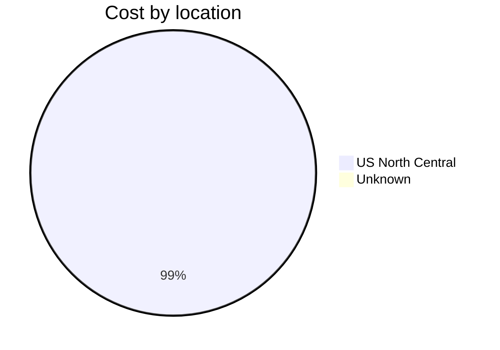
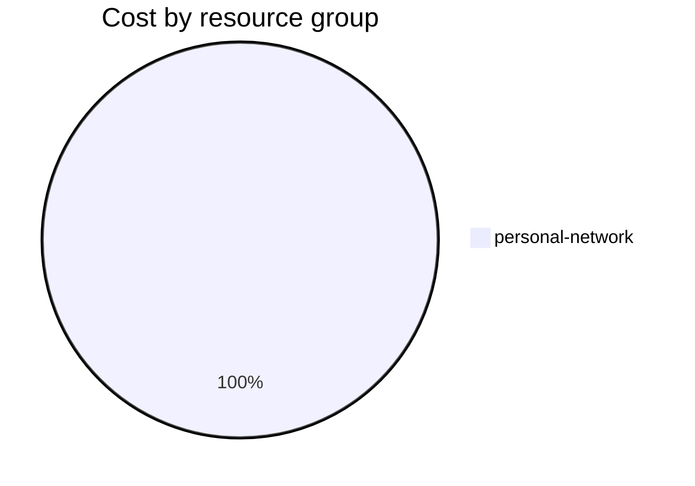

Fetching subscription details...
Fetching cost data...
Fetching forecasted cost data...
Fetching cost data by service name...
Fetching cost data by location...
Fetching cost data by resource group...
# Azure Cost Overview

> Accumulated cost for subscription id `JPF Pay-As-You-Go` from **11/01/2023** to **11/05/2023**

## Totals

|Period|Amount|
|---|---:|
|Today|0.05 USD|
|Yesterday|1.37 USD|
|Last 7 days|6.76 USD|
|Last 30 days|6.76 USD|

```mermaid
gantt
   title Accumulated cost
   dateFormat  X
   axisFormat %s
   section 01 Nov
   USD 1.77 :0, 177
   section 02 Nov
   USD 3.44 :0, 344
   section 03 Nov
   USD 5.34 :0, 534
   section 04 Nov
   USD 6.71 :0, 671
   section 05 Nov
   USD 6.76 :0, 676
   section 06 Nov
   USD 8.37 : done, 0, 837
   section 07 Nov
   USD 10.06 : done, 0, 1006
   section 08 Nov
   USD 11.75 : done, 0, 1175
   section 09 Nov
   USD 13.44 : done, 0, 1344
   section 10 Nov
   USD 15.31 : done, 0, 1531
   section 11 Nov
   USD 16.95 : done, 0, 1695
   section 12 Nov
   USD 18.41 : done, 0, 1841
   section 13 Nov
   USD 20.00 : done, 0, 2000
   section 14 Nov
   USD 21.68 : done, 0, 2168
   section 15 Nov
   USD 23.36 : done, 0, 2336
   section 16 Nov
   USD 25.03 : done, 0, 2503
   section 17 Nov
   USD 26.88 : done, 0, 2688
   section 18 Nov
   USD 28.51 : done, 0, 2851
   section 19 Nov
   USD 29.95 : done, 0, 2995
   section 20 Nov
   USD 31.53 : done, 0, 3153
   section 21 Nov
   USD 33.18 : done, 0, 3318
   section 22 Nov
   USD 34.85 : done, 0, 3485
   section 23 Nov
   USD 36.51 : done, 0, 3651
   section 24 Nov
   USD 38.34 : done, 0, 3834
   section 25 Nov
   USD 39.95 : done, 0, 3995
   section 26 Nov
   USD 41.38 : done, 0, 4138
   section 27 Nov
   USD 42.94 : done, 0, 4294
   section 28 Nov
   USD 44.58 : done, 0, 4458
   section 29 Nov
   USD 46.23 : done, 0, 4623
   section 30 Nov
   USD 47.87 : done, 0, 4787
```

## By Service Name

|Service|Amount|
|---|---:|
|Storage|3.30 USD|
|Virtual Machines|1.54 USD|
|Bandwidth|0.94 USD|
|Virtual Network|0.91 USD|
|Azure DNS|0.06 USD|

## By Location

|Location|Amount|
|---|---:|
|US North Central|6.69 USD|
|Unknown|0.06 USD|

## By Resource Group

|Resource Group|Amount|
|---|---:|
|personal-network|6.76 USD|

Generated at 2023-11-05 11:07:59 for subscription with id `4913be3f-a345-4652-9bba-767418dd25e3`
