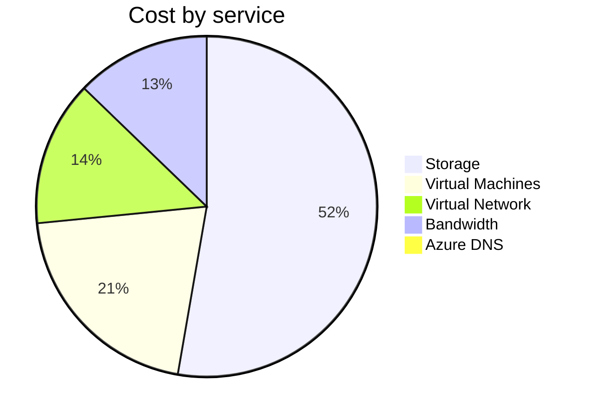
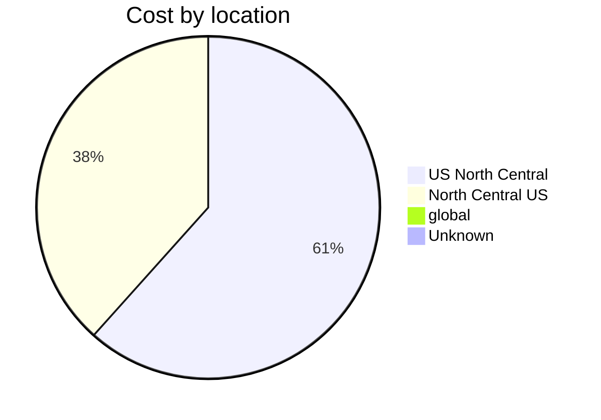
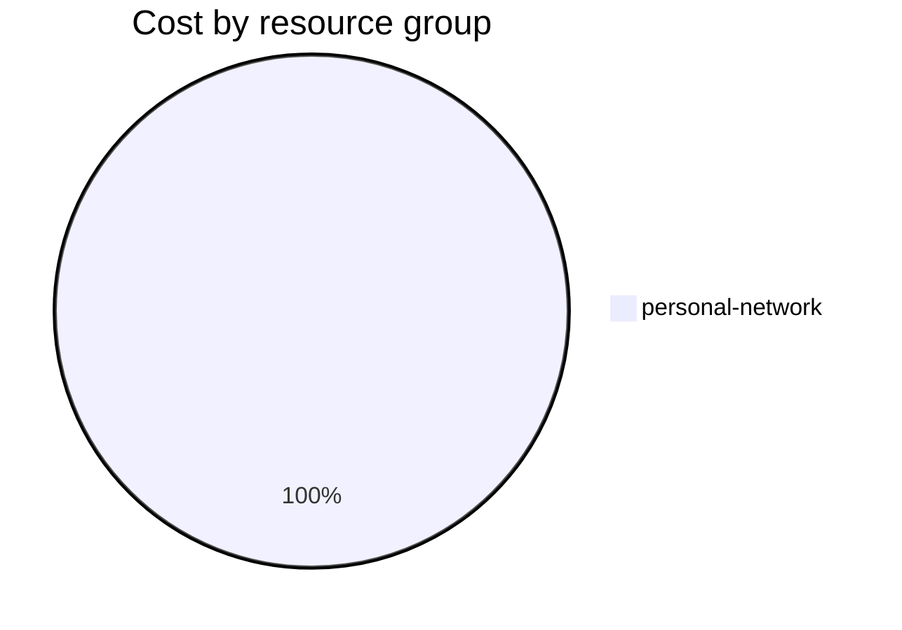

Fetching subscription details...
Fetching cost data...
Fetching forecasted cost data...
Fetching cost data by service name...
Fetching cost data by location...
Fetching cost data by resource group...
# Azure Cost Overview

> Accumulated cost for subscription id `JPF Pay-As-You-Go` from **10/01/2023** to **10/28/2023**

## Totals

|Period|Amount|
|---|---:|
|Today|0.09 USD|
|Yesterday|1.46 USD|
|Last 7 days|11.06 USD|
|Last 30 days|47.30 USD|

```mermaid
gantt
   title Accumulated cost
   dateFormat  X
   axisFormat %s
   section 01 Oct
   USD 3.16 :0, 316
   section 02 Oct
   USD 5.72 :0, 572
   section 03 Oct
   USD 7.55 :0, 755
   section 04 Oct
   USD 9.41 :0, 941
   section 05 Oct
   USD 11.15 :0, 1115
   section 06 Oct
   USD 13.05 :0, 1305
   section 07 Oct
   USD 14.85 :0, 1485
   section 08 Oct
   USD 16.35 :0, 1635
   section 09 Oct
   USD 17.97 :0, 1797
   section 10 Oct
   USD 19.54 :0, 1954
   section 11 Oct
   USD 21.13 :0, 2113
   section 12 Oct
   USD 22.77 :0, 2277
   section 13 Oct
   USD 24.38 :0, 2438
   section 14 Oct
   USD 25.82 :0, 2582
   section 15 Oct
   USD 27.29 :0, 2729
   section 16 Oct
   USD 28.99 :0, 2899
   section 17 Oct
   USD 30.79 :0, 3079
   section 18 Oct
   USD 32.61 :0, 3261
   section 19 Oct
   USD 34.40 :0, 3440
   section 20 Oct
   USD 36.24 :0, 3624
   section 21 Oct
   USD 37.96 :0, 3796
   section 22 Oct
   USD 39.46 :0, 3946
   section 23 Oct
   USD 41.02 :0, 4102
   section 24 Oct
   USD 42.62 :0, 4262
   section 25 Oct
   USD 44.20 :0, 4420
   section 26 Oct
   USD 45.75 :0, 4575
   section 27 Oct
   USD 47.21 :0, 4721
   section 28 Oct
   USD 47.30 :0, 4730
   section 29 Oct
   USD 48.24 : done, 0, 4824
   section 30 Oct
   USD 49.30 : done, 0, 4930
   section 31 Oct
   USD 50.35 : done, 0, 5035
```

## By Service Name

|Service|Amount|
|---|---:|
|Storage|24.71 USD|
|Virtual Machines|9.71 USD|
|Virtual Network|6.46 USD|
|Bandwidth|5.99 USD|
|Azure DNS|0.43 USD|

## By Location

|Location|Amount|
|---|---:|
|US North Central|28.87 USD|
|North Central US|17.99 USD|
|global|0.29 USD|
|Unknown|0.14 USD|

## By Resource Group

|Resource Group|Amount|
|---|---:|
|personal-network|47.30 USD|

Generated at 2023-10-28 11:05:20 for subscription with id `4913be3f-a345-4652-9bba-767418dd25e3`
