Fetching subscription details...
Fetching cost data...
Fetching forecasted cost data...
Fetching cost data by service name...
Fetching cost data by location...
Fetching cost data by resource group...
# Azure Cost Overview

> Accumulated cost for subscription id `JPF Pay-As-You-Go` from **10/01/2023** to **10/16/2023**

## Totals

|Period|Amount|
|---|---:|
|Today|0.10 USD|
|Yesterday|1.39 USD|
|Last 7 days|10.33 USD|
|Last 30 days|26.68 USD|

```mermaid
gantt
   title Accumulated cost
   dateFormat  X
   axisFormat %s
   section 01 Oct
   USD 3.16 :0, 316
   section 02 Oct
   USD 5.72 :0, 572
   section 03 Oct
   USD 7.55 :0, 755
   section 04 Oct
   USD 9.41 :0, 941
   section 05 Oct
   USD 11.15 :0, 1115
   section 06 Oct
   USD 13.05 :0, 1305
   section 07 Oct
   USD 14.85 :0, 1485
   section 08 Oct
   USD 16.35 :0, 1635
   section 09 Oct
   USD 17.94 :0, 1794
   section 10 Oct
   USD 19.39 :0, 1939
   section 11 Oct
   USD 20.84 :0, 2084
   section 12 Oct
   USD 22.29 :0, 2229
   section 13 Oct
   USD 23.75 :0, 2375
   section 14 Oct
   USD 25.19 :0, 2519
   section 15 Oct
   USD 26.58 :0, 2658
   section 16 Oct
   USD 26.68 :0, 2668
   section 17 Oct
   USD 26.97 : done, 0, 2697
   section 18 Oct
   USD 27.17 : done, 0, 2717
   section 19 Oct
   USD 27.93 : done, 0, 2793
   section 20 Oct
   USD 28.57 : done, 0, 2857
   section 21 Oct
   USD 29.00 : done, 0, 2900
   section 22 Oct
   USD 29.97 : done, 0, 2997
   section 23 Oct
   USD 30.34 : done, 0, 3034
   section 24 Oct
   USD 30.34 : done, 0, 3034
   section 25 Oct
   USD 30.34 : done, 0, 3034
   section 26 Oct
   USD 30.35 : done, 0, 3035
   section 27 Oct
   USD 30.35 : done, 0, 3035
   section 28 Oct
   USD 30.35 : done, 0, 3035
   section 29 Oct
   USD 30.57 : done, 0, 3057
   section 30 Oct
   USD 30.57 : done, 0, 3057
   section 31 Oct
   USD 30.57 : done, 0, 3057
```

## By Service Name

|Service|Amount|
|---|---:|
|Storage|14.62 USD|
|Virtual Machines|5.44 USD|
|Virtual Network|3.59 USD|
|Bandwidth|2.79 USD|
|Azure DNS|0.24 USD|

## By Location

|Location|Amount|
|---|---:|
|US North Central|26.44 USD|
|Unknown|0.24 USD|

## By Resource Group

|Resource Group|Amount|
|---|---:|
|personal-network|26.68 USD|

Generated at 2023-10-16 11:06:07 for subscription with id `4913be3f-a345-4652-9bba-767418dd25e3`
