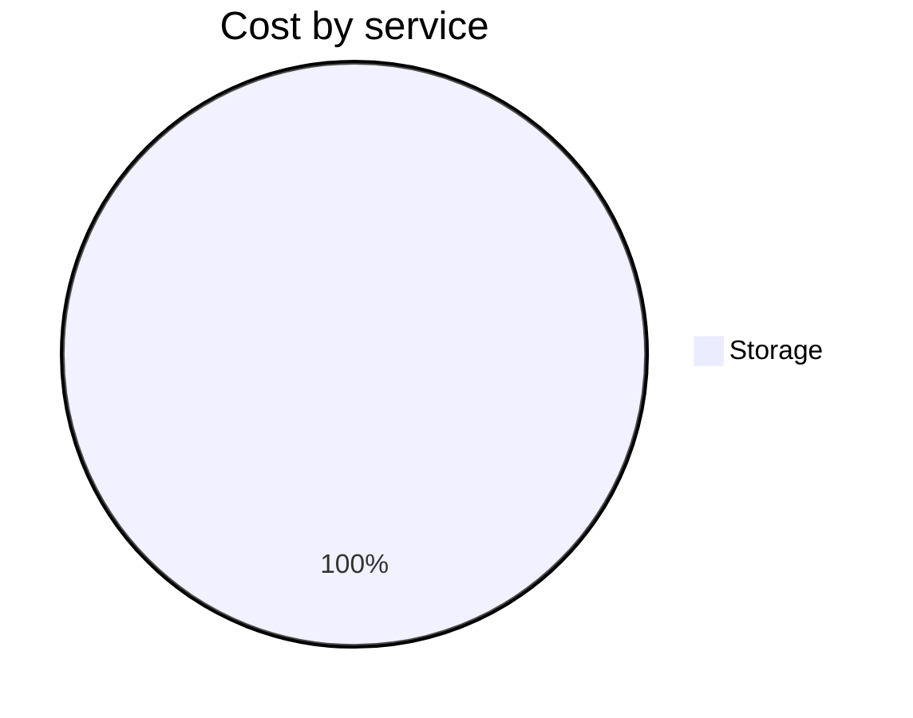
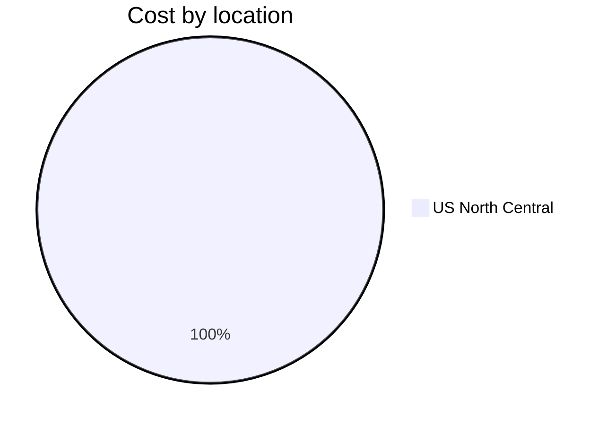
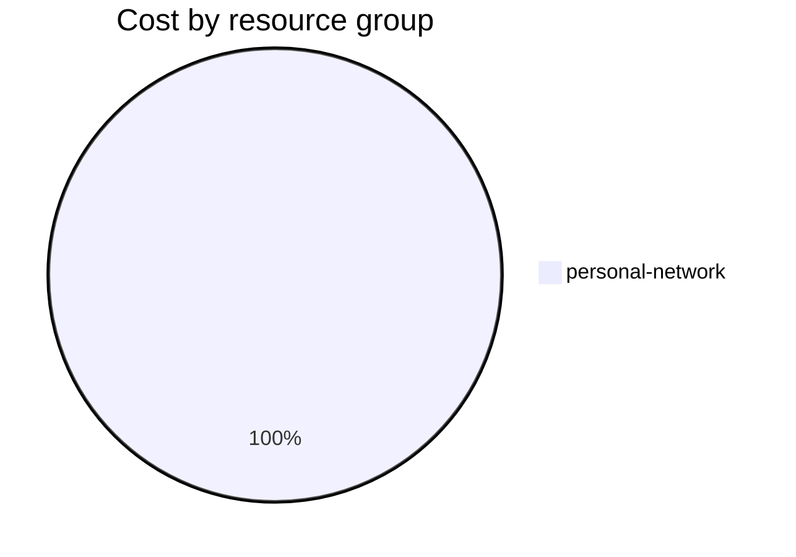

Fetching subscription details...
Fetching cost data...
Fetching forecasted cost data...
Fetching cost data by service name...
Fetching cost data by location...
Fetching cost data by resource group...
# Azure Cost Overview

> Accumulated cost for subscription id `JPF Pay-As-You-Go` from **09/19/2023** to **09/25/2023**

## Totals

|Period|Amount|
|---|---:|
|Today|0.00 USD|
|Yesterday|0.71 USD|
|Last 7 days|4.53 USD|
|Last 30 days|4.53 USD|

```mermaid
gantt
   title Accumulated cost
   dateFormat  X
   axisFormat %s
   section 19 Sep
   USD 0.09 :0, 9
   section 20 Sep
   USD 0.85 :0, 85
   section 21 Sep
   USD 1.60 :0, 160
   section 22 Sep
   USD 2.36 :0, 236
   section 23 Sep
   USD 3.09 :0, 309
   section 24 Sep
   USD 3.83 :0, 383
   section 25 Sep
   USD 4.53 :0, 453
   section 26 Sep
   USD 4.63 : done, 0, 463
   section 27 Sep
   USD 5.38 : done, 0, 538
   section 28 Sep
   USD 6.13 : done, 0, 613
   section 29 Sep
   USD 6.89 : done, 0, 689
   section 30 Sep
   USD 7.63 : done, 0, 763
```

## By Service Name

|Service|Amount|
|---|---:|
|Storage|4.53 USD|

## By Location

|Location|Amount|
|---|---:|
|US North Central|4.53 USD|

## By Resource Group

|Resource Group|Amount|
|---|---:|
|personal-network|4.53 USD|

Generated at 2023-09-26 11:16:22 for subscription with id `4913be3f-a345-4652-9bba-767418dd25e3`
