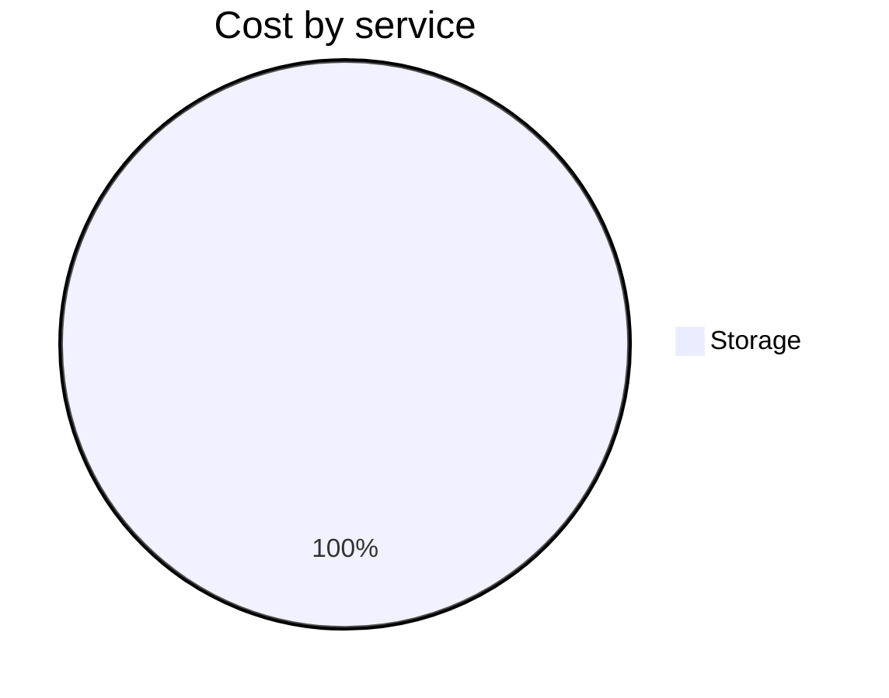
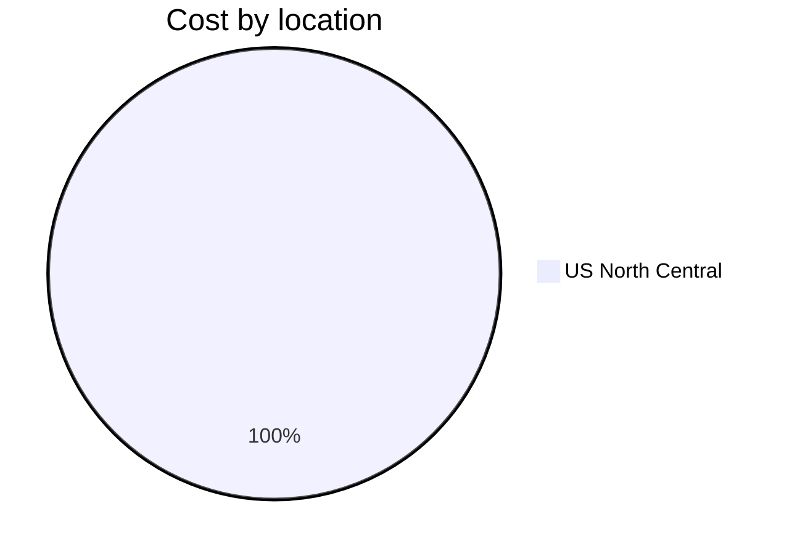
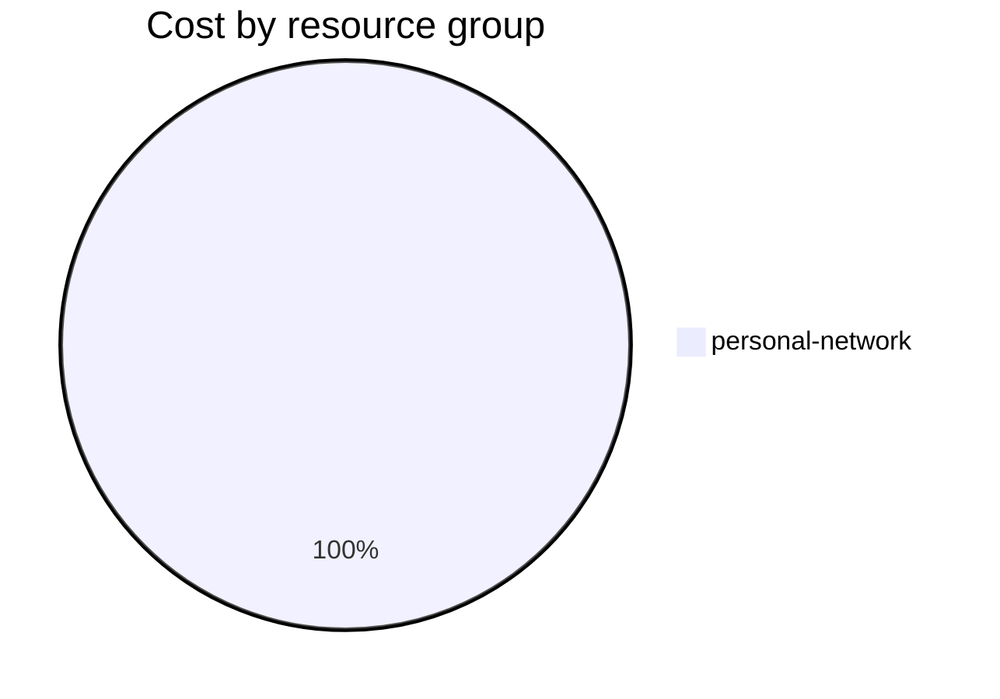

Fetching subscription details...
Fetching cost data...
Fetching forecasted cost data...
Fetching cost data by service name...
Fetching cost data by location...
Fetching cost data by resource group...
# Azure Cost Overview

> Accumulated cost for subscription id `JPF Pay-As-You-Go` from **12/01/2023** to **12/03/2023**

## Totals

|Period|Amount|
|---|---:|
|Today|0.00 USD|
|Yesterday|0.25 USD|
|Last 7 days|1.70 USD|
|Last 30 days|1.70 USD|

```mermaid
gantt
   title Accumulated cost
   dateFormat  X
   axisFormat %s
   section 01 Dec
   USD 0.73 :0, 73
   section 02 Dec
   USD 1.45 :0, 145
   section 03 Dec
   USD 1.70 :0, 170
   section 04 Dec
   USD 2.44 : done, 0, 244
   section 05 Dec
   USD 3.19 : done, 0, 319
   section 06 Dec
   USD 3.93 : done, 0, 393
   section 07 Dec
   USD 4.68 : done, 0, 468
   section 08 Dec
   USD 5.42 : done, 0, 542
   section 09 Dec
   USD 6.16 : done, 0, 616
   section 10 Dec
   USD 6.90 : done, 0, 690
   section 11 Dec
   USD 7.64 : done, 0, 764
   section 12 Dec
   USD 8.39 : done, 0, 839
   section 13 Dec
   USD 9.14 : done, 0, 914
   section 14 Dec
   USD 9.88 : done, 0, 988
   section 15 Dec
   USD 10.62 : done, 0, 1062
   section 16 Dec
   USD 11.36 : done, 0, 1136
   section 17 Dec
   USD 12.10 : done, 0, 1210
   section 18 Dec
   USD 12.84 : done, 0, 1284
   section 19 Dec
   USD 13.59 : done, 0, 1359
   section 20 Dec
   USD 14.33 : done, 0, 1433
   section 21 Dec
   USD 15.07 : done, 0, 1507
   section 22 Dec
   USD 15.82 : done, 0, 1582
   section 23 Dec
   USD 16.56 : done, 0, 1656
   section 24 Dec
   USD 17.29 : done, 0, 1729
   section 25 Dec
   USD 18.03 : done, 0, 1803
   section 26 Dec
   USD 18.78 : done, 0, 1878
   section 27 Dec
   USD 19.52 : done, 0, 1952
   section 28 Dec
   USD 20.26 : done, 0, 2026
   section 29 Dec
   USD 21.01 : done, 0, 2101
   section 30 Dec
   USD 21.75 : done, 0, 2175
   section 31 Dec
   USD 22.48 : done, 0, 2248
```

## By Service Name

|Service|Amount|
|---|---:|
|Storage|1.70 USD|

## By Location

|Location|Amount|
|---|---:|
|US North Central|1.70 USD|

## By Resource Group

|Resource Group|Amount|
|---|---:|
|personal-network|1.70 USD|

Generated at 2023-12-04 11:17:18 for subscription with id `4913be3f-a345-4652-9bba-767418dd25e3`
