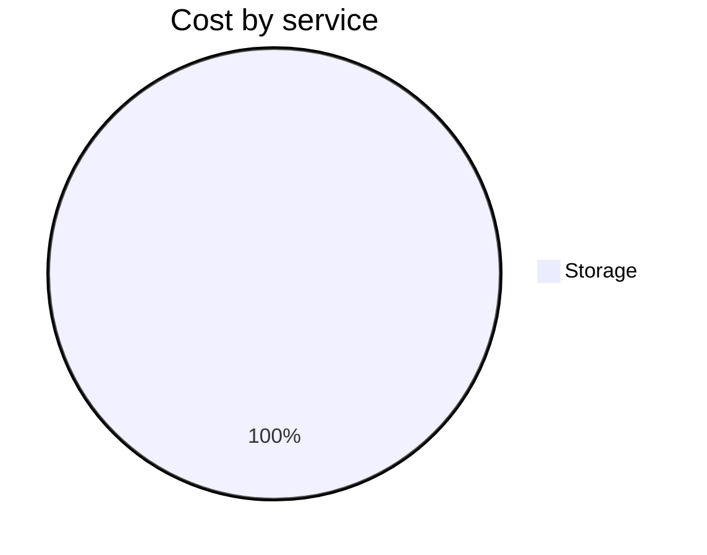
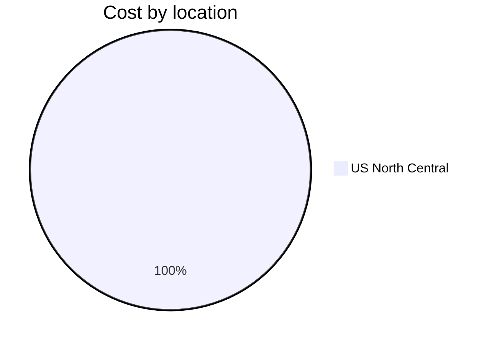
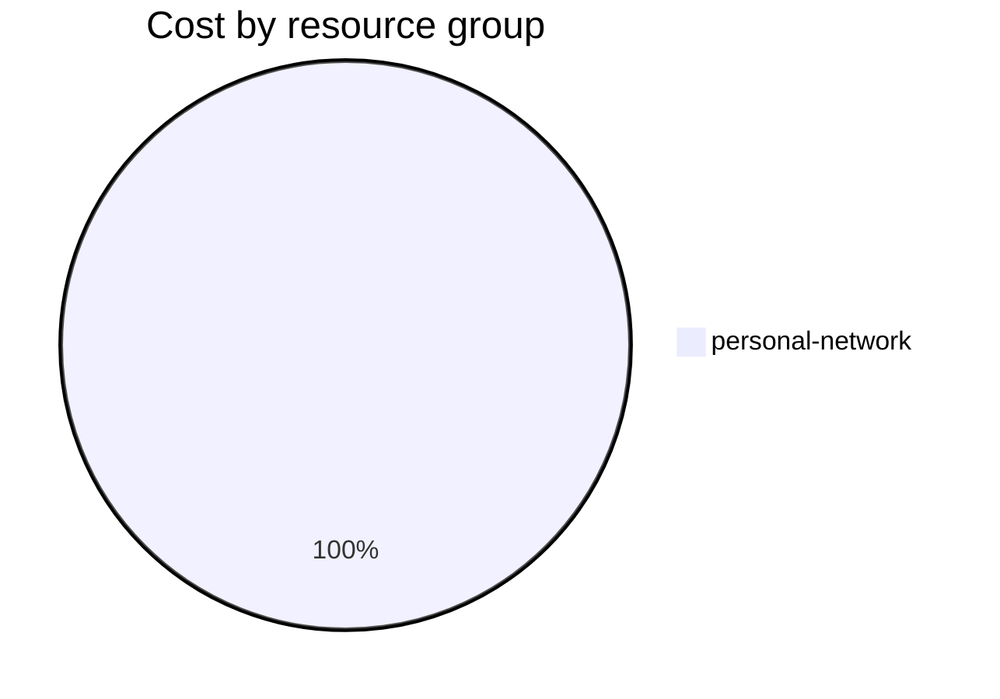

Fetching subscription details...
Fetching cost data...
Fetching forecasted cost data...
Fetching cost data by service name...
Fetching cost data by location...
Fetching cost data by resource group...
# Azure Cost Overview

> Accumulated cost for subscription id `JPF Pay-As-You-Go` from **01/01/2024** to **01/04/2024**

## Totals

|Period|Amount|
|---|---:|
|Today|0.00 USD|
|Yesterday|0.65 USD|
|Last 7 days|2.86 USD|
|Last 30 days|2.86 USD|

```mermaid
gantt
   title Accumulated cost
   dateFormat  X
   axisFormat %s
   section 01 Jan
   USD 0.73 :0, 73
   section 02 Jan
   USD 1.48 :0, 148
   section 03 Jan
   USD 2.22 :0, 222
   section 04 Jan
   USD 2.86 :0, 286
   section 05 Jan
   USD 3.56 : done, 0, 356
   section 06 Jan
   USD 4.28 : done, 0, 428
   section 07 Jan
   USD 4.99 : done, 0, 499
   section 08 Jan
   USD 5.71 : done, 0, 571
   section 09 Jan
   USD 6.44 : done, 0, 644
   section 10 Jan
   USD 7.16 : done, 0, 716
   section 11 Jan
   USD 7.87 : done, 0, 787
   section 12 Jan
   USD 8.57 : done, 0, 857
   section 13 Jan
   USD 9.28 : done, 0, 928
   section 14 Jan
   USD 9.99 : done, 0, 999
   section 15 Jan
   USD 10.70 : done, 0, 1070
   section 16 Jan
   USD 11.43 : done, 0, 1143
   section 17 Jan
   USD 12.14 : done, 0, 1214
   section 18 Jan
   USD 12.85 : done, 0, 1285
   section 19 Jan
   USD 13.54 : done, 0, 1354
   section 20 Jan
   USD 14.25 : done, 0, 1425
   section 21 Jan
   USD 14.95 : done, 0, 1495
   section 22 Jan
   USD 15.66 : done, 0, 1566
   section 23 Jan
   USD 16.39 : done, 0, 1639
   section 24 Jan
   USD 17.10 : done, 0, 1710
   section 25 Jan
   USD 17.80 : done, 0, 1780
   section 26 Jan
   USD 18.48 : done, 0, 1848
   section 27 Jan
   USD 19.19 : done, 0, 1919
   section 28 Jan
   USD 19.88 : done, 0, 1988
   section 29 Jan
   USD 20.59 : done, 0, 2059
   section 30 Jan
   USD 21.31 : done, 0, 2131
   section 31 Jan
   USD 22.02 : done, 0, 2202
```

## By Service Name

|Service|Amount|
|---|---:|
|Storage|2.86 USD|

## By Location

|Location|Amount|
|---|---:|
|US North Central|2.86 USD|

## By Resource Group

|Resource Group|Amount|
|---|---:|
|personal-network|2.86 USD|

Generated at 2024-01-05 11:16:08 for subscription with id `4913be3f-a345-4652-9bba-767418dd25e3`
