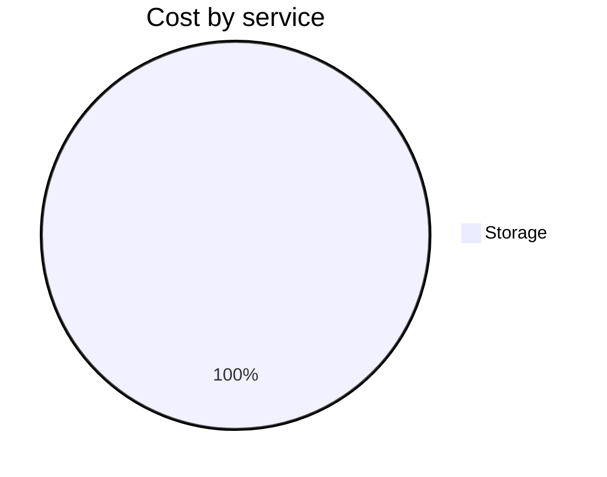
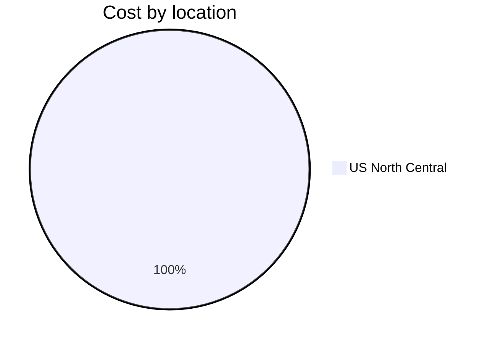
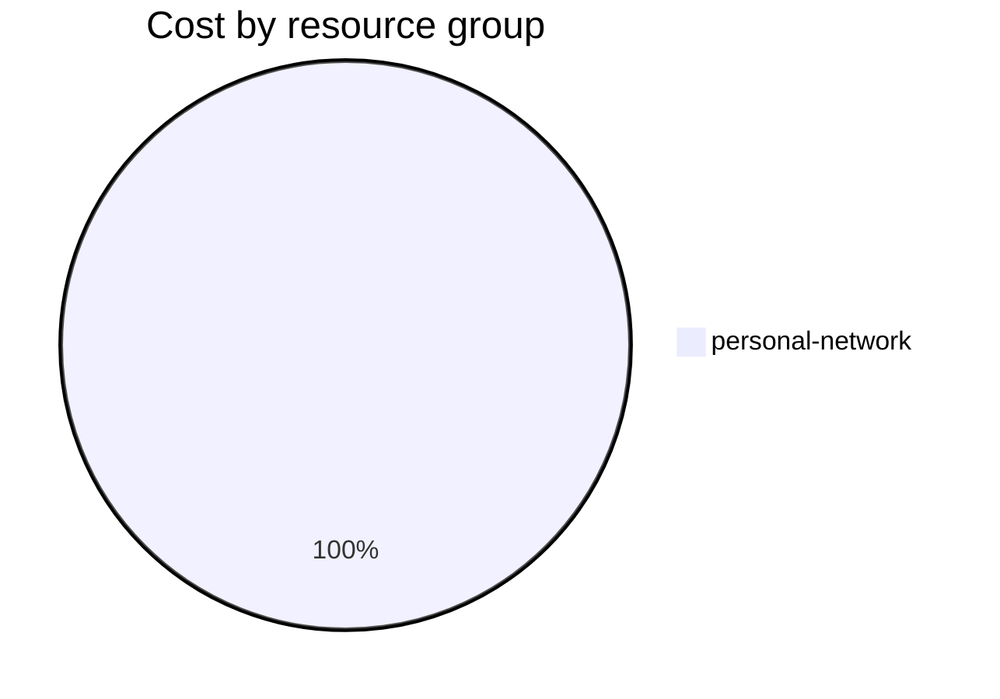

Fetching subscription details...
Fetching cost data...
Fetching forecasted cost data...
Fetching cost data by service name...
Fetching cost data by location...
Fetching cost data by resource group...
# Azure Cost Overview

> Accumulated cost for subscription id `JPF Pay-As-You-Go` from **01/01/2024** to **01/03/2024**

## Totals

|Period|Amount|
|---|---:|
|Today|0.00 USD|
|Yesterday|0.64 USD|
|Last 7 days|2.12 USD|
|Last 30 days|2.12 USD|

```mermaid
gantt
   title Accumulated cost
   dateFormat  X
   axisFormat %s
   section 01 Jan
   USD 0.73 :0, 73
   section 02 Jan
   USD 1.48 :0, 148
   section 03 Jan
   USD 2.12 :0, 212
   section 04 Jan
   USD 2.84 : done, 0, 284
   section 05 Jan
   USD 3.54 : done, 0, 354
   section 06 Jan
   USD 4.27 : done, 0, 427
   section 07 Jan
   USD 4.98 : done, 0, 498
   section 08 Jan
   USD 5.71 : done, 0, 571
   section 09 Jan
   USD 6.44 : done, 0, 644
   section 10 Jan
   USD 7.16 : done, 0, 716
   section 11 Jan
   USD 7.88 : done, 0, 788
   section 12 Jan
   USD 8.58 : done, 0, 858
   section 13 Jan
   USD 9.30 : done, 0, 930
   section 14 Jan
   USD 10.01 : done, 0, 1001
   section 15 Jan
   USD 10.73 : done, 0, 1073
   section 16 Jan
   USD 11.47 : done, 0, 1147
   section 17 Jan
   USD 12.19 : done, 0, 1219
   section 18 Jan
   USD 12.90 : done, 0, 1290
   section 19 Jan
   USD 13.60 : done, 0, 1360
   section 20 Jan
   USD 14.32 : done, 0, 1432
   section 21 Jan
   USD 15.03 : done, 0, 1503
   section 22 Jan
   USD 15.75 : done, 0, 1575
   section 23 Jan
   USD 16.48 : done, 0, 1648
   section 24 Jan
   USD 17.19 : done, 0, 1719
   section 25 Jan
   USD 17.91 : done, 0, 1791
   section 26 Jan
   USD 18.60 : done, 0, 1860
   section 27 Jan
   USD 19.32 : done, 0, 1932
   section 28 Jan
   USD 20.03 : done, 0, 2003
   section 29 Jan
   USD 20.75 : done, 0, 2075
   section 30 Jan
   USD 21.48 : done, 0, 2148
   section 31 Jan
   USD 22.19 : done, 0, 2219
```

## By Service Name

|Service|Amount|
|---|---:|
|Storage|2.12 USD|

## By Location

|Location|Amount|
|---|---:|
|US North Central|2.12 USD|

## By Resource Group

|Resource Group|Amount|
|---|---:|
|personal-network|2.12 USD|

Generated at 2024-01-04 11:15:12 for subscription with id `4913be3f-a345-4652-9bba-767418dd25e3`
