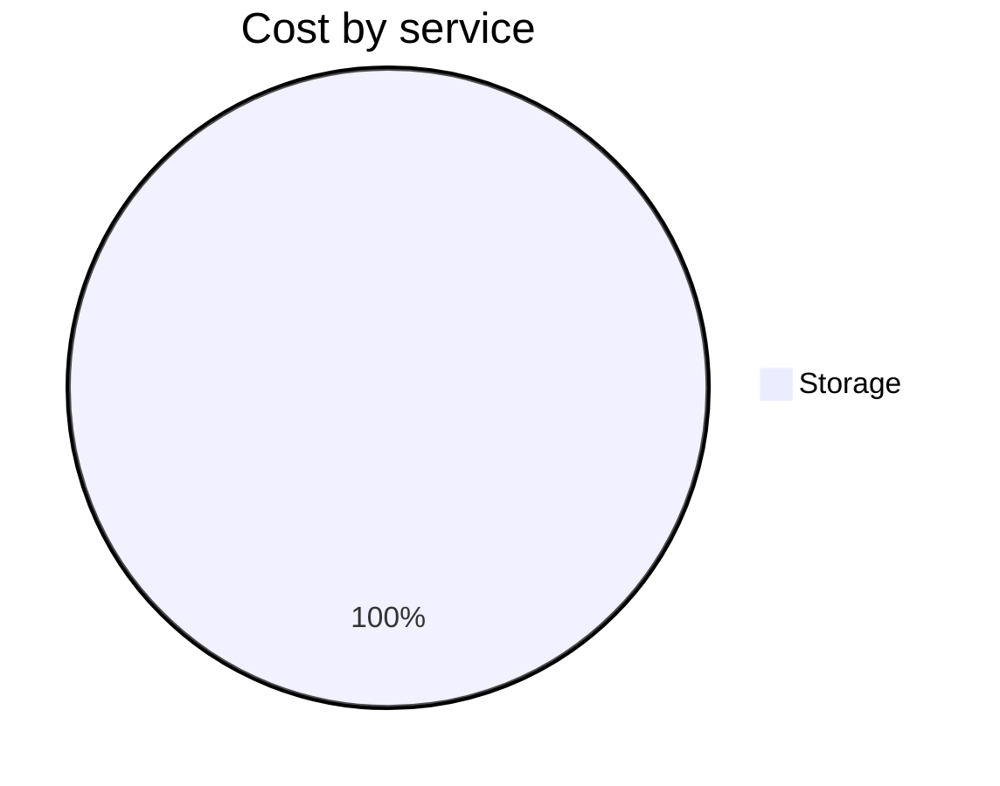
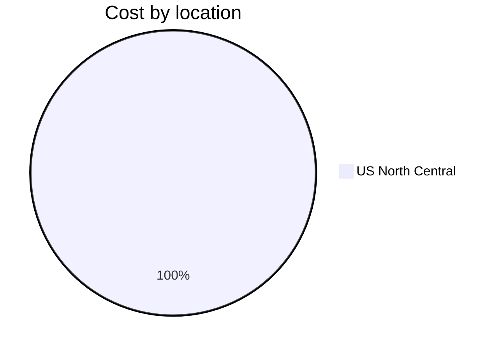
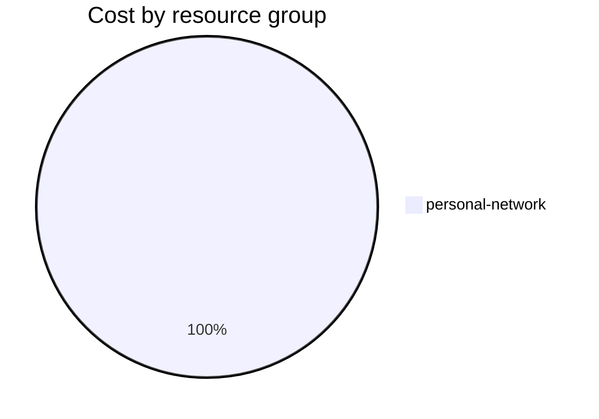

Fetching subscription details...
Fetching cost data...
Fetching forecasted cost data...
Fetching cost data by service name...
Fetching cost data by location...
Fetching cost data by resource group...
# Azure Cost Overview

> Accumulated cost for subscription id `JPF Pay-As-You-Go` from **12/01/2023** to **12/10/2023**

## Totals

|Period|Amount|
|---|---:|
|Today|0.00 USD|
|Yesterday|0.74 USD|
|Last 7 days|5.07 USD|
|Last 30 days|7.24 USD|

```mermaid
gantt
   title Accumulated cost
   dateFormat  X
   axisFormat %s
   section 01 Dec
   USD 0.73 :0, 73
   section 02 Dec
   USD 1.45 :0, 145
   section 03 Dec
   USD 2.17 :0, 217
   section 04 Dec
   USD 2.89 :0, 289
   section 05 Dec
   USD 3.59 :0, 359
   section 06 Dec
   USD 4.34 :0, 434
   section 07 Dec
   USD 5.06 :0, 506
   section 08 Dec
   USD 5.77 :0, 577
   section 09 Dec
   USD 6.50 :0, 650
   section 10 Dec
   USD 7.24 :0, 724
```

## By Service Name

|Service|Amount|
|---|---:|
|Storage|7.24 USD|

## By Location

|Location|Amount|
|---|---:|
|US North Central|7.24 USD|

## By Resource Group

|Resource Group|Amount|
|---|---:|
|personal-network|7.24 USD|

Generated at 2023-12-11 11:17:39 for subscription with id `4913be3f-a345-4652-9bba-767418dd25e3`
