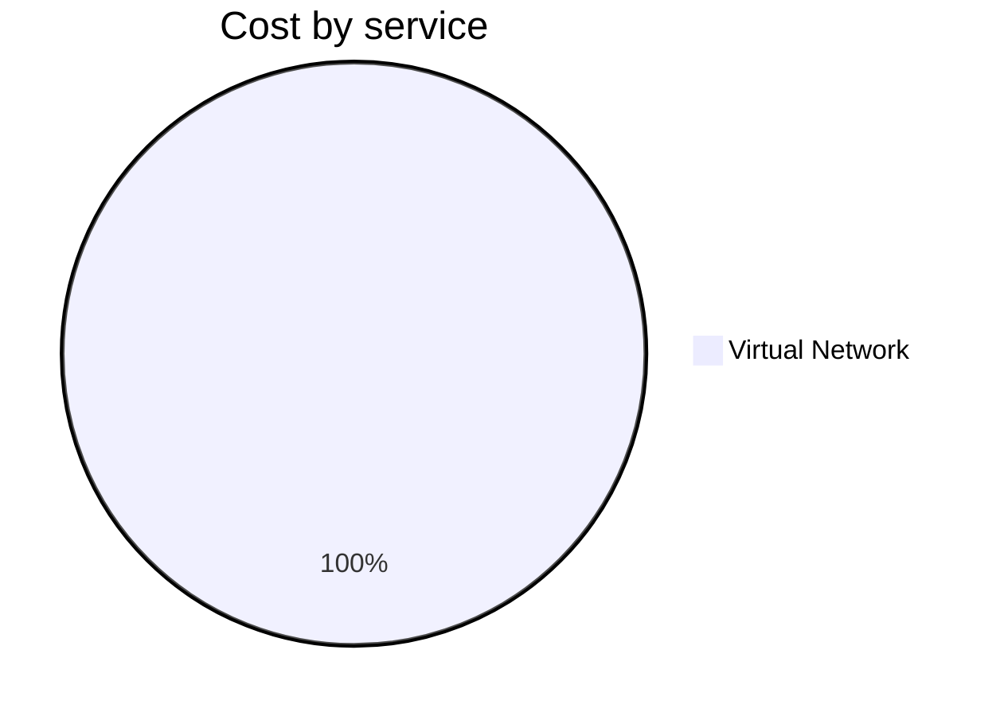
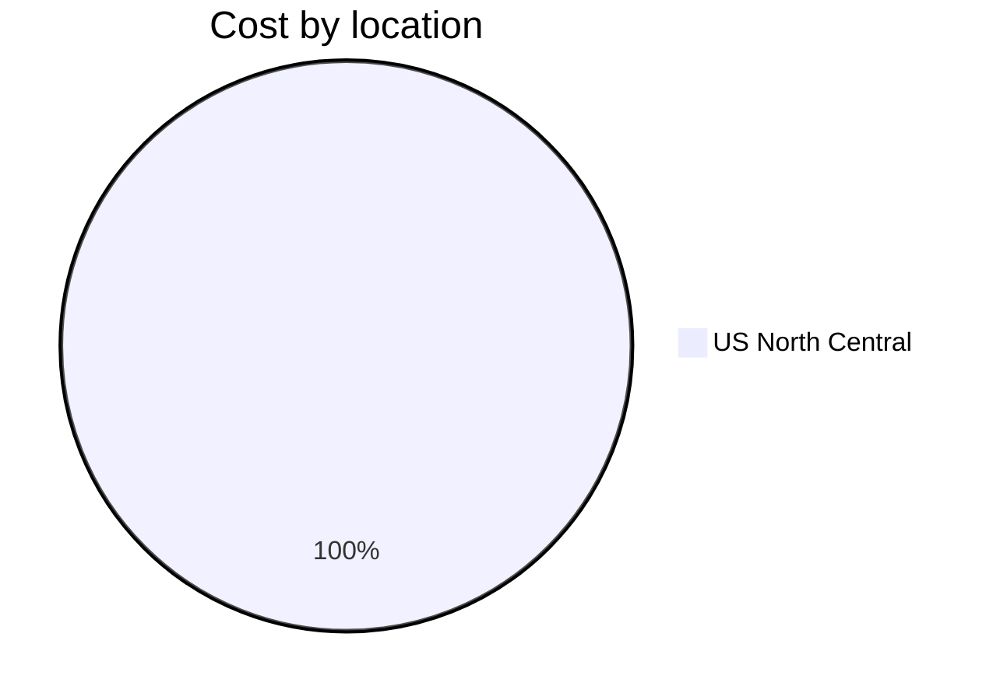
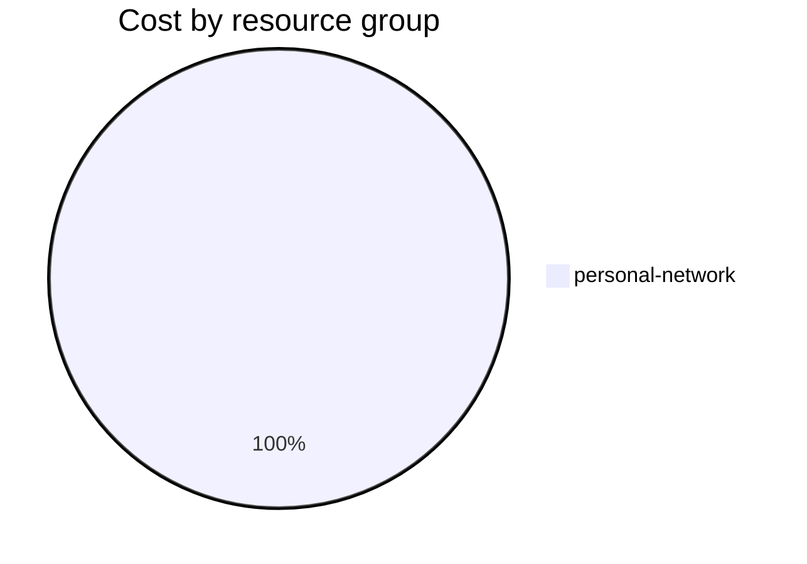

Fetching subscription details...
Fetching cost data...
Fetching forecasted cost data...
Fetching cost data by service name...
Fetching cost data by location...
Fetching cost data by resource group...
# Azure Cost Overview

> Accumulated cost for subscription id `JPF Pay-As-You-Go` from **01/01/2024** to **01/02/2024**

## Totals

|Period|Amount|
|---|---:|
|Today|0.00 USD|
|Yesterday|0.10 USD|
|Last 7 days|0.22 USD|
|Last 30 days|0.22 USD|

```mermaid
gantt
   title Accumulated cost
   dateFormat  X
   axisFormat %s
   section 01 Jan
   USD 0.12 :0, 12
   section 02 Jan
   USD 0.22 :0, 22
   section 03 Jan
   USD 0.34 : done, 0, 34
   section 04 Jan
   USD 0.46 : done, 0, 46
   section 05 Jan
   USD 0.58 : done, 0, 58
   section 06 Jan
   USD 0.70 : done, 0, 70
   section 07 Jan
   USD 0.82 : done, 0, 82
   section 08 Jan
   USD 0.94 : done, 0, 94
   section 09 Jan
   USD 1.06 : done, 0, 106
   section 10 Jan
   USD 1.18 : done, 0, 118
   section 11 Jan
   USD 1.30 : done, 0, 130
   section 12 Jan
   USD 1.42 : done, 0, 142
   section 13 Jan
   USD 1.54 : done, 0, 154
   section 14 Jan
   USD 1.66 : done, 0, 166
   section 15 Jan
   USD 1.78 : done, 0, 178
   section 16 Jan
   USD 1.90 : done, 0, 190
   section 17 Jan
   USD 2.02 : done, 0, 202
   section 18 Jan
   USD 2.14 : done, 0, 214
   section 19 Jan
   USD 2.26 : done, 0, 226
   section 20 Jan
   USD 2.38 : done, 0, 238
   section 21 Jan
   USD 2.50 : done, 0, 250
   section 22 Jan
   USD 2.62 : done, 0, 262
   section 23 Jan
   USD 2.74 : done, 0, 274
   section 24 Jan
   USD 2.86 : done, 0, 286
   section 25 Jan
   USD 2.98 : done, 0, 298
   section 26 Jan
   USD 3.10 : done, 0, 310
   section 27 Jan
   USD 3.22 : done, 0, 322
   section 28 Jan
   USD 3.34 : done, 0, 334
   section 29 Jan
   USD 3.46 : done, 0, 346
   section 30 Jan
   USD 3.58 : done, 0, 358
   section 31 Jan
   USD 3.70 : done, 0, 370
```

## By Service Name

|Service|Amount|
|---|---:|
|Virtual Network|0.22 USD|

## By Location

|Location|Amount|
|---|---:|
|US North Central|0.22 USD|

## By Resource Group

|Resource Group|Amount|
|---|---:|
|personal-network|0.22 USD|

Generated at 2024-01-03 11:18:23 for subscription with id `4913be3f-a345-4652-9bba-767418dd25e3`
