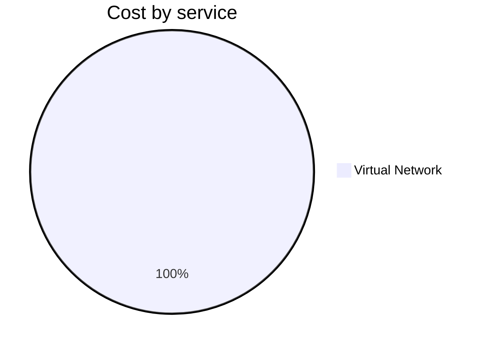
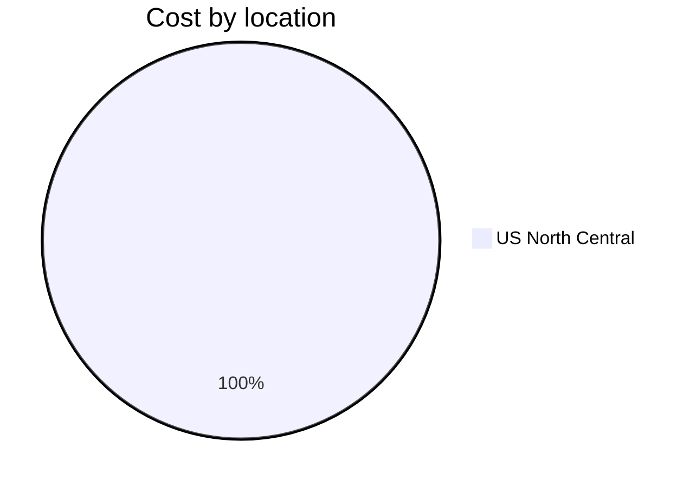
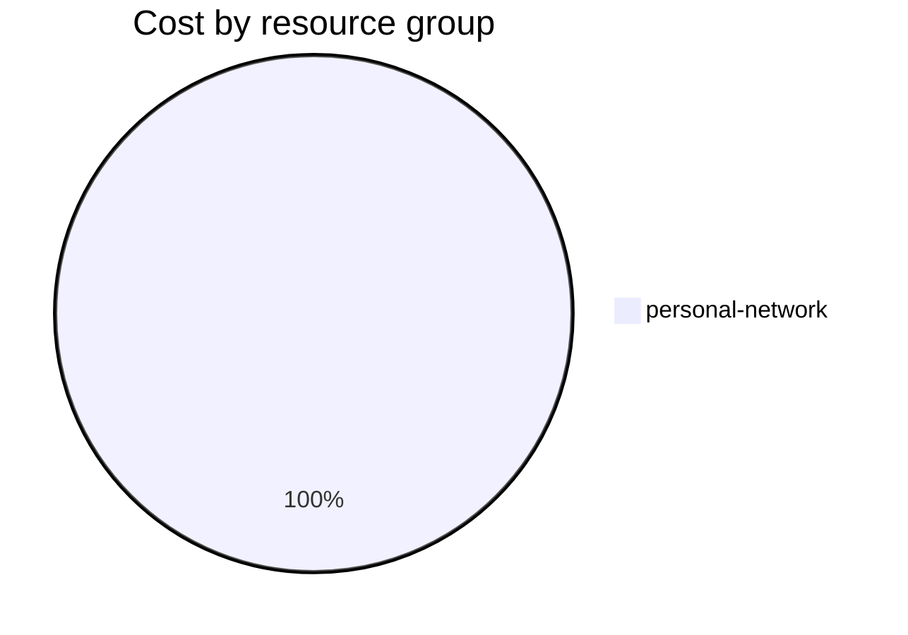

Fetching subscription details...
Fetching cost data...
Fetching forecasted cost data...
Fetching cost data by service name...
Fetching cost data by location...
Fetching cost data by resource group...
# Azure Cost Overview

> Accumulated cost for subscription id `JPF Pay-As-You-Go` from **09/14/2023** to **09/23/2023**

## Totals

|Period|Amount|
|---|---:|
|Today|0.00 USD|
|Yesterday|0.12 USD|
|Last 7 days|0.83 USD|
|Last 30 days|1.18 USD|

```mermaid
gantt
   title Accumulated cost
   dateFormat  X
   axisFormat %s
   section 14 Sep
   USD 0.11 :0, 11
   section 15 Sep
   USD 0.23 :0, 23
   section 16 Sep
   USD 0.35 :0, 35
   section 17 Sep
   USD 0.47 :0, 47
   section 18 Sep
   USD 0.59 :0, 59
   section 19 Sep
   USD 0.71 :0, 71
   section 20 Sep
   USD 0.83 :0, 83
   section 21 Sep
   USD 0.95 :0, 95
   section 22 Sep
   USD 1.07 :0, 107
   section 23 Sep
   USD 1.18 :0, 118
   section 24 Sep
   USD 1.31 : done, 0, 131
   section 25 Sep
   USD 1.43 : done, 0, 143
   section 26 Sep
   USD 1.56 : done, 0, 156
   section 27 Sep
   USD 1.68 : done, 0, 168
   section 28 Sep
   USD 1.81 : done, 0, 181
   section 29 Sep
   USD 1.93 : done, 0, 193
   section 30 Sep
   USD 2.06 : done, 0, 206
```

## By Service Name

|Service|Amount|
|---|---:|
|Virtual Network|1.18 USD|

## By Location

|Location|Amount|
|---|---:|
|US North Central|1.18 USD|

## By Resource Group

|Resource Group|Amount|
|---|---:|
|personal-network|1.18 USD|

Generated at 2023-09-24 11:22:04 for subscription with id `4913be3f-a345-4652-9bba-767418dd25e3`
