Fetching subscription details...
Fetching cost data...
Fetching forecasted cost data...
Fetching cost data by service name...
Fetching cost data by location...
Fetching cost data by resource group...
# Azure Cost Overview

> Accumulated cost for subscription id `JPF Pay-As-You-Go` from **10/01/2023** to **10/02/2023**

## Totals

|Period|Amount|
|---|---:|
|Today|0.00 USD|
|Yesterday|0.10 USD|
|Last 7 days|0.22 USD|
|Last 30 days|0.22 USD|

```mermaid
gantt
   title Accumulated cost
   dateFormat  X
   axisFormat %s
   section 01 Oct
   USD 0.12 :0, 12
   section 02 Oct
   USD 0.22 :0, 22
   section 03 Oct
   USD 0.35 : done, 0, 35
   section 04 Oct
   USD 0.47 : done, 0, 47
   section 05 Oct
   USD 0.59 : done, 0, 59
   section 06 Oct
   USD 0.71 : done, 0, 71
   section 07 Oct
   USD 0.84 : done, 0, 84
   section 08 Oct
   USD 0.96 : done, 0, 96
   section 09 Oct
   USD 1.08 : done, 0, 108
   section 10 Oct
   USD 1.20 : done, 0, 120
   section 11 Oct
   USD 1.33 : done, 0, 133
   section 12 Oct
   USD 1.45 : done, 0, 145
   section 13 Oct
   USD 1.57 : done, 0, 157
   section 14 Oct
   USD 1.70 : done, 0, 170
   section 15 Oct
   USD 1.82 : done, 0, 182
   section 16 Oct
   USD 1.95 : done, 0, 195
   section 17 Oct
   USD 2.07 : done, 0, 207
   section 18 Oct
   USD 2.20 : done, 0, 220
   section 19 Oct
   USD 2.32 : done, 0, 232
   section 20 Oct
   USD 2.45 : done, 0, 245
   section 21 Oct
   USD 2.57 : done, 0, 257
   section 22 Oct
   USD 2.70 : done, 0, 270
   section 23 Oct
   USD 2.82 : done, 0, 282
   section 24 Oct
   USD 2.95 : done, 0, 295
   section 25 Oct
   USD 3.08 : done, 0, 308
   section 26 Oct
   USD 3.20 : done, 0, 320
   section 27 Oct
   USD 3.33 : done, 0, 333
   section 28 Oct
   USD 3.46 : done, 0, 346
   section 29 Oct
   USD 3.58 : done, 0, 358
   section 30 Oct
   USD 3.71 : done, 0, 371
   section 31 Oct
   USD 3.84 : done, 0, 384
```

## By Service Name

|Service|Amount|
|---|---:|
|Virtual Network|0.23 USD|

## By Location

|Location|Amount|
|---|---:|
|US North Central|0.23 USD|

## By Resource Group

|Resource Group|Amount|
|---|---:|
|personal-network|0.23 USD|

Generated at 2023-10-03 11:20:06 for subscription with id `4913be3f-a345-4652-9bba-767418dd25e3`
