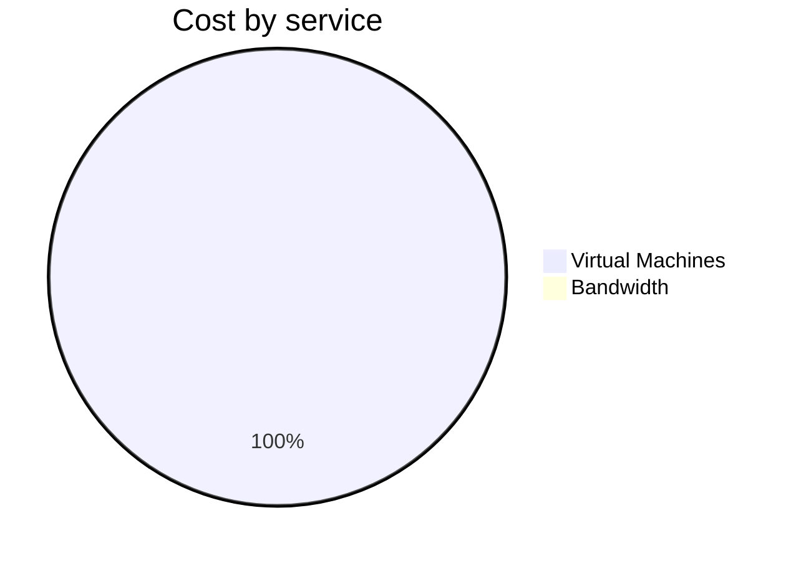
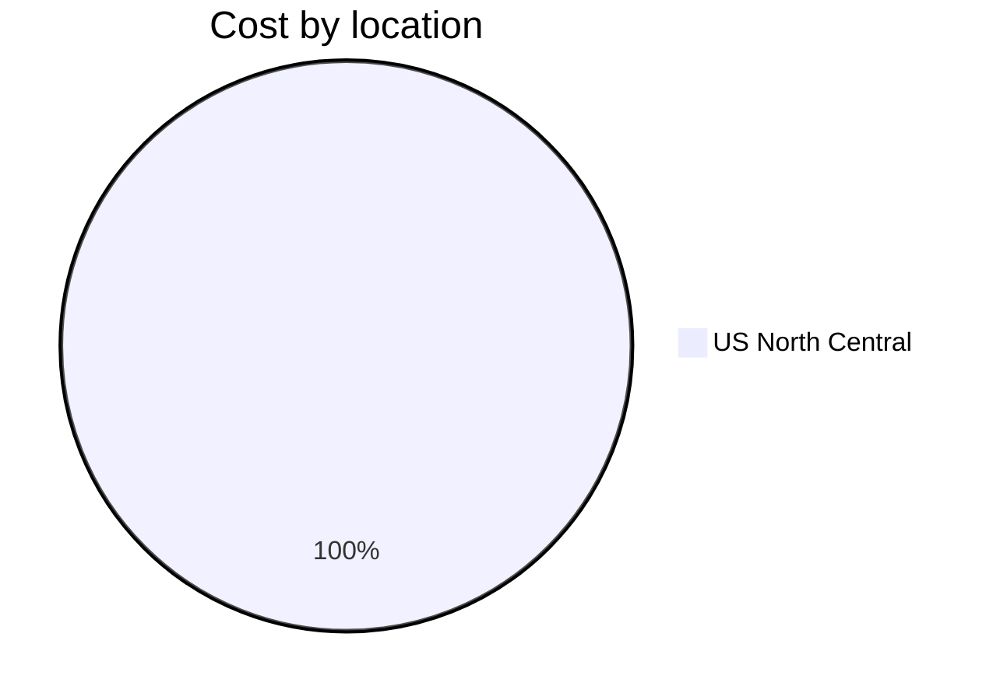
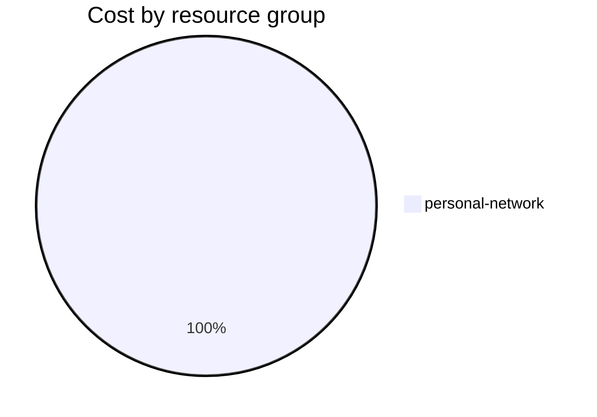

Fetching subscription details...
Fetching cost data...
Fetching forecasted cost data...
Fetching cost data by service name...
Fetching cost data by location...
Fetching cost data by resource group...
# Azure Cost Overview

> Accumulated cost for subscription id `JPF Pay-As-You-Go` from **09/14/2023** to **09/21/2023**

## Totals

|Period|Amount|
|---|---:|
|Today|0.06 USD|
|Yesterday|0.18 USD|
|Last 7 days|1.27 USD|
|Last 30 days|1.27 USD|

```mermaid
gantt
   title Accumulated cost
   dateFormat  X
   axisFormat %s
   section 14 Sep
   USD 0.16 :0, 16
   section 15 Sep
   USD 0.33 :0, 33
   section 16 Sep
   USD 0.51 :0, 51
   section 17 Sep
   USD 0.68 :0, 68
   section 18 Sep
   USD 0.86 :0, 86
   section 19 Sep
   USD 1.03 :0, 103
   section 20 Sep
   USD 1.21 :0, 121
   section 21 Sep
   USD 1.27 :0, 127
   section 22 Sep
   USD 1.44 : done, 0, 144
   section 23 Sep
   USD 1.62 : done, 0, 162
   section 24 Sep
   USD 1.79 : done, 0, 179
   section 25 Sep
   USD 1.97 : done, 0, 197
   section 26 Sep
   USD 2.14 : done, 0, 214
   section 27 Sep
   USD 2.14 : done, 0, 214
   section 28 Sep
   USD 2.30 : done, 0, 230
   section 29 Sep
   USD 2.48 : done, 0, 248
   section 30 Sep
   USD 2.65 : done, 0, 265
```

## By Service Name

|Service|Amount|
|---|---:|
|Virtual Machines|1.27 USD|
|Bandwidth|0.00 USD|

## By Location

|Location|Amount|
|---|---:|
|US North Central|1.27 USD|

## By Resource Group

|Resource Group|Amount|
|---|---:|
|personal-network|1.27 USD|

Generated at 2023-09-21 11:16:34 for subscription with id `4913be3f-a345-4652-9bba-767418dd25e3`
