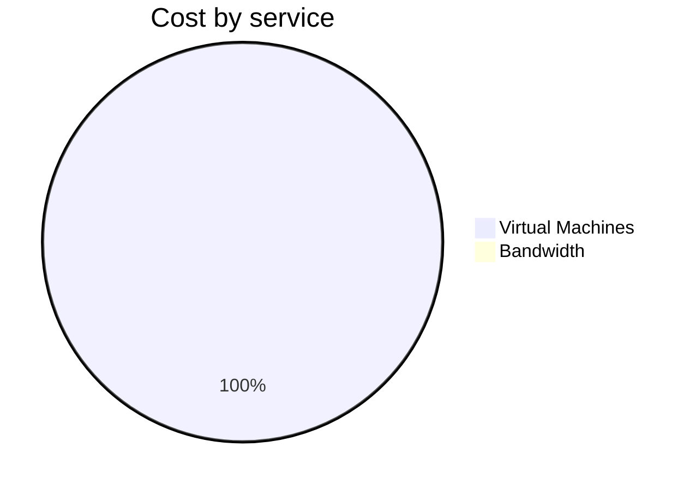
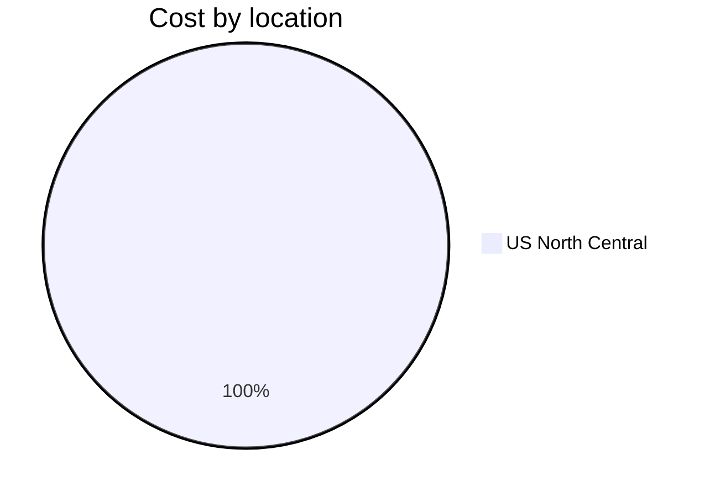
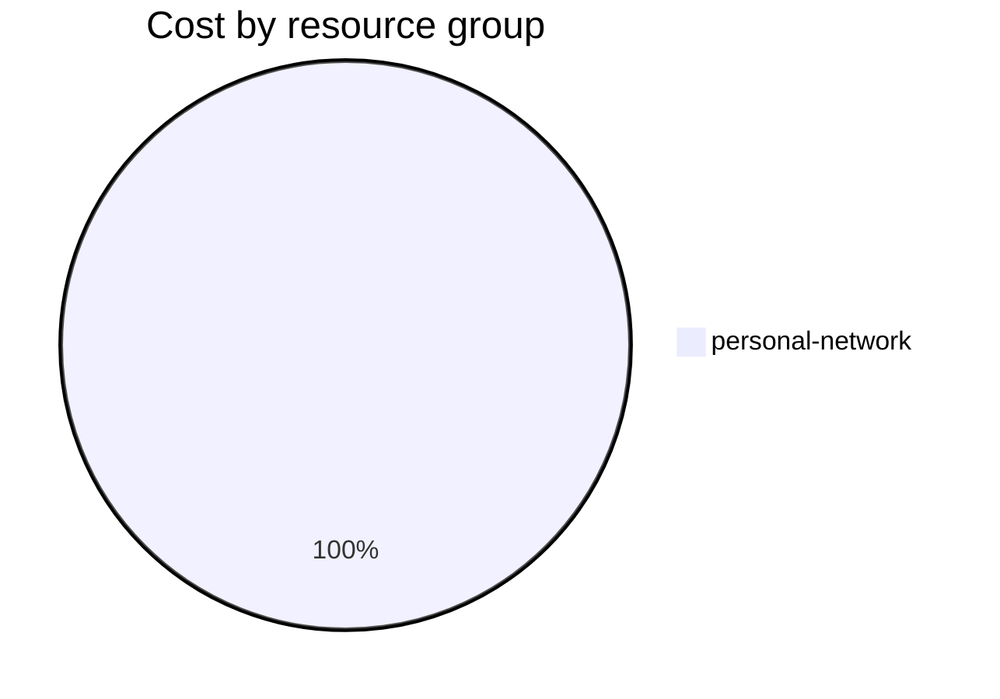

Fetching subscription details...
Fetching cost data...
Fetching forecasted cost data...
Fetching cost data by service name...
Fetching cost data by location...
Fetching cost data by resource group...
# Azure Cost Overview

> Accumulated cost for subscription id `JPF Pay-As-You-Go` from **11/01/2023** to **11/12/2023**

## Totals

|Period|Amount|
|---|---:|
|Today|0.05 USD|
|Yesterday|0.19 USD|
|Last 7 days|1.36 USD|
|Last 30 days|2.10 USD|

```mermaid
gantt
   title Accumulated cost
   dateFormat  X
   axisFormat %s
   section 01 Nov
   USD 0.19 :0, 19
   section 02 Nov
   USD 0.37 :0, 37
   section 03 Nov
   USD 0.56 :0, 56
   section 04 Nov
   USD 0.75 :0, 75
   section 05 Nov
   USD 0.94 :0, 94
   section 06 Nov
   USD 1.12 :0, 112
   section 07 Nov
   USD 1.31 :0, 131
   section 08 Nov
   USD 1.50 :0, 150
   section 09 Nov
   USD 1.68 :0, 168
   section 10 Nov
   USD 1.87 :0, 187
   section 11 Nov
   USD 2.06 :0, 206
   section 12 Nov
   USD 2.10 :0, 210
```

## By Service Name

|Service|Amount|
|---|---:|
|Virtual Machines|2.10 USD|
|Bandwidth|0.00 USD|

## By Location

|Location|Amount|
|---|---:|
|US North Central|2.10 USD|

## By Resource Group

|Resource Group|Amount|
|---|---:|
|personal-network|2.10 USD|

Generated at 2023-11-12 11:13:03 for subscription with id `4913be3f-a345-4652-9bba-767418dd25e3`
