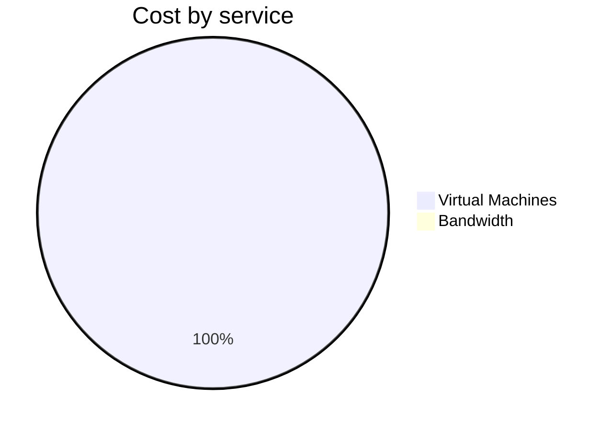
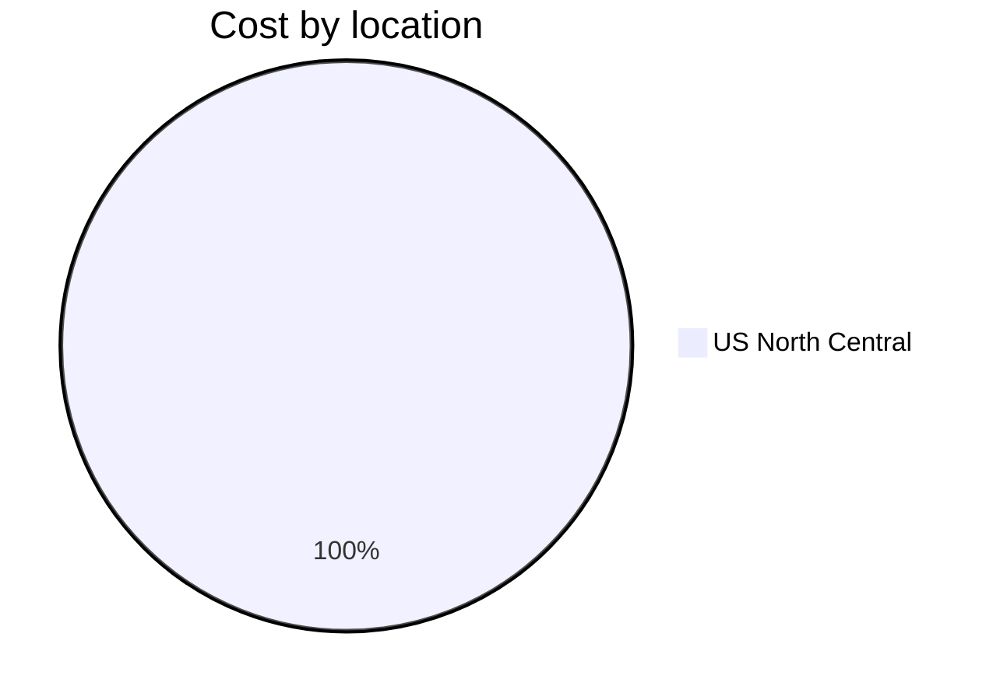
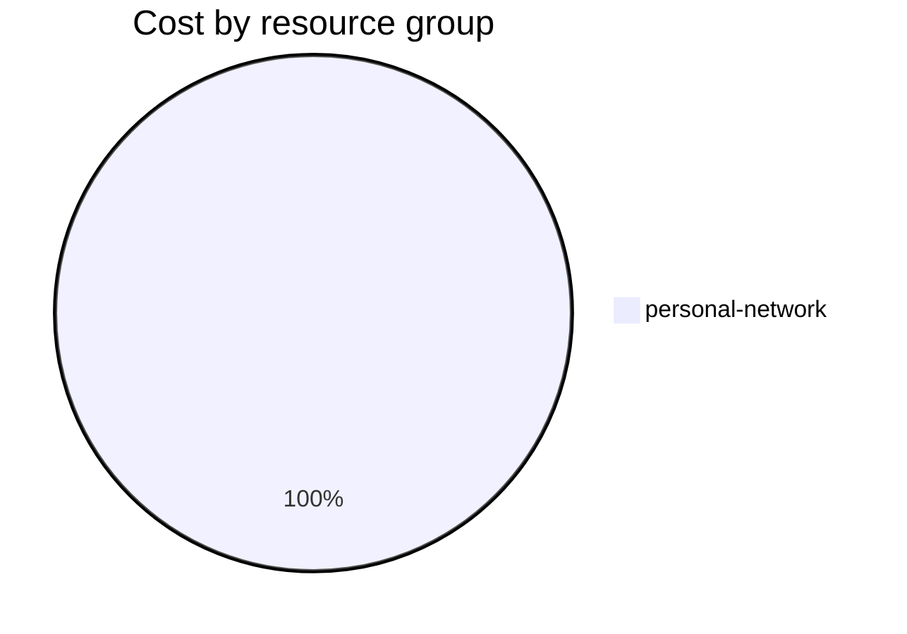

Fetching subscription details...
Fetching cost data...
Fetching forecasted cost data...
Fetching cost data by service name...
Fetching cost data by location...
Fetching cost data by resource group...
# Azure Cost Overview

> Accumulated cost for subscription id `JPF Pay-As-You-Go` from **01/01/2024** to **01/07/2024**

## Totals

|Period|Amount|
|---|---:|
|Today|0.10 USD|
|Yesterday|0.41 USD|
|Last 7 days|2.58 USD|
|Last 30 days|2.58 USD|

```mermaid
gantt
   title Accumulated cost
   dateFormat  X
   axisFormat %s
   section 01 Jan
   USD 0.41 :0, 41
   section 02 Jan
   USD 0.82 :0, 82
   section 03 Jan
   USD 1.24 :0, 124
   section 04 Jan
   USD 1.65 :0, 165
   section 05 Jan
   USD 2.06 :0, 206
   section 06 Jan
   USD 2.47 :0, 247
   section 07 Jan
   USD 2.58 :0, 258
   section 08 Jan
   USD 2.78 : done, 0, 278
   section 09 Jan
   USD 2.98 : done, 0, 298
   section 10 Jan
   USD 3.19 : done, 0, 319
   section 11 Jan
   USD 3.39 : done, 0, 339
   section 12 Jan
   USD 3.60 : done, 0, 360
   section 13 Jan
   USD 3.80 : done, 0, 380
   section 14 Jan
   USD 4.01 : done, 0, 401
   section 15 Jan
   USD 4.21 : done, 0, 421
   section 16 Jan
   USD 4.42 : done, 0, 442
   section 17 Jan
   USD 4.62 : done, 0, 462
   section 18 Jan
   USD 4.83 : done, 0, 483
   section 19 Jan
   USD 5.03 : done, 0, 503
   section 20 Jan
   USD 5.24 : done, 0, 524
   section 21 Jan
   USD 5.45 : done, 0, 545
   section 22 Jan
   USD 5.65 : done, 0, 565
   section 23 Jan
   USD 5.86 : done, 0, 586
   section 24 Jan
   USD 6.07 : done, 0, 607
   section 25 Jan
   USD 6.28 : done, 0, 628
   section 26 Jan
   USD 6.49 : done, 0, 649
   section 27 Jan
   USD 6.69 : done, 0, 669
   section 28 Jan
   USD 6.90 : done, 0, 690
   section 29 Jan
   USD 7.11 : done, 0, 711
   section 30 Jan
   USD 7.32 : done, 0, 732
   section 31 Jan
   USD 7.53 : done, 0, 753
```

## By Service Name

|Service|Amount|
|---|---:|
|Virtual Machines|1.29 USD|
|Bandwidth|0.00 USD|

## By Location

|Location|Amount|
|---|---:|
|US North Central|1.29 USD|

## By Resource Group

|Resource Group|Amount|
|---|---:|
|personal-network|1.29 USD|

Generated at 2024-01-07 11:12:39 for subscription with id `4913be3f-a345-4652-9bba-767418dd25e3`
