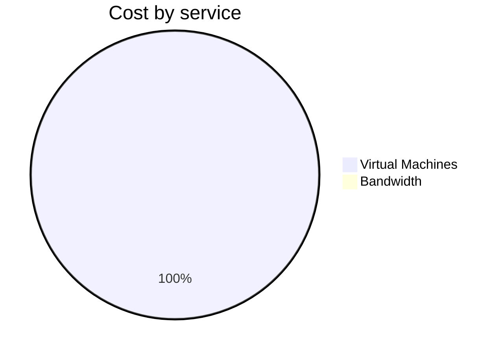
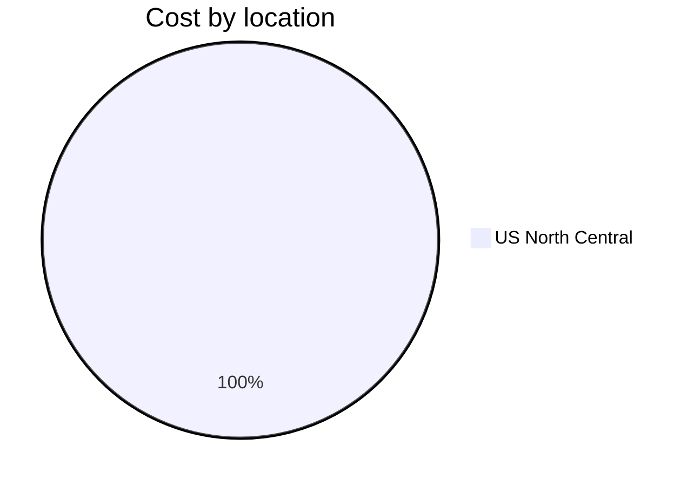
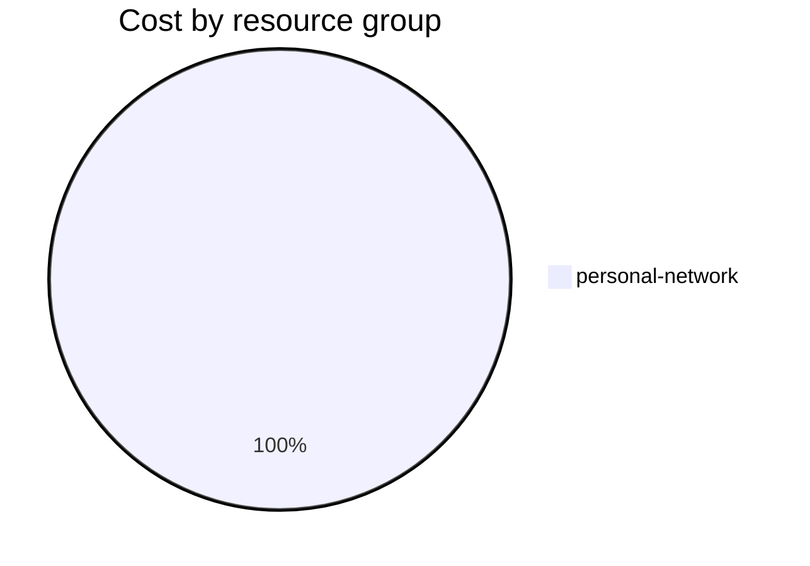

Fetching subscription details...
Fetching cost data...
Fetching forecasted cost data...
Fetching cost data by service name...
Fetching cost data by location...
Fetching cost data by resource group...
# Azure Cost Overview

> Accumulated cost for subscription id `JPF Pay-As-You-Go` from **03/01/2024** to **03/03/2024**

## Totals

|Period|Amount|
|---|---:|
|Today|0.05 USD|
|Yesterday|0.18 USD|
|Last 7 days|0.40 USD|
|Last 30 days|0.40 USD|

```mermaid
gantt
   title Accumulated cost
   dateFormat  X
   axisFormat %s
   section 01 Mar
   USD 0.18 :0, 18
   section 02 Mar
   USD 0.35 :0, 35
   section 03 Mar
   USD 0.40 :0, 40
```

## By Service Name

|Service|Amount|
|---|---:|
|Virtual Machines|0.40 USD|
|Bandwidth|0.00 USD|

## By Location

|Location|Amount|
|---|---:|
|US North Central|0.40 USD|

## By Resource Group

|Resource Group|Amount|
|---|---:|
|personal-network|0.40 USD|

Generated at 2024-03-03 11:12:03 for subscription with id `4913be3f-a345-4652-9bba-767418dd25e3`
